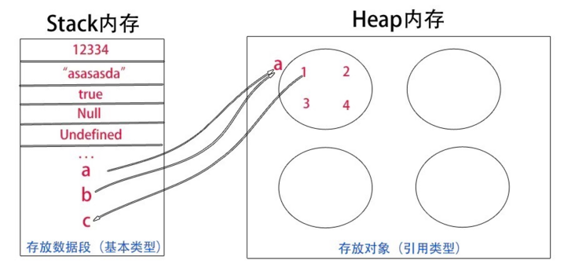
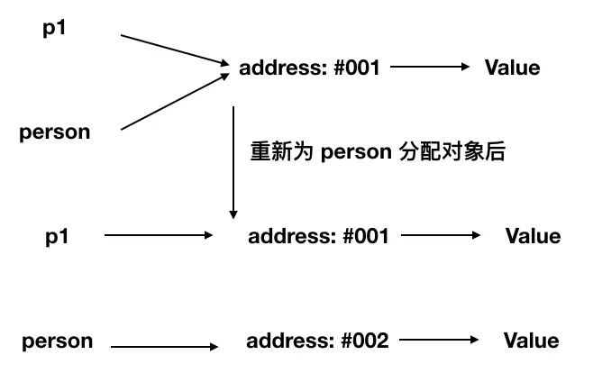
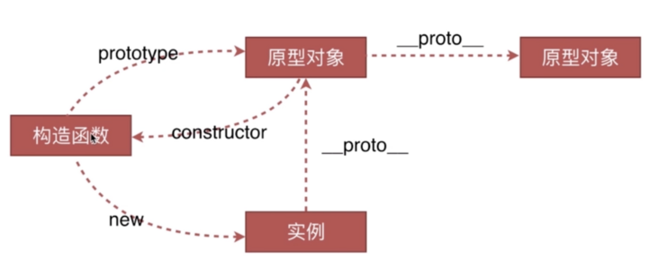
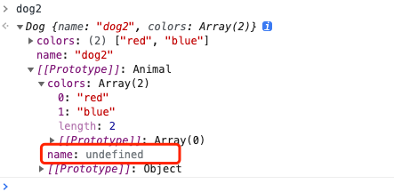
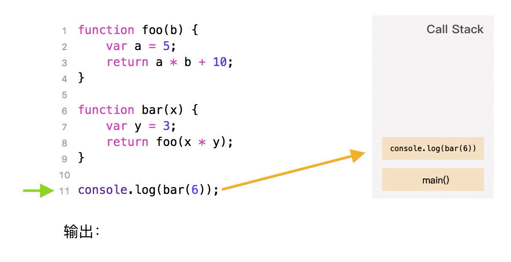

# 前端面试指北

## JavaScript基础知识面试题

### 原始类型
::: tip
JavaScript 中原始类型有七种，原始类型既只保存原始值，是没有函数可以调用的。
:::

#### 七种原始类型
* string
* number
* boolean
* null
* undefined
* symbol(新增)
* bigInt(新增)

::: warning 注意
为什么说原始类型没有函数可以调用，但`'1'.toString()`却又可以在浏览器中正确执行？
:::
因为`'1'.toString()`中的字符串`'1'`在这个时候会被封装成其对应的字符串对象，以上代码相当于`new String('1').toString()`，因为`new String('1')`创建的是一个对象，而这个对象里是存在`toString()`方法的。

#### null到底是什么类型
现在很多书籍把`null`解释成空对象，是一个对象类型。然而在早期`JavaScript`的版本中使用的是32位系统，考虑性能问题，使用低位存储变量的类型信息，`000`开头代表对象，而`null`就代表全零，所以将它错误的判断成`Object`，虽然后期内部判断代码已经改变，但`null`类型为`object`的判断却保留了下来，至于`null`具体是什么类型，属于仁者见仁智者见智，你说它是一个`bug`也好，说它是空对象，是对象类型也能理解的通。

### 对象类型和原始类型区别

#### 一、声明变量时内存分配不同
原始类型：占据空间是固定，存在较小的内存栈中，这样便于迅速查询变量的值
引用类型：存在堆中，栈中存储的变量，只是用来查找堆中的引用地址。
#### 二、声明变量时内存分配不同
在javascript中是不允许直接访问保存在堆内存中的对象的，所以在访问一个对象时，首先得到的是这个对象在堆内存中的地址，然后再按照这个地址去获得这个对象中的值，这就是传说中的按引用访问。而原始类型的值则是可以直接访问到的。
#### 三、复制变量时的不同
1. 原始值：在将一个保存着原始值的变量复制给另一个变量时，会将原始值的副本赋值给新变量，此后这两个变量是完全独立的，他们只是拥有相同的value而已。
2. 引用值：在将一个保存着对象内存地址的变量复制给另一个变量时，会把这个内存地址赋值给新变量，也就是说这两个变量都指向了堆内存中的同一个对象，他们中任何一个作出的改变都会反映在另一个身上。（这里要理解的一点就是，复制对象时并不会在堆内存中新生成一个一模一样的对象，只是多了一个保存指向这个对象指针的变量罢了）。多了一个指针
#### 四、参数传递的不同（把实参复制给形参的过程）
首先我们应该明确一点：ECMAScript中所有函数的参数都是按值来传递的。  
但是为什么涉及到原始类型与引用类型的值时仍然有区别呢？还不就是因为内存分配时的差别。 　  
　　1. 原始值：只是把变量里的值传递给参数，之后参数和这个变量互不影响。  
　　2. 引用值：对象变量它里面的值是这个对象在堆内存中的内存地址，这一点你要时刻铭记在心！  
　　因此它传递的值也就是这个内存地址，这也就是为什么函数内部对这个参数的修改会体现在外部的原因了，因为它们都指向同一个对象。

#### 对象当做函数参数
```js
function testPerson(person) {
  person.age = 52;
  person = {
    name: '李四',
    age: 18
  }
  return person;
}
var p1 = {
  name: '张三',
  age: 23
}
var p2 = testPerson(p1);
console.log(p1.age);  // 输出52
console.log(p2.age);  // 输出18
```
**代码分析**：
1. `testPerson`函数中，`person`传递的是对象`p1`的指针副本
2. 在函数内部，改变`person`的属性，会同步反映到对象`p1`上，`p1`对象中的`age`属性发生了改变，即值为52
3. `testPerson`函数又返回了一个新的对象，这个对象此时和参数`person`没有任何关系，因为它分配了一个新的内存地址
4. 以上分析可以用如下图表示



### 原型、原型链

所有的JS对象都有一个`prototype`属性，指向它的原型对象。当试图访问一个对象的属性时，如果没有在该对象上找到，它还会顺着`proto`（隐式原型）`obj.__proto__.__proto__`该对象的原型的原型，依次层层向上搜索，直到找到一个名字匹配的属性或到达原型链的末尾(null).

1. 原型对象也是普通的对象，是对象一个自带隐式的 `proto` 属性，原型也有可能有自己的原型，如果一个原型对象的原型不为 `null` 的话，我们就称之为原型链。
2. 原型链是由一些用来继承和共享属性的对象组成的（有限的）对象链
#### prototype 和 __proto__
::: tip 
构造函数拥有 prototype，对象没有。
只有实例对象拥有 __proto__(函数也是一个对象)
:::
```js
 var A = function(name) { this.name = name }
 A.__proto__ === Function.prototype
 A 是 Function 的实例，所以函数也拥有__proto__
```
### 继承
在`JavaScript`ES6之前，实现继承需要依赖原型、原型链和构造函数等等技术手段组合使用，在ES6之后，可以使用`Class`类继承(并没有真正的类，只是一个语法糖，实质依然是函数)
::: tip 继承的几种方式
1. 原型链实现继承
2. 借用构造函数实现继承
3. 组合继承
4. 寄生组合继承
5. 类继承
:::

#### 原型链实现继承
::: tip
通过重写子类的原型，并将它指向父类的手段实现。这种方式实现的继承，创建出来的实例既是子类的实例，又是父类的实例。它有如下几种缺陷：
1. 不能向父类构造函数传参
2. 父类上的引用类型属性会被所有实例共享，其中一个实例改变时，会影响其他实例
:::
```js
function Animal() {
  this.colors = ['red','blue'];
}
function Dog(name) {
  this.name = name;
}
Dog.prototype = new Animal();

var dog1 = new Dog('旺财');
var dog2 = new Dog('钢镚');
dog2.colors.push('yellow');
console.log(dog1.colors); // ["red", "blue", "yellow"]
console.log(dog2.colors); // ["red", "blue", "yellow"]

console.log(dog1 instanceof Dog);   // true
console.log(dog1 instanceof Animal);// true
```

#### 借用构造函数实现继承
:::tip
借用构造函数实现继承，通过在子类中使用`call()`方法，实现借用父类构造函数并向父类构造函数传参的目的。但这种方法，无法继承父类原型对象上的属性和方法。
:::
```js
function Animal(name) {
  this.name = name;
  this.colors = ['red','blue'];
}
Animal.prototype.eat = function() {
  console.log(this.name + ' is eating!');
}
function Dog(name) {
  Animal.call(this,name);
}

var dog1 = new Dog('旺财');
var dog2 = new Dog('钢镚');
dog2.colors.push('yellow');

console.log(dog1.colors); // ["red", "blue"]
console.log(dog2.colors); // ["red", "blue", "yellow"]

console.log(dog1 instanceof Dog);   // true
console.log(dog2 instanceof Animal);// false

console.log(dog1.eat()); // 报错
```

#### 组合继承
::: tip
继承的方式核心是在子类的构造函数中通过Animal.call(this)继承父类的属性，然后改变子类的原型为new Animal()来继承父类的函数。
这种继承方式优点在于构造函数可以传参，不会与父类引用属性共享，可以复用父类的函数，但是也存在一个缺点就是在继承父类函数的时候调用了父类构造函数，导致子类的原型上多了不需要的父类属性，存在内存上的浪费。
* 父类构造函数被调用多次。
:::

```js
function Animal(name) {
  this.name = name;
  this.colors = ['red','blue'];
}
Animal.prototype.eat = function() {
  console.log(this.name + ' is eatting');
}
function Dog(name) {
  Animal.call(this,name);
}
Dog.prototype = new Animal(); // 第一次调用
var dog1 = new Dog('dog1');   // 第二次调用
var dog2 = new Dog('dog2');   // 第三次调用
dog1.colors.push('yellow');
console.log(dog1.name);  // 输出dog1
console.log(dog2.colors);// 输出['red','blue']
console.log(dog2.eat()); // 输出dog2 is eatting
console.log(dog2); // A
```

#### 寄生组合继承
::: tip
寄生组合继承是在组合继承的基础上，采用`Object.create()`方法来改造实现
:::
```js
function Animal(name) {
  this.name = name;
  this.colors = ['red','blue'];
}
Animal.prototype.eat = function() {
  console.log(this.name + ' is eatting');
}
function Dog(name) {
  Animal.call(this,name);
}
Dog.prototype = Object.create(Animal.prototype);
Dog.prototype.constructor = Dog;
var dog1 = new Dog('dog1');
var dog2 = new Dog('dog2');
dog1.colors.push('yellow');
console.log(dog1.name);  // 输出dog1
console.log(dog2.colors);// 输出['red','blue']
console.log(dog2.eat()); // 输出dog2 is eatting
```

#### Class实现继承
::: tip
运用ES6 class新特性来实现继承
:::
```js
class Animal {
  constructor(name) {
    this.name = name;
    this.colors = ['red','blue'];
  }
  eat() {
    console.log(this.name + ' is eatting');
  }
}
class Dog extends Animal {
  constructor(name) {
    super(name);
  }
}
var dog1 = new Dog('dog1');
var dog2 = new Dog('dog2');
dog1.colors.push('yellow');
console.log(dog1.name);  // 输出dog1
console.log(dog2.colors);// 输出['red','blue']
console.log(dog2.eat()); // 输出dog2 is eatting
```
### typeof和instanceof

#### typeof
::: tip
`typeof`能准确判断除`null`以外的原始类型的值，对于对象类型，除了函数会判断成`function`，其他对象类型一律返回`object`
:::
```js
typeof null       // "object" `null`：所有机器码均为0, 000：对象
typeof 1          // number
typeof '1'        // string
typeof true       // boolean
typeof undefined  // undefined
typeof Symbol()   // symbol

typeof []         // object
typeof {}         // object
typeof console.log// function
```

#### instanceof
::: tip
`instanceof`通过原型链可以判断出对象的类型，但并不是百分百准确
 比如instanceofnstanceof能够正确判断[] 是Array的实例对象，但不能辨别 [] 不是Object的实例对象,因为它是顺着原型链一级一级往上找
:::
```js
  [] instanceof Array; //true
  [] instanceof Object; //true
  {} instanceof Object;//true
  null  instanceof  null  // TypeError: Right-hand side of 'instanceof' is not an object
  Object instanceof Object // true 
  Function instanceof Function // true 
  Function instanceof Object // true 
  function Foo() { }
  Foo instanceof Foo // false 
  Foo instanceof Object // true 
  Foo instanceof Function // true
  Object.prototype.toString.call() // 完美解决方案
```
### 手写实现一个instanceof
```js
function myInstance(left,right){
  left = left.__proto__
  right = right.prototype
  while(true){
    if(left==null){
      return false;
    }
    if(left===right){
      return true;
    }
    left = left.__proto__
  }
}
```

### 类型转换
`JavaScript`中，类型转换只有三种：
1. 转换成数字
2. 转换成布尔值
3. 转换成字符串

#### 经典类型面试题
```js
console.log([]==![]); // true
```
**代码分析**：
1. ! 的优先级高于== ，右边运算结果等于 false
2. 右侧是一个布尔值，对象`[]`转换成布尔值`true`，因为除了`null`所有对象都转换成布尔值，所以`![]`结果为`false`
3. 此时相当于`对象==布尔值`，依据类型转换规则，转换成数字类型进行比较
4. 对象(空数组)转换成`0`，布尔值`false`转换成`0`
5. 即`0==0`，返回`true`

类型转换规则，如下图：


### == 和 ===
如何你对上面的例子还一知半解，那么我们来详细介绍一下`==`和`===`的规则以及区别。

#### ===严格相等
::: tip
`===`叫做严格相等，是指：左右两边不仅值要相等，类型也要相等，例如`'1'===1`的结果是`false`，因为一边是`string`，另一边是`number`。
:::
```js
console.log('1'===1); // 输出false
```

#### ==不严格相等
::: tip
`==`不像`===`那样严格，对于一般情况，只要值相等，就返回`true`，但`==`还涉及一些类型转换，它的转换规则如下：
* 两边的类型是否相同，相同的话就比较值的大小，例如`1==2`，返回`false`
* 类型不相同会进行类型转换
* 判断的是否是`null`和`undefined`，是的话就返回`true`
* 判断的类型是否是`String`和`Number`，是的话，把`String`类型转换成`Number`，再进行比较
* 判断其中一方是否是`Boolean`，是的话就把`Boolean`转换成`Number`，再进行比较
* 如果其中一方为`Object`，且另一方为`String`、`Number`或者`Symbol`，会将`Object`转换成原始类型后，再进行比较
:::
```js
1 == {id: 1, name: 'AAA'}
        ↓
1 == '[object Object]'
```

#### 转boolean
除了`undefined`、`null`、`false`、`0`、`-0`、`NaN`和空字符串转换成`false`以外，其他所有值都转换成`true`，包括所有对象。

#### 对象转原始类型
对象转原始类型，会调用内置的[ToPrimitive]函数，对于该函数而言，其逻辑如下：
1. 是否已经是原始类型，是则直接返回
2. 调用`valueOf()`，如果转换为原始类型，则返回
3. 调用`toString()`，如果转换为原始类型，则返回
4. 也可以重写`Symbol.toPrimitive()`方法，优先级别最高
5. 如果都没有返回原始类型，会报错
```js
var obj = {
  value: 0,
  valueOf() {
    return 1;
  },
  toString() {
    return '2'
  },
  [Symbol.toPrimitive]() {
    return 3
  }
}
console.log(obj + 1); // 输出4
```

#### 对象转原始类型应用
```js
// 问：如何使if(a==1&&a==2&&a==3) {console.log('true')};正确打印'true'
var a = {
  value: 0,
  valueOf() {
    this.value++;
    return this.value;
  }
}
if(a==1 && a==2 && a==3) {
  console.log('true'); // 输出true
}
```
**代码分析**：
1. 重写对象`a`的`valueOf()`方法，使`value`属性每次调用时自增
2. 当判断`a==1`时，第一次调用`valueOf()`方法，此时`value`等于1，判断`1==1`，继续向下走
3. 判断`a==2`时，第二次调用`valueOf()`方法，此时`value`等于2，判断`2==2`，继续向下走
4. 判断`a==3`时，第三次调用`valueOf()`方法，此时`value`等于3，判断`3==3`，`if`判断结束
5. `if`条件判断为`true && true && true`，执行`console.log('true')`，打印`true`


### new构造调用的过程
无论是通过字面量还是通过`new`进行构造函数调用创建出来的对象，其实都一样。调用`new`的过程如下：
1. 创建一个新对象
2. 原型绑定
3. 绑定this到这个新对象上
4. 返回新对象 

### 手写实现一个new
```js
  function _new(fun) {
    return function() {
      let obj = {
        __proto__: fun.prototype
      }
      fun.apply(obj, arguments)
      return obj
    }
  }
  function person(name, age) {
    this.name = name
    this.age = age  
  }
  let obj = _new(person)('LL', 100)
  let obj2 = new person('LL', 100)
  console.log(obj) //{name: 'LL', age: 100}
  console.log(obj2) //{name: 'LL', age: 100}
```
  ES5 官方文档在 函数定义：
  调用函数person，将其返回值赋给 result；
  其中，person 执行时的实参为传递给 \[\[Construct\]\]（即person本身） 的参数，person 内部 this 指向 obj；
  如果 result 是 Object 类型(基本数据类型除外)，返回 result；
  这也就解释了如果构造函数显式返回对象类型，则直接返回这个对象，而不是返回最开始创建的对象。
### 判断函数是被new调用
```js
  // 来自美团到店事业部的无聊面试题
  // 方法一
  function Person(n,a){
    this.name = n;
    this.age = a;
    console.log(this); // 可以试着打印一下this
    if(this instanceof Person){
      alert('new调用');
    }else{
      alert('函数调用');
    }
  }
  var p = new Person('gordanlee',30); // --> new调用
  Person(); // --> 函数调用

  // 方法二

  function Person(n,a){  
    this.name = n;  
    this.age = a;
    // arguments.callee 可代替换 Person
    // if(this.constructor === arguments.callee){
    if(this instanceof arguments.callee){  
      alert('new调用');  
    }else{  
      alert('函数调用');  
    }  
  }
  var p = new Person('jack',30); // --> new调用  
  Person(); // --> 函数调用
  arguments.callee它可以用于引用该函数的函数体内当前正在执行的函数。这在函数的名称是未知时很有用，例如在没有名称的函数表达式 (也称为“匿名函数”)内。【严格模式下禁用】
```
### this全解析
`JavaScript`中的`this`只有如下几种情况，并按他们的优先级从低到高划分如下：
1. 独立函数调用，例如`getUserInfo()`，此时`this`指向全局对象`window`
2. 对象调用，例如`stu.getStudentName()`，此时`this`指向调用的对象`stu`
3. `call()`、`apply()`和`bind()`改变上下文的方法，`this`指向取决于这些方法的第一个参数，当第一个参数为`null`时，`this`指向全局对象`window`
4. 箭头函数没有`this`，箭头函数里面的`this`只取决于包裹箭头函数的第一个普通函数的`this`
5. `new`构造函数调用，`this`永远指向构造函数返回的实例上，优先级最高。
```js
var name = 'global name';
var foo = function() {
  console.log(this.name);
}
var Person = function(name) {
  this.name = name;
}
Person.prototype.getName = function() {
  console.log(this.name);
}
var obj = {
  name: 'obj name',
  foo: foo
}
var obj1 = {
  name: 'obj1 name'
}

// 独立函数调用，输出：global name
foo();
// 对象调用，输出：obj name
obj.foo();
// apply()，输出：obj1 name
obj.foo.apply(obj1);
// new 构造函数调用，输出：p1 name
var p1 = new Person('p1 name');
p1.getName();
```

#### this解析流程图


### 作用域
每一个变量、函数都有其作用的范围，超出作用不得使用，这个叫做作用域。
#### 全局变量
 1. 在全局范围内声明的变量，如var a=1;
 2. 只有赋值没有声明的值，如a=2;（注：如果a=2在函数环境中，也是全局变量
#### 局部变量
  写入函数中的变量，叫做局部变量。
作用
 1. 程序的安全。
 2. 内存的释放。
#### 作用域链
查找量的过程。先找自己局部环境有没有声明或者是函数，如果有，则查看声明有无赋值或者是函数的内容，如果没有，则向上一级查找。

#### 预解析顺序
::: tip
每个程序都要做的工作，程序开始先预解析语法，标点符号是否有误，解析内存是否可容纳，解析变量……直到解析无误了，才开始按正常的流程顺序走。试想一下，如果没有预解析顺序，直接按流程顺序走，可能程序执行到最后一个函数，发现了语法错误，才开始报错，那性能要有多差啊！
:::
顺序内容：
1. 文件内引用的 `<script>`块依次解析，从上到下连成一片。
2. 每个`script`块内部的var（注意：只解析变量名，不解析值，如var a=2;将var a解析在环境的开头，并不解析后面的值，只有当程序执行到var a=2这行时，才会给变量赋值），`function`解析到本块的开头。
3. 依次解析每个环境，将var,`function`解析到环境的开头。
### 闭包
::: tip
闭包是指有权访问另一个函数作用域中的变量的函数，创建闭包最常用的方式就是在一个函数内部创建另一个函数
:::

#### 闭包的几种表现形式
::: tip
1. 返回一个函数
2. 作为函数参数传递
3. 回调函数
4. 非典型闭包IIFE(立即执行函数表达式)
:::
#### 闭包的闭包的作用有
::: tip
1. 参数和变量不会被垃圾回收机制所收回
2. 封装私有变量,模仿块级作用域(ES5中没有块级作用域),实现JS的模块
:::
**返回一个函数**：这种形式的闭包在`JavaScript`的代码编写中，是非常常见的一种方式。
```js
function  create() {
  let a = 100
  return function () {
    console.log(a) // 100
  }
}
let fn = create()
let a = 200
fn() // 100
```
**作为函数参数传递**：无论通过何种手段将内部函数传递到它所在词法作用域之外，它都会持有对原始作用域的引用，无论在何处执行这个函数，都会产生闭包。
::: tip
自由变量的查找是在函数定义的地方，向上级查找，而不是函数执行的地方。
:::
```js
// 函数作为参数被传递
function print(fn) {
  let a = 200
  fn()
}
let a = 100
function  fn() {
  console.log(a)
}
print(fn) // 100
```

**回调函数**：在定时器、事件监听、Ajax请求、跨窗口通信、Web Workers或者任何异步中，只要使用了回调函数，实际上就是在使用闭包。
```js
// 定时器
setTimeout(function timeHandler(){
  console.log('timer');
}，100)

// 事件监听
$('#container').click(function(){
  console.log('DOM Listener');
})
```
**IIFE**：IIFE(立即执行函数表达式)并不是一个典型的闭包，但它确实创建了一个闭包。
```js
var a = 2;
(function IIFE(){
  // 输出2
  console.log(a);
})();
```

#### 经典循环和闭包面试题
::: tip
以下代码运行结果是什么，如何改进？
:::
```js
for(var i=1;i<=5;i++){
  setTimeout(function timer(){
    console.log(i)
  }, i*1000)
}
```
**代码分析**：<br>
1. `for`循环创建了5个定时器，并且定时器是在循环结束后才开始执行
2. `for`循环结束后，用`var i`定义的变量`i`此时等于6
3. 依次执行五个定时器，都打印变量`i`，所以结果是打印5次6

**第一种改进方法**：利用`IIFE(立即执行函数表达式)`当每次`for`循环时，把此时的`i`变量传递到定时器中
```js
for(var i=1;i<=5;i++){
  (function(j){
    setTimeout(function timer(){
      console.log(j)
    }, i*1000)
  })(i)
}
```

**第二种方法**：`setTimeout`函数的第三个参数，可以作为定时器执行时的变量进行使用
```js
for(var i=1;i<=5;i++){
  setTimeout(function timer(j){
    console.log(j)
  }, i*1000, i)
}
```
**第三种方法(推荐)**：在循环中使用`let i`代替`var i`
```js
for(let i=1;i<=5;i++){
  setTimeout(function timer(){
    console.log(i)
  }, i*1000)
}
```
### 浅拷贝、深拷贝
由于`JavaScript`中对象是引用类型，保存的是地址，深、浅拷贝的区别是，当拷贝结束后，在一定程度上改变原对象中的某一个引用类型属性的值，新拷贝出来的对象依然受影响的话，就是浅拷贝，反之就是深拷贝。

#### 浅拷贝的几种实现方法
::: tip
1. 利用`Object.assign()`方法
2. 利用`...`扩展运算符
:::


**第一种方法：** `Object.assign()`会拷贝原始对象中的所有属性到一个新对象上，如果属性为对象，则拷贝的是对象的地址，改变对象中的属性值，新拷贝出来的对象依然会受影响。
```js
var obj = {
  name: '张三',
  age: 23,
  isStudent: false,
  job: {
    name: 'FE',
    money: 12
  }
}
var newObj = Object.assign({}, obj);
obj.job.money = 21;
console.log(newObj.name);     // 输出张三
console.log(newObj.age);      // 输出23
console.log(newObj.job.money);// 输出21，受影响
```

**第二种方法：**`...`扩展运算符是`ES6`新增加的内容
```js
var obj = {
  name: '张三',
  age: 23,
  isStudent: false
}
var newObj = {...obj};
console.log(newObj.name);     // 输出张三
console.log(newObj.age);      // 输出23
```

#### 深拷贝几种实现方式
::: tip
1. 配合使用`JSON.parse()`和`JSON.stringify()`两个函数(局限性比较大)
2. 实现自己的简易深拷贝方法
3. `lodash`第三方库实现深拷贝
:::

**第一种方法：** 利用`JSON`的序列化和反序列化方法，可以实现简易对象深拷贝，但此种方法有较大的限制：<br>
1. 会忽略属性值为`undefined`的属性
2. 会忽略属性为`Symbol`的属性
3. 不会序列化函数
4. 不能解决循环引用的问题，直接报错
```js
var obj = {
  name: '张三',
  age: 23,
  address: undefined,
  sayHello: function() {
    console.log('Hello');
  },
  isStudent: false,
  job: {
    name: 'FE',
    money: 12
  }
}
var newObj = JSON.parse(JSON.stringify(obj));
obj.job.money = 21;
console.log(newObj.name);      // 输出张三
console.log(newObj.age);       // 输出23
console.log(newObj.job.money); // 输出12

console.log(newObj.address);   // 报错
console.log(newObj.sayHello());// 报错
```
**第二种：** 实现自己简易的深拷贝函数
```js
function deepClone(obj) {
  function isObject(o) {
    return (typeof o === 'object' || typeof o === 'function') && o !== null;
  }
  if(!isObject(obj)) {
    throw new Error('非对象');
  }
  var isArray = Array.isArray(obj);
  var newObj = isArray ? [...obj] : {...obj};
  // Object.keys()返回属性key，但不包括不可枚举的属性
  //Reflect.ownKeys() 返回所有属性key(包括不可枚举类型，不包括继承的属性）
  Reflect.ownKeys(newObj).forEach(key => {
    newObj[key] = isObject(newObj[key]) ? deepClone(newObj[key]) : newObj[key];
  })
  return newObj;
}
var obj = {
  name: 'AAA',
  age: 23,
  job: {
    name: 'FE',
    money: 12000
  }
}
var cloneObj = deepClone(obj);
obj.job.money = 13000;
console.log(obj.job.money);     // 输出13000
console.log(cloneObj.job.money);// 输出12000
```

**第三种方法：** 使用[lodash](https://lodash.com/docs#cloneDeep)第三方函数库实现(需要先引入lodash.js)
```js
var obj = {
  name: '张三',
  age: 23,
  isStudent: false,
  job: {
    name: 'FE',
    money: 12
  }
}
var newObj = _.cloneDeep(obj);
obj.job.money = 21;
console.log(newObj.name);     // 输出张三
console.log(newObj.age);      // 输出23
console.log(newObj.job.money);// 输出12，不受影响
```
### ES6
本章节只介绍ES6常考知识点，更多基础知识请直接跳转至[你不知道的JavaScript(中)](/books/javascript/know-down.md)
#### var、let和const的区别
::: tip
1. `var`声明的变量会提升到作用域的顶部，而`let`和`const`不会进行提升
2. `var`声明的全局变量会被挂载到全局`window`对象上，而`let`和`const`不会
3. `var`可以重复声明同一个变量，而`let`和`const`不会
4. `var`声明的变量作用域范围是函数作用域，而`let`和`const`声明的变量作用域范围是块级作用域。
5. `const`声明的常量，一旦声明则不能再次赋值，再次赋值会报错(更改对象属性不会，因为对象地址没有变,但是chrome92`const`可以重复声明)
:::

**作用域提升：**
```js
console.log(a);  // 输出undefined
console.log(b);  // 报错
console.log(PI); // 报错
var a = 'abc';
let b = 'ABC';
const PI = 3.1415;
```

**挂载到全局变量：**
```js
var a = 'abc';
let b = 'ABC';
const PI = 3.1415;

console.log(window.a);  // 输出abc
console.log(window.b);  // 输出undefined
console.log(window.PI); // 输出undefined
```

**重复声明变量：**
```js
var a = 'abc';
var a;
console.log(a); // 输出abc

let b = 'ABC';
let b;// 报错
```

**变量的作用域范围：**
```js
function foo() {
  var flag = true;
  if(flag) {
    var a = 'abc';
    let b = 'ABC';
    console.log(a); // 输出abc
    console.log(b); // 输出ABC
  }
  console.log(a); // 输出abc
  console.log(b); // 报错
}
foo();
```

**const常量：**
```js
const PI = 3.1415;
PI = 3.1415926; // 报错
```

#### 扩展/收缩符
::: tip
ES6新增加的运算符`...`，称为扩展或者收缩，具体作用取决于到底如何使用。
:::

```js
// ...的扩展
function foo(x,y,z) {
  console.log(x,y,z); // 输出1,2,3
}
var arr = [1,2,3];
foo(...arr);          // 扩展数组：ES6写法
foo.apply(null,arr);  // 扩展数组：ES5写法


// ...的收缩
// 1.收集参数：ES6写法
function bar(...arr) {
  console.log(arr);   // 输出[1,2,3,4,5]
}
// 2.收集参数：ES5写法
function foo(){
  var args = Array.prototype.slice.call(arguments);
  console.log(args);  // 输出[1,2,3,4,5]
}
bar(1,2,3,4,5);
foo(1,2,3,4,5)
```

#### 解构赋值
::: tip
常用的解构赋值，有如下两种情况：<br/>
1. 对象的解构
2. 数组的解构
:::

```js
// 常用解构方式:解构对象 or 解构数组

// ES6之前的获取返回数组和返回对象的方式
function foo() {
  return [1,2,3];
}
function bar() {
  return {
    X: 4,
    Y: 5,
    Z: 6
  }
}
var arr = foo();
var a = arr[0];
var b = arr[1];
var c = arr[2];
var obj = bar();
var x = obj.X;
var y = obj.Y;
var z = obj.Z;
console.log(a,b,c); // 输出1,2,3
console.log(x,y,z); // 输出4,5,6

// ES6之后获取返回数组和返回对象的方式
var [A,B,C] = foo();
var {X,Y,Z} = bar();
console.log(A,B,c); // 输出1,2,3
console.log(X,Y,Z); // 输出4,5,6
```

#### 字符串模板
::: tip
`${内容}`：字符串模板里的内容可以是变量、函数调用以及表达式。
:::
```js
// 字符串模板
var name = 'why';
var age = 23;
var address = '广州';

// ES5拼接字符串
var str = '我叫：'+name+',我的年龄是：'+age+',我的地址是：'+address;

// ES6模板字符串
var newStr = `我叫：${name},我的年龄是：${age},我的地址是：${address}`;

console.log(str);     // 输出:我叫：why,我的年龄是：23，我的地址是：广州
console.log(newStr);  // 输出:我叫：why,我的年龄是：23，我的地址是：广州
```

#### map和set结构

**Map结构：** 对象是创建无序键值对数据结构映射的主要机制，在ES6之前，对象的属性只能是字符串，在ES6之后，`Map`结构允许使用对象、数组等作为键。`Map`结构的方法或者属性如下：

* `set()`：新增一个map结构的数据
* `get(key)`：根据键获取值
* `size`：获取map结构的长度
* `delete(key)`：根据指定的键删除
* `has(key)`：判断指定的键是否存在于map结构中
* `keys()`遍历，`values()`遍历，`entries()`键值对遍历
* `clear()`清空map结构
```js
// Map结构
var map = new Map();
var x = { id: 1 },
    y = { id: 2 };

// 设置map数据
map.set(x,'bar');
map.set(y,'foo');

// 获取map数据
console.log(map.get(x));  // 输出bar
console.log(map.get(y));  // 输出foo

// 获取map结构的长度
console.log(map.size);    // 输出2

// 根据指定键删除map数据
map.delete(x);

// 根据指定的键判断是否存在于map结构中
console.log(map.has(x));  // 输出false

// 遍历map键
for(var key of map.keys()) {
  console.log(key);       // 输出{id:2}
}

// 遍历map值
for(var value of map.values()) {
  console.log(value);     // 输出foo
}

// 遍历map键值对
for(var item of map.entries()) {
  console.log(item[0]);   // 输出y
  console.log(item[1]);   // 输出{id:2}
}
```

**Set结构：** `Set`是一个集合，它里面的值是唯一的，重复添加会被忽略(`Set`结构不允许强制类型转换，`1`和`"1"`被认为是两个不同的值)。`Set`结构的方法和属性如下： <br/>
* `add()`：添加新值
* `size`：获取`Set`结构的长度
* `delete()`：根据指定的键删除
* `has()`：判断指定的键是否存在`Set`集合中
* `keys()`遍历、`values()`遍历、`entries()`遍历
* `clear()`：清空`Set`结构

```js
// Set结构
var set = new Set();
var x = { id: 1 };
var y = { id: 2 };
var a = 1;
var b = "1";
var c = true

// 添加Set数据
set.add(x);
set.add(y);
set.add(a);
set.add(b);
set.add(c);

// 获取Set数据的长度
console.log(set.size);  // 输出5

// 删除Set数据
set.delete(c);

// 判断某个值是否存在Set结构中
console.log(set.has(c));// 输出false

// 遍历Set的键
for(var key of set.keys()) {
  console.log(key);     // 输出{id：1} {id:2} 1 "1"
}

// 遍历Set的值
for(var value of set.values()) {
  console.log(value);   // 输出{id:1} {id:2} 1 "1"
}

// 遍历Set的键值对
for(var item of set.entries()) {
  console.log(item[0]); // 输出 {id:1} {id:2} 1 "1"
  console.log(item[1]); // 输出 {id:1} {id:2} 1 "1"
}
```

**Set结构的扩展运用：** 数组去重、并集、交集、差集
```js
// Set集合的运用：数组的去重、并集、交集、差集
var arr1 = [1,2,1,3,4,5];
var arr2 = [4,5,6,7];

// 去重：输出1,2,3,4,5
console.log(Array.from(new Set(arr1)));

// 并集：输出1,2,3,4,5,6,7
var union = Array.from(new Set([...set1,...set2]));
console.log(union);  

// 交集：输出4,5
var intec = Array.from(new Set(arr.filter(x => arr1.includes(x))));
console.log(intec);

// 差集
var diff1 = Array.from(new Set(arr1.filter(x => !arr2.includes(x))));
var diff2 = Array.from(new Set(arr2.filter(x => !arr1.includes(x))));
console.log(diff1);    // 输出：1,2,3
console.log(diff2);    // 输出：6,7
```

#### Proxy能干什么
在`Vue2.0+`的版本中，`Vue`使用`Object.definedProperty()`方法来实现数据的响应式，在`Vue3.0`的开发计划中，作者计划使用ES6新增加的`Proxy`代理来实现数据的响应式，它相比于`Object.definedProperty()`有如下几个特点： <br/>
1. `Proxy`可以一次性为所有属性实现代理，无需遍历，性能更佳
2. `Proxy`能监听到以前使用`Object.definedProperty()`监听不到的数据变动。
3. 由于是ES6新增加的特性，所以浏览器兼容性方面比`Object.definedProperty()差`
```js
let onWatch = function(obj,setBind, getLogger) {
  return new Proxy(obj, {
    get(target, property, receiver) {
      getLogger(target, property);
      return Reflect.get(target, property, receiver);
    },
    set(target, property, value, receiver) {
      setBind(value, property);
      return Reflect.set(target, property, value);
    }
  })
}

let obj = { a: 1}
let p = onWatch(obj, (value, property) => {
  console.log(`监听到${property}属性的改变，其值为${value}`)
}, (target, property) => {
  console.log(`监听到获取属性${property},其值为${target[property]}`)
})
p.a = 2;        // 监听到a属性的改变，其值为2
console.log(a); // 监听到获取属性a,其值为2
```

#### 数组的map、filter和reduce的区别

**map：** `map`方法的作用是生成一个新数组(把原数组中的所有元素做一些变动，放进新数组中)
```js
var newArr = [1,2,3].map(v => v*2);
console.log(newArr); // 输出[2,4,6];
```

**filter：** `filter`方法的作用是从原数组中过滤出符合条件的元素，并生成一个新数组
```js
var newArr = [1,2,3,4,5,6].filter(item => item%2==0);
console.log(newArr); // 输出[2,4,6];
```

**reduce：** `reduce`方法的作用是通过回调函数的形式，把原数组中的元素最终转换成一个值，第一个参数是回调函数，第二个参数是初始值
```js
var arr = [1,2,3,4,5,6];
var sum = arr.reduce((account, current) => {
  return account + current;
}, 0);
console.log(sum); // 21
```

### JavaScript异步

#### 并发和并行
并行和并发是两个概念，容易混淆是因为并行和并发在中文意思上相近，其实在英文中，这是完全不相同的东西，并行(parallelism)、并发(concurrency)
::: tip 概念理解
并行(parallelism)：是微观概念，假设CPU有两个核心，则我们就可以同时完成任务A和任务B，同时完成多个任务的情况就可以称之为并行。<br/>
并发(concurrency)：是宏观概念，现在有任务A和任务B，在一段时间内，通过任务之间的切换完成这两个任务，这种情况称之为并发。
:::

#### 回调函数
回调函数广泛存在于我们所编写的`JavaScript`代码中，它表现在事件绑定，Ajax请求或者其他的情况下，一个回调函数可表现成如下形式
```js
ajax(url, () => {
  console.log('这里是回调函数');
})
```
**回调地狱：** 回调函数很好的解决了某些异步情况，但过度滥用回调函数会造成回调地狱，即回调函数过长，嵌套过深。过长或者嵌套过深的回调函数，会让回调函数存在强耦合关系，一旦有一个函数有所改动，那么可能会牵一发而动全身。一个回调地狱可能如下所示：
```js
ajax(firstUrl, () => {
  console.log('这里是首次回调函数');
  ajax(secondUrl, () => {
    console.log('这里是第二次回调函数');
    ajax(threeUrl, () => {
      console.log('这里是第三次回调函数');
      // todo更多
    })
  })
})
```

#### Generator
在ES6之前，一个函数一旦执行将不会被中断，一直到函数执行完毕，在ES6之后，由于`Generator`的存在，函数可以暂停自身，待到合适的机会再次执行。用`Generator`可以解决回调地狱。
```js
function *fetch() {
  yield ajax(url, () => {console.log('这里是首次回调函数');});
  yield ajax(url, () => {console.log('这里是第二次回调函数');});
  yield ajax(url, () => {console.log('这里是第三次回调函数');});
}
var it = fetch();
var result1 = it.next();
var result2 = it.next();
var result3 = it.next();
```

#### Promise
`Promise`翻译过来就是承诺的意思，`Promise`一共有三种状态：`pending(等待中)`、`resolve(完成)`和`reject(拒绝)`，这个承诺意味着在将来一定会有一个表决，并且只能表决一次，表决的状态一定是`resolve(完成)`或者`reject(拒绝)`，一个`Promise`可能会是如下的形式：
```js
// 普通的Promise
function foo() {
  return new Promise((resolve,reject) => {
    // 第一次表决有效，其后无论是resolve()还是reject()都无效
    resolve(true); 
    resolve(false);
  })
}

// Promise解决回调地狱
ajax(url).then(res => {
  console.log('这里是首次回调函数');
}).then(res => {
  console.log('这里是第二次回调函数');
}).then(res => {
  console.log('这里是第三次回调函数');
})
```

**Promise.all()：** `Promise.all()`方法是把一个或者几个`Promise`组合在一个数组里，只有当数组中的所有`Promise`全部表决完成，才返回。
```js
var p1 = Promise.resolve(1);
var p2 = new Promise((resolve) => {
  setTimeout(() => {
    resolve(2);
  }, 100);
})
var p3 = 3;
Promise.all([p1,p2,p3]).then((res) => {
  console.log(res); // 输出[1,2,3]
})
```
**Promise.race()：** `Promise.race()`方法把一个或者几个`Promise`组合在一个数组里，只要数组中有一个表决了，就返回。
```js
var p1 = Promise.resolve(1);
var p2 = new Promise((resolve) => {
  setTimeout(() => {
    resolve(2);
  }, 100);
})
var p3 = 3;
Promise.race([p2,p1,p3]).then((res) => {
  console.log(res); // 输出1
})
```


#### async/await
如果一个方法前面加上了`async`，那么这个方法就会返回一个`Promise`，`async`就是将函数用`Promise.resolve()`包裹了下，并且`await`只能配合`async`使用，不能单独出现。一个`async/await`可能会是如下的形式：
```js
// 普通的async/await
async function foo() {
  let number = await 3; // await自动用promise.resolve()包装
  console.log(number);
}
foo();

// async/await解决回调地狱
async function fetch() {
  var result1 = await ajax(url1);
  var result2 = await ajax(url2);
  var result3 = await ajax(url3);
}
fetch();
```

#### setInterval、setTimeout和requestAnimationFrame
**setTimeout** `setTimeout`延时执行某一段代码，但`setTimeout`由于`EventLoop`的存在，并不百分百是准时的，一个`setTimeout`可能会表示如下的形式：
```js
// 延时1s之后，打印hello,world
setTimeout(() => {
  console.log('hello,world');
}, 1000)
```
**setInterval：** `setInterval`在指定的时间内，重复执行一段代码，与`setTimeout`类似，它也不是准时的，并且有时候及其不推荐使用`setInterval`定时器，因为它与某些耗时的代码配合使用的话，会存在执行积累的问题，它会等耗时操作结束后，一起一个或者多个执行定时器，存在性能问题。一个`setInterval`可能会表示如下的形式：
```js
setInterval(() => {
  console.log('hello,world');
}, 1000)
```

**requestAnimationFrame：** 翻译过来就是请求动画帧，它是html5专门用来设计请求动画的API，它与`setTimeout`相比有如下优势：
1. 根据不同屏幕的刷新频率，自动调整执行回调函数的时机。
2. 当窗口处于未激活状态时，`requestAnimationFrame`会停止执行，而`setTimeout`不会
3. 自带函数节流功能
```js
var progress = 0;
var timer = null;
function render() {
  progress += 1;
  if (progress <= 100) {
    console.log(progress);
    timer = window.requestAnimationFrame(render);
  } else {
    cancelAnimationFrame(timer);
  }
}
//第一帧渲染
window.requestAnimationFrame(render);
```


### EventLoop事件循环

#### 进程和线程
::: tip
`JavaScript`是单线程执行的，在`JavaScript`运行期间，有可能会阻塞UI渲染，这在一方面说明`JavaScript`引擎线程和UI渲染线程是互斥的。`JavaScript`被设计成单线程的原因在于，`JavaScript`可以修改DOM，如果在`JavaScript`工作期间，UI还在渲染的话，则可能不会正确渲染DOM。单线程也有一些好处，如下：
1. 节省内存空间
2. 节省上下文切换时间
3. 单线程没有锁的问题存
:::
**进程：** CPU在运行指令及加载和保存上下文所需的时间，放在应用上一个程序就是一个进程，一个浏览器tab选项卡就是一个进程 <br/>
**线程：** 线程是进程中更小的单位，描述了执行一段指令所需的时间。
::: tip
一个进程可以包括多个线程，一个进程的内存空间是共享的，每个线程都可以使用这些共享内存，
一个线程使用某些共享内存时，其他线程必须等它结束，才能使用这一块内存,如果其他线程使用，就加上一把锁-"互斥锁"，防止多个线程同时读写某一块内存区域。
:::

#### 执行栈
::: tip
可以把执行栈看成是一个存储函数调用的栈结构，遵循先进后出的原则，一个执行栈可能表现如下：
:::



#### EventLoop
上面讲到函数会在执行栈中执行，那么当遇到异步代码后，该如何处理呢？其实当遇到异步代码的时候，会被挂起在Task队列中，一旦执行栈为空，就会从Task中拿出需要执行的代码执行，所以本质上讲JS中的异步还是同步行为。


如上图，可以看到，不同的异步任务是有区别的，异步任务又可以划分如下：
1. 宏任务(`script`、`setTimeout`、`setInterval`、`setImmidiate`、`I/O`、`UI Rendering`)可以有多个队列
2. 微任务(`procress.nextTick`、`Promise.then`、`Object.observe`、`mutataionObserver`)只能有一个队列

**执行顺序：** 当执行栈执行完毕后，会首先执行微任务队列，当微任务队列执行完毕再从宏任务中读取并执行，当再次遇到微任务时，放入微任务队列。
```js
setTimeout(() => {
  console.log(1);
  Promise.resolve().then(() => {
    console.log(2);
  })
}, 0)
setTimeout(() => {
  console.log(3);
}, 0)
Promise.resolve().then(() => {
  console.log(4);
})
console.log(5);
// 输出结果：5 4 1 2 3
```

**代码分析：**
1. `console.log(5)`是唯一的同步任务，首先执行，输出5
2. 将所有异步任务放在Task队列中，挂起
3. 同步任务执行完毕，开始执行微任务队列，即`Promise.then`，输出4
4. 微任务队列执行完毕，执行宏任务队列`setTimeout`
5. 宏任务队列中首先执行同步任务，再次遇到微任务，放入微任务队列中，输出1
6. 同步任务执行完毕，执行微任务队列，输出2
7. 微任务队列执行完毕，执行宏任务队列`setTimeout`，输出3
