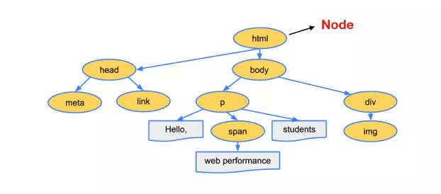
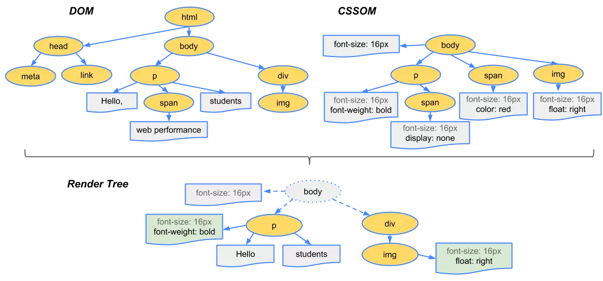
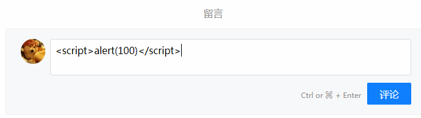
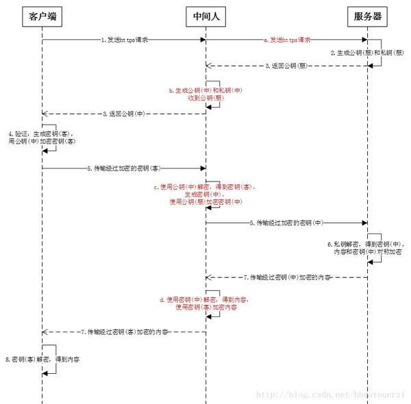
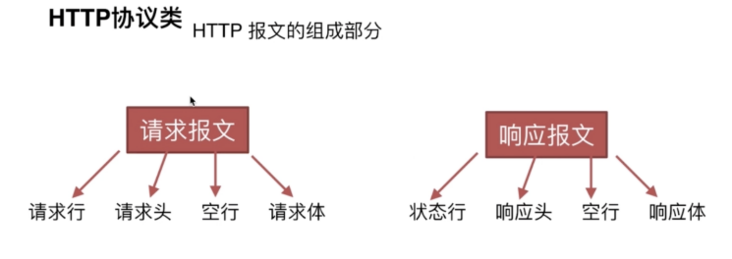
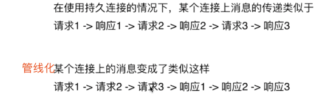

# 前端进阶指北

## 浏览器相关基础面试题

### 事件机制

#### 注册事件
注册事件，我们一般使用`addEventListener(name, callback, boolean)`函数，该函数支持三个参数，参数说明如下：
1. `name`：代表待注册事件的名字，例如：`click`或者`mouseover`
2. `callback`：代表注册事件的回调函数
3. `boolean`：一个`boolean`值，为`true`代表事件捕获时触发，为`false`时代表事件冒泡时触发。参数缺省时默认为`false`
```js
// 一个注册事件的案例
// 点击DOM元素时。顺序打印出：捕获时触发 冒泡时触发
var box = document.getElementById('box');
DOM 0 
  box.onclick = function(){}
DOM 2
  box.addEventListener('click', () => {
    console.log('捕获时触发');
  }, true);
  box.addEventListener('click',() => {
    console.log('冒泡时触发');
  }, false);
```


#### 事件触发顺序
::: tip
在浏览器中，事件的触发顺序一般而言依据：**捕获**->**目标阶段**->**冒泡**三个顺序。但事件的触发顺序并不总是按以上顺序执行，当我们给同一个DOM元素同时注册捕获和冒泡事件时，事件的触发顺序是按你**注册事件的顺序**来执行的。
::: 
**捕获**: window→document→html→boby→...目标元素

**冒泡**: 目标元素→boby→html→document→window
```js
// 点击DOM元素时。顺序打印出：冒泡时触发 捕获时触发
var box = document.getElementById('box');
box.addEventListener('click',() => {
  console.log('冒泡时触发');
}, false);
box.addEventListener('click', () => {
  console.log('捕获时触发');
}, true);
```

**阻止事件冒泡：** `stopPropagation()`和`stopImmediaPropagation()`方法都能阻止事件的向上冒泡，但这两者是有区别的：`stopImmediaPropagation()`还能阻止目标执行别的注册事件。
```js
// 阻止事件冒泡
// 1. 当不阻止冒泡时，window的click会触发
// 2. 当使用stopPropagation()时，window的click不会被触发
// 3. 当使用stopImmediatePropagation()时，DOM的捕获事件不会触发，window的click不会触发
box.addEventListener('click',(event) => {
  console.log('冒泡时触发');
  // event.preventDefault()     // 阻止默认事件
  // event.stopPropagation();   // 阻止冒泡
  // event.stopImmediatePropagation(); // 事件响应优先级,一个按钮绑定两个事件，在其中一个事件回调中调用此方法，另一个事件不会执行。
  // event.currentTarget // 可做事件委托，把子元素的事件都代理绑定在父级元素上，这样只需要绑定一次，然后通过它，就可以获取当前触发的具体节点。
  // event.target // 当前(父级)所绑定的事件 。
}, false);
box.addEventListener('click', (event) => {
  console.log('捕获时触发');
}, true);
window.addEventListener('click', (event) => {
  console.log('子元素点击事件向上冒泡时触发');
})
```
#### 自定义事件
::: tip
Cunstome 和 Event: 区别Cunstome可以多传一个对象作为参数
:::
```js
var eve = new Event('cunstome') || new Cunstome('cunstome', params)
dom.addEventListener('cunstome', function(){
  console.log('cunstome')
})
dom.dispatchEvent(eve) // 触发事件
```
### 跨域
::: tip 同源策略
同源策略是指，一个源的客户端脚本在没有明确授权的情况下，不能访问另一个源的客户端脚本。当一个URL和另一个URL，只要**协议**、**域名**或者**端口号**有一个不同，则就会出现跨域。
解决跨域常用方法有：
1. JSONP
2. 跨域资源共享（CORS）
3. nginx代理跨域
4. nodejs中间件代理跨域
5. WebSocket协议跨域
6. postMessage
7. document.domain + iframe跨域
8. location.hash + iframe
9. window.name + iframe跨域
::: tip
反向代理是工作在 HTTP 上的，一般都是 Nginx。全国各地访问baidu.com就肯定要通过代理访问，不可能都访问百度的那台服务器。 （VPN正向代理，代理客户端）
:::
#### JSONP实现跨域
::: tip 原理
JSONP实现跨域的原理是利用`script`标签没有跨域限制，通过`src`指向一个`ajax`的URL，最后跟一个回调函数`callback`
:::
```js
// 一个JSONP跨域的案例
<script src="http://www.baidu.com/getUserInfo?name=张三&callback=jsonp"></script>
function jsonp() {
  console.log('JSONP实现跨域');
}
```
```js
// 实现自己的JSONP
var jsonp = function (url, data, callback) {
  var cbName = 'callback_' + new Date().getTime();
  var queryString = url.indexOf('?') == -1 ? '?' : '&';
  for (var k in data) {
    queryString += k + '=' + data[k] + '&';
  }
  queryString += 'callback=' + cbName;
  var script = document.createElement('script');
  script.src = url + queryString;
  window[cbName] = function (data) {
    callback(data);
    document.body.removeChild(script);
  };
  document.body.appendChild(script);
}
// 实测
jsonp('http://api.douban.com/v2/movie/in_theaters', {'count': 1}, function (data) {
  console.log(data)
})
```

#### CORS实现跨域
::: tip
CORS：`CORS`需要浏览器和后端同时配合才能生效，后端通过设置`Access-Control-Allow-Origin`就可以开启哪些域名可以使用`CORS`跨域，在进行`CORS`跨域请求时，会出现简单请求或者复杂请求。
:::

**CORS简单请求**：当请求方式为`get`，`head`、`post`之一并且`Content-Type`为`text/plain`、`multipart/form-data`、`application/x-www-form-urlencoded`三种之一时，就是简单请求。

**CORS复杂请求：** 当不符合简单请求时，就是复杂请求，对于复杂请求来说，首先会发送一个`option`请求，用于知道服务器是否允许跨域请求。

#### document.domain实现跨域
::: tip
document.domain只能用于**二级域名相同**的情况下
```js
// 域名a.test.com 和域名b.test.com
// 设置如下代码后，二级域名为test.com的网站都能实现跨域
document.domain = 'test.com'
```
:::

#### postMessage
::: tip
`postMessage`
1. 页面和其打开的新窗口的数据传递
2. 多窗口之间消息传递
3. 页面与嵌套的iframe消息传递
4. 上面三个场景的跨域数据传递
:::
```html
<body>
  <iframe src="https://www.baidu.com" frameborder="0"></iframe>
</body>
```
```js
// 父页面发送请求
window.frames[0].postMessage('getcolor','*');
// 父页面接受请求
window.addEventListener('message',function(e){
  console.log(e.data); // 打印red
},false);

// 子页面发送请求
window.addEventListener('message',function(e){
  window.parent.postMessage('red','*');
},false);
```
 #### nginx代理跨域
1. **nginx配置解决iconfont跨域**

浏览器跨域访问js、css、img等常规静态资源被同源策略许可，但iconfont字体文件(eot|otf|ttf|woff|svg)例外，此时可在nginx的静态资源服务器中加入以下配置。
```js
location / {
  add_header Access-Control-Allow-Origin *;
}
```
2. **nginx反向代理接口跨域**

跨域原理： 同源策略是浏览器的安全策略，不是HTTP协议的一部分。服务器端调用HTTP接口只是使用HTTP协议，不会执行JS脚本，不需要同源策略，也就不存在跨越问题。

实现思路：通过nginx配置一个代理服务器（域名与domain1相同，端口不同）做跳板机，反向代理访问domain2接口，并且可以顺便修改cookie中domain信息，方便当前域cookie写入，实现跨域登录。
```
#proxy服务器
server {
    listen       81;
    server_name  www.domain1.com;

    location / {
        proxy_pass   http://www.domain2.com:8080;  #反向代理
        proxy_cookie_domain www.domain2.com www.domain1.com; #修改cookie里域名
        index  index.html index.htm;

        # 当用webpack-dev-server等中间件代理接口访问nignx时，此时无浏览器参与，故没有同源限制，下面的跨域配置可不启用
        add_header Access-Control-Allow-Origin http://www.domain1.com;  #当前端只跨域不带cookie时，可为*
        add_header Access-Control-Allow-Credentials true;
    }
}
```

### 浏览器存储
::: tip
浏览器存储有如下四种方法，每种方法都有不同支持，具体特性请参考表格
1. cookie
2. localStorage
3. sessionStorage
4. indexDB
:::


#### Cookie
**设置cookie**
```js
function setCookie(cname, cvalue, exdays) {
  var d = new Date();
  d.setTime(d.getTime() + (exdays*24*60*60*1000));
  var expires = "expires="+d.toUTCString();
  document.cookie = cname + "=" + cvalue + "; " + expires;
}
setCookie('name', 'why', 30);
```

**获取cookie**
```js
function getCookie(name) {
  var arr, reg = new RegExp("(^| )" + name + "=([^;]*)(;|$)");
  if (arr = document.cookie.match(reg))
    return unescape(arr[2]);
  else
    return null;
}
setCookie('name', 'why', 30);
console.log(getCookie('name')); // 打印why
```

#### localStorage 和 sessionStorage
**设置localStorage和sessionStorage**
```js
localStorage.setItem('name','why');
sessionStorage.setItem('age',23);
```

**获取localStorage和sessionStorage**
```js
localStorage.setItem('name','why');
console.log(localStorage.getItem('name')); // 打印why
sessionStorage.setItem('age',23);
console.log(sessionStorage.getItem('age'));// 打印23
```

#### service worker
`Service Worker`是运行在浏览器背后的独立进程，一般可以用来实现缓存功能，实现`Service Worker`的话，必须使用https传输协议，一个实现`Service Worker`缓存`js`文件可以如下写
```js
if('serviceWorker' in navigator) {
  navigator.serviceWorker.register('./1.js').then(success => {
    console.log('注册成功');
  }).catch(error => {
    console.log('注册失败');
  })
}
```

## 浏览器其他面试题
一个浏览器数据请求会经历三个步骤：**发起网络请求**、**后端处理**、**浏览器响应**。浏览器缓存可以让我们在第一步和第三步中优化性能。

### 缓存机制

#### 缓存位置
::: tip
缓存在不同的位置，它的优先级是不同的，缓存按优先级可以划分为：
1. Service Worker可以让我们自由控制应该缓存哪些文件(PWA实现的重要手段)
2. Memory Cache(内存缓存)内存缓存读取效率高，但一旦我们关闭了浏览器，内存缓存也就没有了。
3. Disk Cache(硬盘缓存)与内存缓存相比，硬盘缓存具有量大以及时效的两大优点。
4. Push Cache当前三者缓存都没有命中时，才会读取Push Cache中的缓存信息，但此种方式的缓存信息时间较短，只在会话`Session`中存在，一旦会话结束也就释放了。
5. 当以上缓存都没有命中时，才会发起请求。
:::

#### 缓存策略
::: tip
通常来说，浏览器缓存策略分为两种：**强缓存**和**协商缓存**，缓存策略可通过HTTP Header来实现。
:::
**强缓存：** 强缓存可以通过设置`Expires`和`Cache-Control`来实现，强缓存表示在缓存期间，不需要请求，`State Code`为200，并且Size显示from disk cache或from memory cach, `Cache-Control`可以组合使用多个指令，常见指令如下所示：


**Expires：** 缓存过期时间，用来指定资源到期的时间，是服务器端的具体的时间点，HTTP/1 的产物，受限于本地时间，如果修改了本地时间，可能会造成缓存失效。Expires: Wed, 22 Oct 2018 08:41:00 GMT表示资源会在 Wed, 22 Oct 2018 08:41:00 GMT 后过期，需要再次请求。

**Cache-Control：** `Cache-Control:max-age=300` max-age代表相对时间，不管服务端客户端时间是否一致，以客户端为主，拿个这个请求300m之内不会再次请求服务器了。

**协商缓存：** 协商缓存就是强制缓存失效后，浏览器携带缓存标识向服务器发起请求验证资源是否有更新，可通过设置HTTP Header的`Last-Modified`和`ETag`来实现，如果资源没有改变，`State Code`为304

**Last-Modified(上次修改时间)和If-Modified-Since**
浏览器在第一次访问资源时，服务器返回资源的同时，在response header中添加 Last-Modified的header，值是这个资源在服务器上的最后修改时间，浏览器接收后缓存文件和header；
浏览器下一次请求这个资源，浏览器检测到有 Last-Modified这个header，于是添加If-Modified-Since这个header，值就是Last-Modified中的值；服务器再次收到这个资源请求，会根据 If-Modified-Since 中的值与服务器中这个资源的最后修改时间对比，如果没有变化，返回304和空的响应体，直接从缓存读取，如果If-Modified-Since的时间小于服务器中这个资源的最后修改时间，说明文件有更新，于是返回新的资源文件和200

**但是 Last-Modified 存在一些弊端：**

1. 如果本地打开缓存文件，即使没有对文件进行修改，但还是会造成 Last-Modified 被修改，服务端不能命中缓存导致发送相同的资源
2. 因为 Last-Modified 只能以秒计时，如果在不可感知的时间内修改完成文件，那么服务端会认为资源还是命中了，不会返回正确的资源

既然根据文件修改时间来决定是否缓存尚有不足，能否可以直接根据文件内容是否修改来决定缓存策略？所以在 HTTP / 1.1 出现了ETag和If-None-Match
**Etag:** 是服务器响应请求时，返回当前资源文件的一个唯一标识(由服务器生成)，只要资源有变化，Etag就会重新生成(相当于哈希值)。
### 渲染原理

#### DOM树
浏览器在接受到服务器传递回来的字节流数据后，会经过转换，把`0`和`1`的字节流数据转换成DOM树结构，会经历如下图所示的过程：


最终可能回渲染成如下的DOM树结构：



#### CSSDOM
与DOM树渲染过程类似，CSSOM树渲染过程会经历如下图所示的过程：


#### DOM和CSSOM树合并
当DOM树和CSSOM树渲染完毕后，就会合并在一起形成一个渲染树，渲染树并不是简单的将DOM树和CSSOM树简单的合并在一起，渲染树只包含需要显示的DOM节点。渲染树合并完毕后，然后会根据渲染树进行布局，随后调用GPU进行绘制，显示在屏幕上。


#### 从浏览器地址栏输入url到页面
1. 浏览器根据 DNS 服务器得到域名的 IP 地址

`DNS是一个网络服务器，DNS存在着多级缓存，从离浏览器的距离排序的话，有以下几种: 浏览器缓存，系统缓存，路由器缓存，IPS服务器缓存，根域名服务器缓存，顶级域名服务器缓存，主域名服务器缓存。`
2. 是否命中缓存，无命中 TCP 连接：TCP 三次握手
3. 向这个 IP 的机器发送 HTTP 请求
4. 服务器收到、处理并返回 HTTP 请求
5. 浏览器解析渲染页面
6. 断开连接：TCP 四次挥手

#### 页面渲染过程
1. 处理 HTML(HTML Parser) 标记并构建 DOM 树。
2. 处理 CSS 标记并构建 CSSOM 树。
3. 将 DOM 与 CSSOM 合并成一个渲染树。
4. Layout根据渲染树来布局，以计算每个节点的几何信息。
5. 将各个节点绘制到屏幕上。

**CSS**

link 标签（无论是否 inline）会被视为阻塞渲染的资源，浏览器会优先处理这些 CSS 资源，直至 CSSOM 构建完毕。

**JavaScript**

`script` 标签会阻塞 `HTML` 解析
改变阻塞模式：`defer` 与 `async`
::: tip `defer` 和 `async` 的区别在于
1. `defer` HTML 结构完全生成，以及其他脚本执行完成，在window.onload 之前执行。
2. `async` 一旦下载完，渲染引擎就会中断渲染，执行这个脚本以后，再继续渲染。
3. 如果有多个 `defer` 脚本，会按照它们在页面出现的顺序加载
4. 多个 `async` 脚本不能保证加载顺序
:::
### 回流（Reflow/重排）与重绘（Repaint）
::: tip
1. 当`render tree`(渲染树)中的一部分(或全部)因为元素的规模尺寸，布局，隐藏等改变而需要重新构建。这就称为回流(reflow)。每个页面至少需要一次回流，就是在页面第一次加载的时候。在回流的时候，浏览器会使渲染树中受到影响的部分失效，并重新构造这部分渲染树，完成回流后，浏览器会重新绘制受影响的部分到屏幕中，该过程成为重绘。
2. 当`render tree`中的一些元素需要更新属性，而这些属性只是影响元素的外观，风格，而不会影响布局的，比如background-color。则就叫称为重绘。
:::
**注意：回流必将引起重绘，而重绘不一定会引起回流。**

**当页面布局和几何属性改变时就需要回流。下述情况会发生浏览器回流：**
1. 添加或者删除可见的DOM元素；
2. 元素位置改变；
3. 元素尺寸改变——边距、填充、边框、宽度和高度、改变盒模型
4. 内容改变——比如文本改变或者图片大小改变而引起的计算值宽度和高度改变；
5. 页面渲染初始化；
6. 浏览器窗口尺寸改变——resize事件发生时；
#### 重绘和回流其实也和 Eventloop 有关（衍生React Fiber）
1.  当 Eventloop 执行完 Microtasks 后，会判断`document`是否需要更新，因为浏览器是 60Hz 的刷新率，每 16.6ms 才会更新一次。
2.  然后判断是否有`resize`或者`scroll`事件，有的话会去触发事件，所以`resize`和`scroll`事件也是至少 16ms 才会触发一次，并且自带节流功能。
3.  判断是否触发了 media query
4.  更新动画并且发送事件
5.  判断是否有全屏操作事件
6.  执行`requestAnimationFrame`回调
7.  执行`IntersectionObserver`回调，该方法用于判断元素是否可见，可以用于懒加载上，但是兼容性不好
8.  更新界面
9.  以上就是一帧中可能会做的事情。如果在一帧中有空闲时间，就会去执行`requestIdleCallback`回调
#### 减少重绘和回流
1. 使用`transform`替代`top`
2. 使用`visibility`替换`display: none`，因为前者只会引起重绘，后者会引发回流（改变了布局）
3. 不要把节点的属性值放在一个循环里当成循环里的变量
for(let i = 0; i < 1000; i++) { // 获取 offsetTop 会导致回流，因为需要去获取正确的值  console.log(document.querySelector('.test').style.offsetTop) }
4. 不要使用`table`布局，可能很小的一个小改动会造成整个`table`的重新布局
5. 动画实现的速度的选择，动画速度越快，回流次数越多，也可以选择使用`requestAnimationFrame`
6. 将频繁重绘或者回流的节点设置为图层，图层能够阻止该节点的渲染行为影响别的节点。比如对于`video`标签来说，浏览器会自动将该节点变为图层。
7. var fragment = document.createDocumentFragment();
## 安全防范面试题
### XSS跨域脚本攻击
::: tip
XSS攻击简单来说就是攻击者想尽一切办法把可执行的代码嵌入到页面中，可以窃取 Cookie 信息、监听用户行为（键盘事件输入密码）、修改DOM模拟登入框、插入悬浮广告，以达到非法窃取某些数据或者破坏的目的。
:::
网络劫持在页面传输过程中修改 HTML 页面的内容，这种劫持类型很多，有通过 WiFi 路由器劫持,运营商劫持

**依据情景的不同，XSS攻击可分为两种类型**
#### 反射性XSS
用户将一段含有恶意代码的请求提交给 Web 服务器，Web 服务器接收到请求时，又将恶意代码反射给了浏览器端(不存储)，一个反射性XSS可能如下所示
```js
// 搜索地址栏取参数
// http://localhost:3000/?xss=<script>alert('你被xss攻击了')</script>
/* GET home page. */
router.get('/', function(req, res, next) {
  res.render('index', { title: 'Express',xss:req.query.xss });
});
<div>
  <%- xss %>
</div>
```

#### 存储型XSS
用户将一段含有恶意代码的请求提交给 Web 服务器，Web 服务器接收到请求时，又将恶意代码反射给了浏览器端(不存储



#### XSS防御
::: tip
1. 将由用户输入的内容，进行必要的标签转义，包括`<`、`>`、`/`等,`React.dangerouslySetInnerHTML`
2. 再服务端设置`cookie`属性`httpOnly`防止客户端通过`document.cookie`读取
3. 过滤一些危险属性或者方法，例如`onerror`方法、`href`属性、`src`属性等
4. 充分利用 CSP
:::
```js
React.dangerouslySetInnerHTML
var txt="<script>alert('1')</script>";
txt=txt.replace(/<script|<\/script/ig,function(c){
    return "&lt;"+c.substring(1);
});
code:<script>alert('你被xss攻击了')</script>

// 很多 XSS 攻击都是来盗用 Cookie 的，因此还可以通过使用 HttpOnly 属性来保护我们 Cookie 的安全。
// HTTP 响应头来设置
`set-cookie: NID=189=M8q2FtWbsR8RlcldPVt7qkrqR38LmFY9jUxkKo3-4Bi6Qu_ocNOat7nkYZUTzolHjFnwBw0izgsATSI7TZyiiiaV94qGh-BzEYsNVa7TZmjAYTxYTOM9L_-0CN9ipL6cXi8l6-z41asXtm2uEwcOC5oh9djkffOMhWqQrlnCtOI; expires=Sat, 18-Apr-2020 06:52:22 GMT; path=/; domain=.google.com; HttpOnly`
```

### CSP内容安全策略
::: tip
CSP内容安全策略本质上来说是建立白名单机制，告诉浏览器哪些外部资源可以加载和执行，我们只需要配置，拦截主要交给浏览器。
:::

通常有两种方法设置CSP：
1. 通过设置`HTTP Header`的`Content-Security-Policy`
2. 通过`meta`标签来设置，例如：`<meta http-equiv="Content-Security-Policy">`

```js
// 1、限制加载其他域下的资源文件，这样即使黑客插入了一个 JavaScript 文件，这个 JavaScript 文件也是无法被加载的；
// 2、禁止向第三方域提交数据，这样用户数据也不会外泄；
// 3、禁止执行内联脚本和未授权的脚本；
// 4、还提供了上报机制，这样可以帮助我们尽快发现有哪些 XSS 攻击，以便尽快修复问题。
Content-Security-Policy:default-src * data: blob:;script-src 'self' *.netease.com *.127.net *.126.net *.163.com *.w3t.cn *.googletagmanager.com *.google-analytics.com *.googleadservices.com *.google.com res.wx.qq.com 127.0.0.1:* 'unsafe-inline' 'unsafe-eval' blob:;style-src * 'unsafe-inline' data:;img-src 'self' *.netease.com *.127.net *.126.net *.163.com *.doubleclick.net *.googletagmanager.com *.google-analytics.com *.googleadservices.com *.google.com res.wx.qq.com 127.0.0.1:* data:
*   script-src： 只允许加载网易域内的内容以及统计，微信等的js。
*   img-src： 只允许加载网易域内，或者统计服务域的内容（比如google统计服务通过获取图片的方式上传数据）
```

### CSRF跨域请求伪造
::: tip
CSRF攻击原理上是攻击者伪造一个后端请求地址，诱导用户进行点击，如果用户在**已登录**的情况,并在本地生成Cookike,下点击了这个危险链接，则后端服务器会认为是用户在正常访问，攻击者从而可以从请求中拿到一些信息，进而进行攻击。
:::
``` html
<!DOCTYPE html>
<html>
  <body>
    <h1>黑客的站点：图片地址伪装get请求</h1>
    
  </body>
</html>
// 在不登出A的情况下，访问危险网站B（其实是利用了网站A的漏洞，温馨提示一下，cookie保证了用户可以处于登录状态，但网站B其实拿不到 cookie。 （新浪微博关注get请求，利用这个漏洞点击连接批量关注）
```
#### CSRF防御
::: tip
CSRF防御有如下几种方式：
1. `Get`请求不对数据进行修改
2. 不让第三方网站访问用户的`Cookie`，可以通过`Cookie`的`SameSite`属性
3. 阻止第三方网站请求
4. 在进行请求时，附加`refer`验证和`token`验证(Token用的最多，自定义Token在请求头,避免模拟get请求直接携带cookie)

通过 Referer 告诉服务器 HTTP 请求的来源。
Origin 属性只包含了域名信息，并没有包含具体的 URL 路径
:::

### 点击劫持
::: tip
点击劫持是一种视觉欺骗的攻击手段。攻击者将需要攻击的网站通过 iframe 嵌套的方式嵌入自己的网页中，并将 iframe 设置为透明，在页面中透出一个按钮诱导用户点击。
:::

#### 防御手段
设置HTTP响应头`X-FRAME-OPTIONS`，它可以设置`DENY`、`SAMEORIGIN`、`ALLOW-FROM`分别表示不允许`iframe`展示、只允许永远`iframe`展示、表示页面可以在指定来源的`iframe`中展示。


### 中间人攻击
::: tip
中间人攻击是攻击方同时与服务端和客户端建立起了连接，并让对方认为连接是安全的，但是实际上整个通信过程都被攻击者控制了。攻击者不仅能获得双方的通信信息，还能修改通信信息。一般来说使用`HTTPS`协议可以有效防止中间人攻击，但并不是说`HTTPS`就可以高枕无忧，因为攻击者可以通过某种方式从`HTTPS`降级到`HTTP`进行访问。
:::



### 异常监控
**一、即使运行错误： 代码错误**
```js
// try...catch(IE)
// window.onerror
window.addEventListener('error', function(`errorMessage, scriptURI, lineNo, columnNo, error`) {
    console.log('errorMessage: ' + errorMessage); // 异常信息
    console.log('scriptURI: ' + scriptURI); // 异常文件路径  
    console.log('lineNo: ' + lineNo); // 异常行号
    console.log('columnNo: ' + columnNo); // 异常列号 
    console.log('error: ' + error); // 异常堆栈信息
}, true)
// 跨域的js运行
// 1.在script标签增加 crossorigin
//  2. 服务端设置js资源响应头access-control-allow-headers： *
```
**二、资源加载错误**

1. `object.onerror`（例如:img.onerror/video.onerror/script.onerror,且不会冒泡）
2. `performance.getEntries()`
3. 利用`window.onerror`的捕获

**三、框架提供**

1. Vue 2.x中我们应该这样捕获全局异常：`Vue.config.errorHandler`
2. React 16.x 版本中引入了 `Error Boundary`
3. `sourceMap`解析
4. funbug 或者 bad.js等第三方库
### 如何监控网页崩溃？
强烈建议阅读[如何监控网页崩溃](https://zhuanlan.zhihu.com/p/40273861)

网页都崩溃了，页面看不见了，JS 都不运行了，还有什么办法可以监控网页的崩溃，并将网页崩溃上报呢

**一、利用`load` 与 `beforeunload`,页面崩溃无法触发 `beforeunload` 事件**
```js
window.addEventListener('load', function () {
    sessionStorage.setItem('good_exit', 'pending');
    setInterval(function () {
        sessionStorage.setItem('time_before_crash', new Date().toString());
    }, 1000);
  });

  window.addEventListener('beforeunload', function () {
    sessionStorage.setItem('good_exit', 'true');
  });

  if(sessionStorage.getItem('good_exit') &&
    sessionStorage.getItem('good_exit') !== 'true') {
    /*
        insert crash logging code here
    */
    alert('Hey, welcome back from your crash, looks like you crashed on: ' + sessionStorage.getItem('time_before_crash'));
  }
```
**二、基于`Service Worker` 的崩溃统计方案**

1. Service Worker 有自己独立的工作线程，与网页区分开，网页崩溃了，Service Worker 一般情况下不会崩溃；
2. Service Worker 生命周期一般要比网页还要长，可以用来监控网页的状态；
3. 网页可以通过 navigator.serviceWorker.controller.postMessage API 向掌管自己的 SW 发送消息(心跳检测)。
```js
// 页面 JavaScript 代码
if (navigator.serviceWorker.controller !== null) {
  let HEARTBEAT_INTERVAL = 5 * 1000; // 每五秒发一次心跳
  let sessionId = uuid();
  let heartbeat = function () {
    navigator.serviceWorker.controller.postMessage({
      type: 'heartbeat',
      id: sessionId,
      data: {} // 附加信息，如果页面 crash，上报的附加数据
    });
  }
  window.addEventListener("beforeunload", function() {
    navigator.serviceWorker.controller.postMessage({
      type: 'unload',
      id: sessionId
    });
  });
  setInterval(heartbeat, HEARTBEAT_INTERVAL);
  heartbeat();
}
```
#### 上报错误信息
1. 采用Ajax通信方式上报
2. 利用newImage上报信息(代码简单，不需要第三方库, 可跨域，不需要接受会调响应)
## 页面性能优化
::: tip
1. 降低请求量
2. 加快请求速度
3. 缓存
4. 渲染: JS/CSS 优化，加载顺序，服务端渲染，pipeline。
:::
1. 使用HTTP2.0(首部压缩、多路复用、服务器推送)
2. 使用CDN
3. DNS预解析(预热):DNS请求需要的带宽非常小，但是延迟却有点高，这点在手机网络上以及网站用到多域名资源特别明显，而一次典型的DNS解析一般需要20-200ms，所以DNS预解析可以让延迟明显减少一些。（尤其是移动网络环境下）页面的加载。在某些图片较多的页面中，在发起图片加载请求之前预先把域名解析好将会有至少 5% 的图片加载速度提升
```html
// 打开和关闭DNS预读取
<meta http-equiv="x-dns-prefetch-control" content="on">
// 强制查询特定主机名
<link rel="dns-prefetch" href="//hm.baidu.com">
// 关于a标签: 浏览器默认开启DNS预解析，但是在https下默认关闭，所以需要mata标签强制开启
<a href="http://www.baidu.com"></a>
```
4. 利用浏览器缓存→缓存分类(强缓存、协商缓存)→缓存原理
5. `Web Worker` 的作用，就是为 JavaScript 创造多线程环境，允许主线程创建 Worker 线程，将一些任务分配给后者运行
```js
var worker = new Worker('work.js');
worker.postMessage('Hello World');
worker.postMessage({method: 'echo', args: \['Work'\]});
Service Worker 有自己独立的工作线程，与网页区分开，网页崩溃了，Service Worker 一般情况下不会崩溃；
```
6. `Service Worker`，Service Worker的目的在于离线缓存，转发请求和网络代理。Service Worker 是在 Web Worker 的基础上加上了持久离线缓存能力
``` js
// 1. Service Worker 有自己独立的工作线程，与网页区分开，网页崩溃了，Service Worker 一般情况下不会崩溃,生命周期一般要比网页还要长，可以用来监控网页(心跳检测)的状态；
  navigator.serviceWorker.controller.postMessage()
// 2.借助webpack插件WorkboxWebpackPlugin和ManifestPlugin,加载serviceWorker.js,通过serviceWorker.register()注册
// Service Worker实际上是浏览器和服务器之间的代理服务器，它最大的特点是在页面中注册并安装成功后，运行于浏览器后台，不受页面刷新的影响，可以监听和截拦作用域范围内所有页面的 HTTP 请求。
new WorkboxWebpackPlugin.GenerateSW({
    clientsClaim: true,
    exclude: [/\.map$/, /asset-manifest\.json$/],
    importWorkboxFrom: 'cdn',
    navigateFallback: paths.publicUrlOrPath + 'index.html',
    navigateFallbackBlacklist: [
        new RegExp('^/_'),
        new RegExp('/[^/?]+\\.[^/]+$'),
    ],
}),

new ManifestPlugin({
    fileName: 'asset-manifest.json',
    publicPath: paths.publicUrlOrPath,
    generate: (seed, files, entrypoints) => {
        const manifestFiles = files.reduce((manifest, file) => {
            manifest[file.name] = file.path;
            return manifest;
        }, seed);
        const entrypointFiles = entrypoints.app.filter(
            fileName => !fileName.endsWith('.map')
        );

        return {
            files: manifestFiles,
            entrypoints: entrypointFiles,
        };
    },
}),
```
7. 压缩资源合并，服务开启gzip，图片base/webp/雪碧图，骨架屏幕，懒加载,减少HTTP请求
```js
// 例如使用阿里云的oss存储服务，只需要在图片链接尾部拼接webp
const isWebp =  document.createElement('canvas').toDataURL('image/webp').indexOf('data:image/webp') == 0;
const url = `https://www.gordanlee.com/image/log.png?x-oss-process=image/format,webp`
```
8. 非核心代码异步加载→异步加载的方式→异步加载的区别
``` js
  1. defer —— 以前适用于IE，现在适用于所有主流浏览器
  2. async —— h5新属性
  3. 动态生成script标签jsonp,如vue按需加载
```
9. 窗口化:只加载当前窗口能显示的DOM元素，当视图变化时，删除隐藏的，添加要显示的DOM就可以保证页面上存在的dom元素数量永远不多，页面就不会卡顿
```js
 1. npm i react-window // 使用react-window去做长列表渲染
 2. content-visibility: auto; // content-visibility可以实现可见网页只加载可见区域内容，使网页的渲染性能得到数倍(四倍)的提升。
```
## HTTP相关面试题
### 七层网络模型
应用层、表示层、会话层、传输层、网络层、数据链路层、物理层
### TCP和UDP
::: tip
1. TCP 是面向连接的，udp 是无连接的即发送数据前不需要先建立链接。
2. TCP 提供可靠的服务。也就是说，通过 TCP 连接传送的数据，无差错，不丢失， 不重复，且按序到达;UDP 尽最大努力交付，即不保证可靠交付。 并且因为 tcp 可靠， 面向连接，不会丢失数据因此适合大数据量的交换。
3. TCP 是面向字节流，UDP 面向报文，并且网络出现拥塞不会使得发送速率降低(因 此会出现丢包，对实时的应用比如 IP 电话和视频会议等)。
4. TCP 只能是 1 对 1 的，UDP 支持 1 对 1,1 对多。
5. TCP 的首部较大为 20 字节，而 UDP 只有 8 字节。
6. TCP 是面向连接的可靠性传输，而 UDP 是不可靠的。
TCP应用场景：HTP，HTTP，邮件
UDP应用场景：即时通讯, 游戏
:::
**大白话区别：** UDP/TCP，UDP数据往往没有保障,但速度快,通常用于查询和响应，TCP由于多次验证，传输有保证，但速度慢，多用于主服务器和从服务器之间的传,`WebSocket`也是属于`TCP`
### TCP 三次握手
:::tip
客服端发c起请求连接服务器端s确认，服务器端也发起连接确认客服端确认。
1. 第一次握手：客服端发送一个请求连接，服务器端只能确认自己可以接受客服端发送的报文段
2. 第二次握手：服务端向客服端发送一个链接，确认客服端收到自己发送的报文段
3. 第三次握手：服务器端确认客服端收到了自己发送的报文段
:::
#### HTTP协议的主要特征
1. 简单快速： 统一资源符
2. 灵活：通过Http协议就可以完成数据传输
3. 无连接：连接一次就会断，不会保持连接
4. 无状态：下次客户端再请求服务端，服务端是无法确认连接者的身份（目前通过加Session区分，与http无关）


**请求行：** http 方法（get、post、put、delete、head）、页面地址、http协议、http版本

**请求头：** key=value&

**请求空行：** 请求头 和 请求体的分割，告诉服务端之后的内容是请求体

**请求体：** key=value&
### HTTP1.0、HTTP1.1、HTTP2.0
建议阅读有关[HTTP详解](https://blog.csdn.net/yexudengzhidao/article/details/98207149)
#### HTTP1.0
无状态、无连接
#### HTTP1.1:
1. 持久连接（keep-Alive）
2. 请求管道化
3. 增加缓存处理（新的字段如cache-control）
4. 增加Host字段、支持断点传输等（把文件分成几部分)
#### HTTP2.0:
1. **多路复用：** 相同域名多个请求，共享同一个TCP连接，降低了延迟,我们经常会使用到雪碧图、使用多个域名等方式来进行优化，都是因为浏览器限制了同一个域名下的请求数量，当页面需要请求很多资源的时候，队头阻塞（Head of line blocking）会导致在达到最大请求时，资源需要等待其他资源请求完成后才能继续发送
2. **请求优先级：** 给每个request设置优先级
3. **二进制分帧：** 之前是用纯文本传输
4. **数据流：** 数据包不是按顺序发送，对数据包做标记。每个请求或回应的所有数据包成为一个数据流，
5. **服务端推送：** 可以主动向客户端发送消息，服务器可以对一个客户端的请求发送多个响应。如果一个请求是由你的主页发送的，服务器可能会响应主页内容、logo以及样式表，因为他知道客户端会用到这些东西。这样不但减轻了数据传送冗余步骤，也加快了页面响应的速度，提高了用户体验
6. **头部压缩：** 减少包的大小跟数量,我们使用了HPACK（HTTP2头部压缩算法）压缩格式对传输的header进行编码，减少header的大小。并在两端维护了索引表，用于记录出现过的header，后面在传输过程中就可以传输已经记录过的header的键名，对端收到数据后就可以通过键名找到对应的值
#### 持久连接(http1.1+) 和 非持久连接
**非持久连接:** HTTP协议采用“请求-应答”模式，当使用普通模式，即非KeepAlive模式时，每个请求/应答客户和服务器都要新建一个连接，完成之后立即断开连
接（HTTP协议为无连接的协议）

**持久连接:** 当使用Keep-Alive模式（又称持久连接、连接重用）时，Keep-Alive功能使客户端到服务器端的连接持续有效，当出现对服务器的后继请求时，Keep-Alive功能避免了建立或者重新建立连接。
#### HTTP的管线化技术


管线化是指将多个HTTP请求整批发送，在发送过程中不用等待对方响应。很明显管线化是在持久连接的基础上实现的，管线化的实现，能够同时并行发送多个请求，而不需要一个接一个的等待响应。并且只有**GET**和**HEAD**请求可以进行管线化，而POST则有所限制。此外，初次创建连接时也不应启动管线机制，因为对方（服务器）不一定支持HTTP/1.1版本的协议。
### HTTPS
:::tip
HTTPS 的 SSL 加密是在传输层实现的。

**HTTP:** 超文本传输协议，是互联网上应用最为广泛的一种网络协议，是一个客户端和服 务器端请求和应答的标准(TCP)，用于从 WWW 服务器传输超文本到本地浏览器的传 输协议，它可以使浏览器更加高效，使网络传输减少。

**HTTPS:** 是以安全为目标的 HTTP 通道，简单讲是 HTTP 的安全版，即 HTTP 下加入 SSL 层，HTTPS 的安全基础是 SSL，因此加密的详细内容就需要 SSL。

**过程:** 客户端先向服务器端索要公钥，然后用公钥加密信息，服务器收到密文后，用自己的私钥解密。服务器公钥放在数字证书中

**注意:** chrome在HTTP和HTTPS下相同域名可以并发的请求数不同：HTTP = 6，HTTPS > 13，
:::
### 对称加密与非对称加密
建议阅[读浅谈对称加密与非对称加密](https://www.cnblogs.com/lfri/p/12593232.html)
:::tip
HTTPS 在内容传输的加密上使用的是对称加密，非对称加密只作用在证书验证阶段
:::
**对称加密:** 加密和解密的秘钥使用的是同一个。
* 优点：算法简单，加密解密容易，效率高，执行快。
* 缺点：相对来说不算特别安全，只有一把钥匙，密文如果被拦截，且密钥也被劫持，那么，信息很容易被破译。

**非对称加密:** 与对称加密算法不同，非对称加密算法需要两个密钥：公开密钥（publickey）和私有密钥（privatekey)。
* 优点：安全，即使密文被拦截、公钥被获取，但是无法获取到私钥，也就无法破译密文。作为接收方，务必要保管好自己的密钥。
* 缺点：加密算法及其复杂，安全性依赖算法与密钥，而且加密和解密效率很低。
### HTTP常用状态码
:::tip
* **1XX 提示信息：** 表示请求已接到继续处理
* **2XX 成功：** 服务器成功的接收了客户端请求
* **3XX类 重定向：** 完成请求进行下一步操作

  301 redirect: 301 代表永久性转移(地址A的资源已经被永久地移除了,不可访问)

  302 redirect: 302 代表暂时性转移

  304 服务器告诉客户端你已经存在缓存了，可以继续使用

* **4XX 客户端错误：**  请求有语法错误 或请求无法实现

  400 客服端请求有语法错误，不能被服务器所理解

  401 请求未经许可

  403 对被请求页面的访问被禁止

  404 资源不存在
* **5XX 服务器错误：** 服务器未能实现合法请求

  500 服务器发生了不可预期的错误原来的缓冲的文档还可以继续使用

  503 请求未完成，服务器临时过载或宕机
:::
## 浏览器进程
### 单进程浏览器
:::tip
2007年之前，市面上的浏览器都是单进程的，即所有页面中所有的模块都运行在一个进程里，这些模块包括：网络、插件、javascript运行环境、渲染引擎、页面展现等,这么多模块都运行在一个进程中，是浏览器不稳定、不流畅和不安全的主要因素。
1. **不稳定:** 早起浏览器需要借助插件来实现web视频、web游戏等强大功能。但是插件是及其不稳定的因素，当插件崩溃时，会导致整个浏览器的崩溃，因为插件作为一个模块与其他模块都共同运行在浏览器进程中。除去插件模块外，渲染引擎模块也是不稳定的，一些复杂的javascript代码会是渲染引擎模块崩溃，导致浏览器崩溃
2. **不流畅:** 所有页面的渲染模块、javascript执行环境以及插件都运行在同一线程中，这就意味着同一时刻只能有一个模块可以执行。如果有一个无限循环的脚本运行在一个单进程的浏览器的页面里是，它会占据整个线程，这会导致运行在该线程中的其它模块，都没有机会被执行。因为浏览器中所有的页面都运行在此线程中，所以这些页面没有机会被执行，这样就会导致整个浏览器失去响应，变卡顿。页面的内存泄漏也会直接导致单进程变慢。运行复杂页面时，部分内存不能完全被回收，这样导致使用时间越长，内存占用越高，浏览器就会变的越慢。
3. **不安全:** 插件可以使用C/C++等代码编写，通过插件可以获取到操作系统的任何资源，当运行一个插件时，这个插件能完全操作你的电脑，如果是恶意插件的话，它可以在你的电脑上释放病毒或盗窃你的账号密码等。页面脚本可以通过浏览器漏洞获得你的系统权限，恶意的脚本可以通过获取到的权限，对你的电脑做一些恶意的事情。
:::
### 多进程浏览器
:::tip
1. 浏览器进程：主要负责界面显示、用户交互、子进程管理、提供存储功能等功能
2. 渲染进程：将HTML、CSS、Javascript转换为用户可以交互的界面，默认情况下，chrome会为每个Tab标签提供一个渲染进程，渲染进程是运行在沙箱模式下
3. GPU进程：chrome的UI界面都选择使用GPU来绘制
4. 网络进程：负责页面的网络资源加载
5. 插件进程：负责插件的运行，因为插件的易崩溃，所以需要通过插件进程来隔离，已保证插件崩溃时，不会影响浏览器以及其他页面资源
（如果是同一站点，从A页面点到B页面，此时，两个页面同用一个渲染进程，如果两个页面的站点不同，会是两个渲染进程，如果页面中有iframe，iframe也会自己占用一个进程）
:::