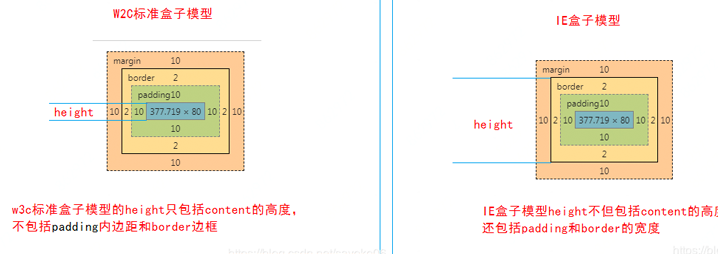
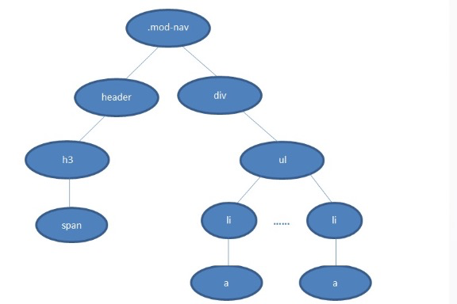

# 前端面试指北

## HTML和CSS相关基础面试题

### css盒模型

::: tip 区别：计算宽高的方式不一样。
1.IE盒子模型(怪异盒子)box-sizing :border-box;
width:200px = border + padding + content
2.W3C标准盒模型box-sizing : content-box;
width:200px = content
:::
**获取宽高:**
``` js
 1. dom.style.width/height (获取内连样式)
 2. dom.currentStyle.width/height(渲染以后的高度，仅IE)
 3. widonw.getComputedStyle(dom).width/height (最佳，兼容性好)
 4. dom.getBoundingClientRect().width/height/right/top
```
### BFC(块级格式化上下文，用于清楚浮动，防止margin重叠等)
::: tip
一个块格式化上下文（block formatting context） 是Web页面的可视化CSS渲染出的一部分。它是块级盒布局出现的区域，也是浮动层元素进行交互的区域。（当出现父子、或者兄弟margin重叠时，浏览器会默认取最大的）
:::
**BFC原理(渲染规则):**
1. 内部的box会在垂直方向，一个接一个地放置
2. BFC内，两个盒子的垂直距离由 margin 属性决定。属于同一个BFC的两个相邻Box的margin会发生重叠【符合合并原则的margin合并后是使用大的margin】
3. BFC内，每个盒子的左外边缘接触内部盒子的左边缘（对于从右到左的格式，右边缘接触）。即使在存在浮动的情况下也是如此。除非创建新的BFC。
4. BFC的区域不会与float box重叠。
5. BFC就是页面上的一个隔离的独立容器，容器里面的子元素不会影响到外面的元素。反之也如此。
6. 计算BFC的高度时，浮动元素也参与计算。
**如何创建BFC:**
``` js
根元素
float的值不为none  
overflow值不为visible  
position值不为static / relative  
display的值为table-cell，table-caption， inline-block 中的任何一个
```
### 选择器权重
::: tip
组合选择器的优先级：根据组合选择器的权重进行计算，权重大的优先级就高。
组合选择器权重计算方式：各选择器权重相加之和
!important > 行内样式>ID选择器 > 类选择器 > 标签 > 通配符* > 继承 > 浏览器默认属性
:::
``` js
1. *              0
2. 标签选择器      1
3. 类选择器        10
4. id选择器        100
5. style行间样式   1000
6. ！important    10000
7. 后代选择器 看里面的组成
```
### css选择器选择顺序是从右往左？


`.mod-nav ul li`
如果有是从左到右，首先就要检查当前元素到html的整条路径，找到最上层
的 .mod-nav，再往下找，遍历子节点header和子节点div,如果遇到不匹
配就必须回到最上层那个.mod-nav，往下找去.mod-nav匹配选择器中的第
一个ul，回溯若干次才能确定匹配与否，效率很低。逆向匹配则不同，如果
当前的DOM元素不是selector最后的li，那只要一步就能排除。只有在匹
配时，才会不断向上找父节点进行验证，这样效率是不是会高很多。
（减少回溯）
**总结**
1.  右边的tree复杂度要比左边的低
2.  右边的tree公用样式重合度比左边的低
3.  右边的tree从根开始的节点数要比左边的少

### querySelectorAll 和 getElementsByTagName的区别
::: tip 主要区别(返回值)
`querySelectorAll()`返回的是`NodeList`集合,`getElementsByTagName()`返回的是`HTMLCollection`集合。
其前者是一个动态集合，后者是一个静态集合。
`static NodeList`也就是说如果将它的返回结果保存下来，当文档更新时，保存的NodeList里的元素不会跟着更新。
:::
### 清楚浮动方法
1. 父元素 `overflow: hidden`;
2. 浮动元素后面的元素： `clear: both`;
3. 伪元素选择器:`.clear::after{ content:’’;display:block; clear:both;}`;
4. 父元素设置高度；
5. 父级元素：`display: table`;
### 如何做水平垂直居中？
**方案一：** 已知宽高，设置 `position: absolute;`，然后left和top都设置为50%，再根据`margin`的负值来调正

**方案二：** 类似方案一，最后一步用`transform:translate(-50%,-50%)`;

**方案三：** 绝对定位，top、bottom、left、right都设置为0，设置好宽高，然后margin: auto;

**方案四：** 父元素 `display:table-cell` + `vertical-align:middle`;

**方案五：** 使用flex弹性盒模型
```html
<div class=“box”>
    <div class=“item”></div>
</div>
.box{
  display:flex;
  justifly-content:center;
  align-item:center;
}
.box{
  position:relative;
}
.item{
  position:absolute;
  top:50%;
  transform:translateY(-50%);
}
```
### 三栏布局
**方案一：** 浮动布局(只有处理好浮动，兼容性最佳)
如果高度不固定只有 表格布局 和 flexbox布局 能自适应。
```css
 .layout .left{
    float:left;
    width:300px;
    background: red;
  }
  .layout .center{
    background: yellow;
  }
  .layout .right{
    float:right;
    width:300px;
    background: blue;
  }
```
**方案二：** 绝对布局(缺点:子元素也脱离了文本流)
```css
.layout div{
  position: absolute;
}
.layout .left{
  left:0;
  width: 300px;
  background: red;
}
.layout .center{
  left: 300px;
  right: 300px;
  background: yellow;
}
.layout .right{
  right:0;
  width: 300px;
  background: blue;
}
```
**方案三：** flexbox布局(移动端最佳方案)
```css
.layout{
  display: flex;
}
.layout.left{
  width: 300px;
  background: red;
}
.layout .center{
  flex:1;
  background: yellow;
}
.layout .right{
  width: 300px;
  background: blue;
}
```
**方案四：** 表格布局（PC端）
```css
.layout{
  width:100%;
  height: 100px;
  display: table;
}
.layout.table > div{
  display: table-cell;
}
.layout.table .left{
  width: 300px;
  background: red;
}
.layout.table .center{
  background: yellow;
}
.layout.table .right{
  width: 300px;
  background: blue;
}
```
**方案五：** 网格布局（cs3新增，类似删格布局）
```css
.layout{
  width:100%;
  display: grid;
  grid-template-rows: 100px;
  grid-template-columns: 300px auto 300px;
}
.layout.grid .left{
  background: red;
}
.layout.grid .center{
  background: yellow;
}
.layout.grid .right{
  background: blue;
}
```
### position 跟 display、overflow、float 这些特性相互叠加后会怎么样?
::: tip 主要区别(返回值)
display 属性规定元素应该生成的框的类型;
position 属性规定元素的定位类型;
float 属性是一种布局方式，定义元素在哪个方向浮动。
类似于优先级机制:position:absolute/fixed 优先级最高，有他们在时，float 不起作 用，display 值需要调整。float 或者 absolute 定位的元素，只能是块元素或表格。
:::
### flex: 1 是哪些值的缩写
**flex-grow:** 指定子项目的放大比例, 默认为0(即不放大). 该属性可取值为任何正整数. 假设各个子项目的放大比例之和为n, 那么容器内剩余的空间将分配n份, 每个子项目各自分到x/n份. (x为该子项目的放大比例)

**flex-shrink：** 指定子项目的缩小比例, 默认为1. 设置为0时, 空间不足该子项目将不缩小. 我们知道, 容器的缩小总宽度=子项目所需要的总宽度-容器实际宽度, 假设容器需要缩小的宽度为W, 某子项目的默认宽度为L, 其缩小比例为p, 那么该子项目实际的宽度为L-p*W.

**flex-basis：** 规定的是子元素的基准值,指定了 flex 元素在主轴方向上的初始大小。如果不使用 box-sizing 来改变盒模型的话，那么这个属性就决定了 flex 元素的内容盒（content-box）的宽或者高（取决于主轴的方向）的尺寸大小
### 简易版动态计算REM
::: tip
完整版需要考虑DPR(物理像素和设备独立像素(CSS像素分辨率)比例devicePixelRatio)  metaEl.setAttribute('content', 'initial-scale=' + scale + ', maximum-scale=' + scale + ', minimum-scale=' + scale + ', user-scalable=no');
:::
``` js
(function(){
  function commputed(){
    let docEl = doc.documentElement,
        winW = docEl.clientWidth,
        desw = 750
    if(winW >= desW) {
      docEl.stylel.fontSize = "100px";
    }
    HTML.style.fontSize = (winW / desw) * 100 + 'px';
  }
  doc.addEventListener('resize', commputed, false); 
})()
```


