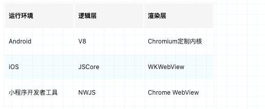

### 什么是跨平台
:::tip
跨平台开发是软件开发中一个重要的概念,即不依赖于操作系统,也不信赖硬件环境。一个操作系统下开发的应用,放到另一个操作系统下依然可以运行。诸如java,delphi和易语言，都已做到了跨平台。它们将可以在多种系统下开发，运行和维护。
:::
### 常用的跨平台方案

:::tip
1. Hybrid: H5(HTML5)+ 原生 ( Cordova、 Tonic、微信小程序)。
2. Javascript 开发 + 原生渲染 ( React Native、Weex、快应用)。
3. 自绘引擎 + 原生 (Flutter)。
* weex、react native 的渲染部分都是通过实现了 virtual dom 的渲染，用安卓、ios 各自的渲染方式实现，逻辑部分使用 js 引擎，通过 bridge 注入一些安卓、ios 的 api
* `flutter` 则是直接使用 skia 绘图库绘制，并且逻辑跨端使用 `dart` vm。
:::

### JavaScriptCore
:::tip
`JavaScriptCore` 是 JavaScript 引擎，通常会被叫做虚拟机，专门设计来解释和执行 JavaScript 代码,JScore 是 IOS WebKit 的一部分,目前 JS 引擎还有Google的V8 ，Mozilla 的 piderMonkey。

**JSCore 是 WebKit 的一部分，就是基于webkit中以C/C++实现的JavaScriptCore的一个包装，用最简单的话描述这个框架，它大概提供了两种能力：**
* 在原生代码(Objective-C)里面执行 JavaScript，而不用通过浏览器
* 把原生对象注入到 JavaScript 环境里面去
:::
### 混合开发 Hybrid
:::tip
要解决跨端问题的第一步就是解决两种语言之间的通信，比如在 iOS 端就是 OC/Swift 和 JS 的通信，而 Android 端则是 Java 和 JS 的通信。我们以 iOS 端为例来看通信是怎么完成的

**Web→原生**
1. **拦截 url:** 原生在WebView容器组件中监听url的变化，自定义协议也算是url。Web里可使用window.location.href = 'xxxx://xxx?a=x&b=x'改变url，这时原生进行拦截url即可，就能拿到数据，同时阻止页面刷新等操作(schema)。缺点: android系统对url参数做了字节限制，无法进行大数据的通信
3. **WebChromeClient弹窗拦截:** alert: 弹出个提示框，只能点确认无回调;confirm: 弹出个确认框（确认，取消），可以回调;prompt: 弹出个输入框，让用户输入东西，可以回调;缺点: 不建议使用，会无差别的拦截所有前端的window弹窗
3. **WKScriptMessageHandler:** iOS使用WKUserContentController的-addScriptMessageHandler:name:方法监听name为jsToOc的消息,
window.webkit.messageHandlers.jsToOc.postMessage()的方式对jsToOc方法发送消息（只适用于 WKWebView，iOS8+）。

**原生→Web**

**JS上下文注入（推荐）**: 不通过任何拦截的办法，而是直接将一个native对象（or函数）注入到JS里面，可以由web的js代码直接调用，直接操作
1. **JavaScriptCore:** 通过系统提供的 JavaScriptCore，我们可以轻易拿到 webview 内的 JS 运行环境,如同 Chrome 浏览器打开了控制台模式,k可以把原生对象注入到 JavaScript 环境里面，如同JSONP (只适用于 UIWebView，iOS7+）
2. **evaluateJavascript:** 执行了一个字符串化的js代码(Android 4.4+)
3. **addJavascriptInterface:** 进行对象映射, 暴露一个java对象给js, （低版本Android4以下好像有一些安全问题，本人没有验证）
* WebViewJavascriptBridge（适用于 UIWebView 和 WKWebView，属于第三方框架）
:::

### ReactNative

:::tip
JavaScriptCore + ReactJS + Bridges 就成了 React Native
* **渲染跨:**  使用 react 的 virtual dom 的渲染实现 安卓、ios原生组件
* **逻辑跨端:** 基于 js 引擎，通过 bridge 注入一些设备能力的 api,每一个支持 RN 的原生功能必须同时有一个原生模块和一个 JS 模块，JS 模块是原生模块的封装，方便 Javascript 调用其接口。Bridge 会负责管理原生模块和对应 JS 模块之间的沟通, 通过 Bridge, JS 代码能够驱动所有原生接口，实现各种原生酷炫的效果
:::
## 小程序
### 微信小程序
:::tip
小程序的主要开发语言是 JavaScript ，虽然有与网页开发有相似性但是还有一定的区别
* 网页开发渲染线程和脚本线程是互斥的，也是为什么长时间的脚本运行可能会导致页面失去响应
* 小程序中，逻辑层和渲染层是分开的，双线程同时运行。渲染层的界面使用 WebView 进行渲染；逻辑层采用 JSCore 运行 JavaScript 代码
* 网页开发面对的主要是浏览器及移动端浏览器 WebView
* 小程序开发面对的是两大操作系统 iOS 和 Android 的 微信客户端，所以开发时候需要注意的是微信客户端的版本号和小程序API 支持的基础库版本号
:::
渲染非原生组件以及脚本执行环境的区别如下

### 渲染层和逻辑层
:::tip
小程序的渲染层和逻辑层分别由2个线程管理：渲染层的界面使用了 WebView 进行渲染；逻辑层采用 JsCore 线程运行 JS 脚本。一个小程序存在多个界面，所以渲染层存在多个 WebView 线程，这两个线程的通信会经由微信客户端做中转，逻辑层发送网络请求也经由 Native 转发。
优点: 
Web技术是非常开放灵活的，开发者可以利用JavaScript脚本恶意地操作DOM，危害用户和网站的安全
1. 可以防止恶意攻击者的xss攻击
2. 可以防止开发者恶意盗取用户敏感信息(如open-data标签，无法直接通过DOM获取)
3. 提升页面加载性能，在网页中解析JS会阻塞HTML解析，小程序双线程不会。
:::

### 整体架构
:::tip
当我们对 View 层进行事件操作后，会通过 WeixinJSBridge 将数据传递到 Native 系统层。Native 系统层决定是否要用 native 处理，然后丢给逻辑层进行用户的逻辑代码处理。逻辑层处理后将数据通过 WeixinJSBridge 返给 View 层。View 渲染更新视图，如下图所示。
:::

