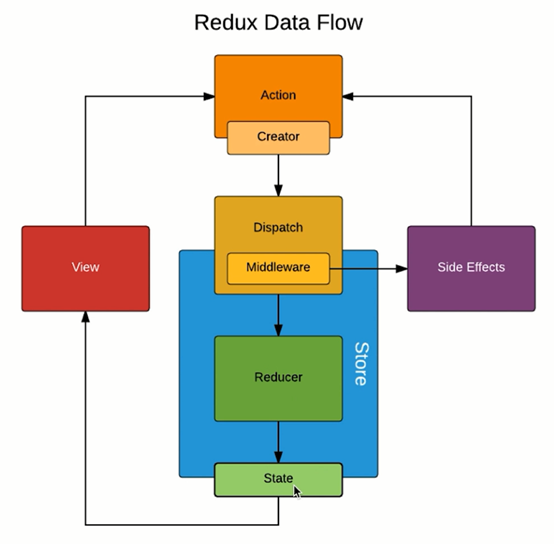

# 前端面试指北
## React基础
### 什么是 React
:::tip
React是一个简单的javascript UI库，用于构建高效、快速的用户界面。它是一个轻量级库，因此很受欢迎。它遵循组件设计模式、声明式编程范式和函数式编程概念，以使前端应用程序更高效。它使用虚拟DOM来有效地操作DOM。它遵循从高阶组件到低阶组件的单向数据流。
:::
### 函数式编程
:::tip
函数式编程是声明式编程的一部分。javascript中的函数是第一类公民，这意味着函数是数据，你可以像保存变量一样在应用程序中保存、检索和传递这些函数。

**函数式编程有些核心的概念，如下：**
* 不可变性(Immutability)
* 纯函数(Pure Functions)
* 数据转换(Data Transformations)
* 高阶函数 (Higher-Order Functions)
* 递归
* 组合
:::
### Vue React一些区别
:::tip
1. `Vue` 定义了很多指令(如v-for、v-if)去实现一些展示，`React` 主要还是依赖JS方法去实现
2. `Vue` 绑定事件 `Event` 是原生的和DOM事件一样, 而 `React` 是封装组合之后的 `SyntheticBaseEvent` 需要访问`nativeEvent` 才能获取原生`Event`。
3. `Vue` 使用 `v-model` 语法糖实现双向数据绑定，而`React`则需要自己绑定`onChange` 事件
:::
### React的生命周期

:::tip
创建、 更新、 销毁三个阶段 `componentDidMount` => `componentDidUpdate` => `componentWillUnmount`
1. **创建阶段：** 旧版本组件构造函数调用完成之后会有`componentWillmount`方法，新版本省略，新增`getDerivedStateFromProps`方法（并不常用），且该方法在组件props,state变更时也会被调用
2. **更新阶段:** 当`shouldComponentUpdate`返回ture后，会调用rende方法重新渲染组件。在组件更新完成之前有`getSnapShotBeforeUpdate`方法
* **`componentWillMount`**(16.9废弃):在渲染之前执行，用于根组件中的 App 级配置。
* **`componentDidMount`**：在第一次渲染之后执行，可以在这里做AJAX请求，DOM 的操作或状态更新以及设置事件监听器。
* **`componentWillReceiveProps`**(废弃)：在初始化render的时候不会执行，它会在组件接受到新的状态(Props)时被触发，一般用于父组件状态更新时子组件的重新渲染, `getDerivedStateFromProps`可替代
* **`getDerivedStateFromProps`**：会在调用 render 方法之前调用，并且在初始挂载及后续更新时都会被调用。它应返回一个对象来更新 state，如果返回 null 则不更新任何内
* **`shouldComponentUpdate`**：确定是否更新组件。默认情况下，它返回true。如果确定在 state 或 props 更新后组件不需要在重新渲染，则可以返回false，这是一个提高性能的方法。
* **`componentWillUpdate`**(废弃)：在shouldComponentUpdate返回 true 确定要更新组件之前件之前执行。
* **`componentDidUpdate`**：它主要用于更新DOM以响应props或state更改。
* **`componentWillUnmount`**：创建、 更新、 销毁三个阶段，它用于取消任何的网络请求，或删除与组件关联的所有事件监听
:::
### React 父子组建生命周期
```js
// 加载渲染过程
  parent-constructor
  parent-componentWillMount
  parent-render
    child-constructor
    child-componentWillMount
    child-render
    child-componentDidMount
  parent-componentDidMount
// 更新过程
  parent-shouldComponentUpdate
  parent-componentWillUpdate
  parent-render
    child-componentWillReceiveProps
    child-shouldComponentUpdate
    child-render
    child-componentDidUpdate
  parent-componentDidUpdate
// 卸载组件
  parent-componentWillUnmount
    child-componentWillUnmount
```
### 为什么React中事件绑定的函数内部this默认指向undefined
:::tip
函数的作用域是由函数调用的时候决定的，而不是函数声明的时候。第一次调用是作为对象中的函数调用，因此this指向对象本身。而第二次调用是作为普通函数调用，所以this指向全局对象，在严格模式时会指向undefined。

**解决办法：**
1. 使用es6箭头函数，箭头函数this默认指向上一层级的环境 `<input onChange={()=>this.change()}  />`
2. 使用bind绑定this写在constructor里 `this.change = this.change.bind(this)`;  
:::
```js
var name = 'Gordanlee';
var obj = {
    name: 'Wuyifan',
    getName: function() {
        return this.name;
    }
};

var getName = obj.getName;
obj.getName(); // Wuyifan
getName(); // Gordanlee

class EventDemo extends React.Component {
    constructor(props) {
        super(props)
        this.state = {
            name: 'gordanlee',
        }
        // 修改方法的 this 指向
        this.clickHandler2 = this.clickHandler2.bind(this)
        推荐面这种写法
    }
    clickHandler1() {
      console.log('this....', this) // this 默认是 undefined
      this.setState({
          name: 'wuyifan'
      })
    }
    // 静态方法，this 指向当前实例
    clickHandler2() {
    }
    // 获取 event
    clickHandler3 = (event) => {
    }
    render() {
        // // this - 使用 bind
        return 
        <div>
          <p onClick={this.clickHandler1}>
              {this.state.name}
          </p>
          // 不建议在标签中写bind, 会导致bind多次执行，建议再头部赋值只绑一次
          <p onClick={this.clickHandler2.bind(this)}>
              {this.state.name}
          </p>
          <p onClick={this.clickHandler2(this)}>
              {this.state.name}
          </p>
          <p onClick={this.clickHandler3}>
              {this.state.name}
          </p>
        <div>
    }
}
```
### 浅谈React合成

:::tip
`JSX`上写的事件并没有绑定在对应的真实 `DOM` 上，而是通过事件代理的方式，将所有的事件都统一绑定在了 `document`上。这样的方式不仅减少了内存消耗，还能在组件挂载销毁时统一订阅和移除事件。
（在`React17`之前，`React`是把所有事件委托在`document`上的，`React17`及以后版本不再把事件委托在`document`上，而是委托在挂载的容器上了。）
* **目的:**
1. 合成事件首先抹平了浏览器之间的兼容问题(如标准事件模型、IE)，另外这是一个跨浏览器原生事件包装器，赋予了跨浏览器开发的能力；
2. 对于原生浏览器事件来说，浏览器会给监听器创建一个事件对象。如果你有很多的事件监听，那么就需要分配很多的事件对象，造成高额的内存分配问题。但是对于合成事件来说，有一个事件池专门来管理它们的创建和销毁，当事件需要被使用时，就会从池子中复用对象，事件回调结束后，就会销毁事件对象上的属性，从而便于下次复用事件对象
* **优点**
1. 兼容所有浏览器，更好的跨平台；
2. 将事件统一存放在一个数组，避免频繁的新增与删除（垃圾回收）。
3. 方便 react 统一管理和事务机制
:::
```js
// 定义捕获事件
Vue: <div @click.capture="handleClick" />
React: <div onClickCapture={this.onClickOuter} />
// react 事件不能采用 return false 的方式来阻止浏览器的默认行为，而必须要地明确地调用preventDefault()来阻止默认行为。
// `Event` 是封装组合之后的 `SyntheticBaseEvent`, 模拟出来的DOM事件所有能力。
// `event.nativeEvent` 是原生事件对象
// React绑定事件，最后都会追加Eevent参数
```
### React 组件中怎么做事件代理
:::tip
React基于Virtual DOM实现了一个SyntheticEvent层（合成事件层），定义的事件处理器会接收到一个合成事件对象的实例，它符合W3C标准，且与原生的浏览器事件拥有同样的接口，支持冒泡机制，所有的事件都自动绑定在最外层上。
在React底层，主要对合成事件做了两件事：
* 事件委派： React会把所有的事件绑定到结构的最外层，使用统一的事件监听器，这个事件监听器上维持了一个映射来保存所有组件内部事件监听和处理函数。
* 自动绑定： React组件中，每个方法的上下文都会指向该组件的实例，即自动绑定this为当前组件。
:::
### setState
:::tip
1. 不可变值(为了性能优化,不去触发shouldComponentUpdate)
2. 可能是异步更新
* 异步： 在 React 可以控制的地方，就为 true，比如在 React 生命周期事件和合成事件中，都会走合并操作，延迟更新的策略。
* 同步： 在 React 无法控制的地方，比如原生事件，具体就是在 addEventListener 、setTimeout、setInterval 等事件中，就只能同步更新。
3. 可能会被合并
* `setState()` 传递对象就会被合并（类似Object.assign），传递函数则不会被合并
:::
```js
class StateDemo extends React.Component {
    constructor(props) {
        super(props)

        // 第一，state 要在构造函数中定义
        this.state = {
            count: 0
        }
    }
    render() {
        return <div>
            <p>{this.state.count}</p>
            <button onClick={this.increase}>累加</button>
        </div>
    }
    increase = () => {
        // this.state.count++ // 错误的写法
        // setState 一定要用不可变值了
        // 只能用setState去修改值，禁止提前修改值，会导致shouldComponentUpdat中nextProps, nextState 相等
        this.setState({
            count: this.state.count + 1 // SCU
        }, ()=>{
         console.log('callback', this.state.count) // 1 异步获取
        })
        // this.setState 是异步的，如果立刻同步获取是拿不到最新修改的值，需要用setState第二个参数会调函数中获取, 联想 Vue $nextTick - DOM
        console.log('同步获取', this.state.count) // 0 
        // 操作数组、对象的的常用形式
        setTimeout(() => {
          this.setState({
            count: 100
          })
          console.log('setTimeout', this.state.count) // 100
        }, 0);
    }
    increase2 = () => { // state 异步更新前会被合并
      for (let index = 0; index < 10; index++) {
        // setState传入对象,会被合并（类似Object.assign）。执行结构只一次 + 1
        this.setState({
            count: this.state.count + 1 // 0 + 1
        })
      } // 
      setTimeout(() => {
        console.log('for', this.state.count) // 1
      }, 0);
    }
    increase3 = () => { // state 异步更新前会被合并
      for (let index = 0; index < 10; index++) {
        // setState传入函数不会被合并，结果为10，函数无法像对象一样被合并，只能被执行
        this.setState((prevState, props)=>{
          return {
            count: prevState.count + 1
          }
        })
      }
      console.log('for', this.state.count) // 0
      setTimeout(() => {
        console.log('for', this.state.count) // 10
      }, 0);
    }
    bodyClickHandler = () => {
        this.setState({
            count: this.state.count + 1
        })
        console.log('count in body event', this.state.count) // 最新的值
    }
    componentDidMount() {
        // 自己定义的 DOM 事件，setState 是同步的
        document.body.addEventListener('click', this.bodyClickHandler)
    }
    componentWillUnmount() {
        // 及时销毁自定义 DOM 事件
        document.body.removeEventListener('click', this.bodyClickHandler)
        // clearTimeout
    }
}
```
## React 进阶
### 受控和非受控组
:::tip
* **受控组件：** 控制着输入的过程，`react`的`state`为唯一的数据来源，被`react.state`这样控制着的就是受控组件(相当于实现数据绑定)。
* **非受控组件：** 不设置value值(只能设置`defaultValue`、`defaultChecked`),通过ref获取dom节点然后再取value值。在html表单中，input select checkbox，来暂存输入值,如果不需要关心控制值是怎么修改更新的，只需要获取这个组件的值，那么这个就是非受控组件。
**非受控组件使用场景：**
1. 必须手动操作DOM元素，`setState`实现不了。
2. 文件上传`<input type="file">`
3. 开始或使用某些富文本编辑器、需要传入DOM 元素
:::
```js
class App extends React.Component {
    constructor(props) {
        super(props)
        this.state = {
            name: 'gordanlee',
            flag: true,
        }
        this.nameInputRef = React.createRef() // 创建 ref
        this.fileInputRef = React.createRef()
    }
    render() {
        // // input defaultValue
        return <div>
            {/* 使用 defaultValue 而不是 value ，使用 ref */}
            <input defaultValue={this.state.name} ref={this.nameInputRef}/>
            {/* state 并不会随着改变 */}
            <span>state.name: {this.state.name}</span>
            <br/>
            <button onClick={this.alertName}>alert name</button>
        </div>
        // // checkbox defaultChecked
        // return <div>
        //     <input
        //         type="checkbox"
        //         defaultChecked={this.state.flag}
        //     />
        // </div>
        // file
        // return <div>
        //     <input type="file" ref={this.fileInputRef}/>
        //     <button onClick={this.alertFile}>alert file</button>
        // </div>
    }
    alertName = () => {
        const elem = this.nameInputRef.current // 通过 ref 获取 DOM 节点
        alert(elem.value) // 不是 this.state.name
    }
    alertFile = () => {
        const elem = this.fileInputRef.current // 通过 ref 获取 DOM 节点
        alert(elem.files[0].name)
    }
}
```
### 类组件和函数组件之间的区别
:::tip
* 类组件: 可以使用其他特性，如状态 state 和生命周期钩子。
* 函数组件: 当组件只是接收 props 渲染到页面时，就是无状态组件，就属于函数组件，也被称为哑组件或展示组件
1. 函数组件的性能比类组件的性能要高，因为类组件使用的时候要实例化，而函数组件直接执行函数取返回结果即可,为了提高性能，尽量使用函数组
2. 函数组件无实例、无`this`、无状态state,无生命周期不能扩展其他方法。
3. 函数组件获取的总是事件发生的时候的值，即使值在事件发生后已经更新了,而类组件获取的总是最新的值。
:::
```js
//函数组件传参
function CounterFunction(props) {
    const { count } = props;
    const showAlert = () => {
        setTimeout(() => {
            alert(count + '--from Function');
        }, 3000);
    };
    return (
        <div>
            <p>You clicked {count} times</p>
            <button onClick={showAlert}>Show count</button>
        </div>
    );
}
//类组件
class CounterClass extends React.Component {
    showAlert = () => {
        setTimeout(() => {
            alert(this.props.count + '--from Class');
        }, 3000);
    };

    render() {
        return (
            <div>
                <p>He clicked {this.props.count} times</p>
                <button onClick={this.showAlert.bind(this)}>
                  Show count
                </button>
            </div>
        );
    }
}


class App extends React.Component {
    state = {
        count : 123
    };
    render() {
        return (
            <div className="App" onClick={() => this.setState({count: 456})}>
                <CounterFunction count={this.state.count}/>
                <CounterClass count={this.state.count} />
            </div>
        );
    }
}
// 当你两次调用的时候，你就会发现他们的页面渲染是相同的，count值都会变成456，但是，alert出来的值可就不一样了。
// Function的是123，Class的是456。所以当showAlert事件发生的时候，Function取的是发生前的值，是触发事件前的值，就像处对象，哪怕分手后，双方立刻找到了新对象，但仍然记得当初的美好
```
### Portals(传送门)
:::tip
组件默认会按照既定层次嵌套渲染，Portal可以将React节点渲染到指定节点(如Dialog、Tooltip),vue2.x需要用`v-transfer-dom`,Vue3.0x可以用`Teleport`
1. 父组件overflow:hidden
2. 父组件z-index值太小
3. fixed 需要放在body第一层
:::
```js
  render() {
      // // 正常渲染
      // return <div className="modal">
      //     {this.props.children} {/* vue slot */}
      // </div>

      // 使用 Portals 渲染到 body 上。
      // fixed 元素要放在 body 上，有更好的浏览器兼容性。
      return ReactDOM.createPortal(
          <div className="modal">{this.props.children}</div>,
          document.body // DOM 节点
      )
  }
```
### context(上下文)
:::tip
React context的api解决的问题是祖先元素与子孙元素的通信问题。
* 用props太繁琐,层级过深不友好
* 用redux小题大做
:::
```js
import React from 'react'
// 创建 Context 填入默认值（任何一个 js 变量）
const ThemeContext = React.createContext('欧美简约')
const ThemeContext2 = React.createContext('呃玛西亚')
// 底层组件 - 函数是组件
function ThemeLink (props) {
    // const theme = this.context // 会报错。函数式组件没有实例，即没有 this
    // 函数式组件可以使用 Consumer(消费)
    // Context多了很容易导致嵌套地狱。
    return <ThemeContext.Consumer>
      { (value) => 
      <p>当前主题1-{value}
        <ThemeContext2.Consumer>
          { (value2) => <span>当前主题2-{value2}</span> }
        </ThemeContext2.Consumer>
      </p> 
      }
    </ThemeContext.Consumer>
}

// 底层组件 - class 组件
class ThemedButton extends React.Component {
    // 指定 contextType 读取当前的 theme context。
    // static contextType = ThemeContext // 也可以用 ThemedButton.contextType = ThemeContext
    render() {
        const theme = this.context // React 会往上找到最近的 theme Provider，然后使用它的值。
        console.log('theme', theme)
        return <div>
            <p>当前主题-{theme}</p>
        </div>
    }
}
ThemedButton.contextType = ThemeContext // 指定 contextType 读取当前的 theme context。

// 中间的组件再也不必指明往下传递 theme 了。
function Toolbar(props) {
    return (
        <div style={{background: 'yellow', padding: '10px'}}>
            中间组件
            <div style={{background: 'pink'}}>
              <ThemedButton />
              <ThemeLink />
            </div>
        </div>
    )
}

class App extends React.Component {
    constructor(props) {
        super(props)
        this.state = {
            theme: '欧美简约'
        }
    }
    render() {
        return <div style={{background: 'red', padding: '10px'}}>
          <ThemeContext.Provider value={this.state.theme}>
              <Toolbar />
              <button onClick={this.changeTheme}>切换主题</button>
          </ThemeContext.Provider>
        </div>
    }
    changeTheme = () => {
        this.setState({
            theme: this.state.theme === '城乡结合' ? '欧美简约' : '城乡结合'
        })
    }
}
export default App
```
### 异步组件
:::tip
* import()
* React.lazy
* React.Suspense
:::
```js
import React from 'react'
const ContextDemo = React.lazy(() => import('./ContextDemo'))
class App extends React.Component {
    constructor(props) {
        super(props)
    }
    render() {
        return <div>
            <p>引入一个动态组件</p>
            <hr />
            <React.Suspense fallback={<div>Loading...</div>}>
                <ContextDemo/>
            </React.Suspense>
        </div>
        // 1. 强制刷新，可看到 loading （看不到就限制一下 chrome 网速）
        // 2. 看 network 的 js 加载
    }
}
export default App
```
### 高阶组件 HOC 
:::tip
高阶组件不是一种功能，而是一种模式，类似应该是一个组件工厂、装饰器，获取低阶组件，生成高阶组件,简而言之，高阶组件就是一个函数，它接受一个组件为参数，返回一个新组件(如拉加载数据容器、播放器状态)。
1. 代码复用，代码模块化
2. 增删改props
3. 渲染劫持
:::
```js
// React-redux的connect也是一个高阶组件
import React from 'react'
// 高阶组件
const HOCFactoryMouse = (Component) => {
  class withMouseComponent extends React.Component {
      constructor(props) {
        super(props)
        this.state = { x: 0, y: 0 }
      }
      handleMouseMove = (event) => {
        this.setState({
          x: event.clientX,
          y: event.clientY
        })
      }
      render() {
          return (
            <div style={{ height: '500px', background: 'pink' }} onMouseMove={this.handleMouseMove}>
              {/* 1. 透传所有 props 2. 增加 mouse 属性 */}
              {JSON.stringify(this.props)}
              <Component {...this.props} mouse={this.state}/>
            </div>
          )
      }
  }
  return withMouseComponent
}
const App = (props) => {
    const a = props.a
    const { x, y } = props.mouse // 接收 mouse 属性
    return (
        <div style={{ height: '500px' }}>
            <h1>鼠标坐标: ({x}, {y})</h1>
            <p>{a}</p>
        </div>
    )
}
export default HOCFactoryMouse(App) // 返回高阶函数
// <HOCDemo a="100"/>
```
### Render Props
:::tip
组件接收一个函数，这个函数获取组件的state实现渲染逻辑(例如多个按钮，每个按钮点击会打开不同的Dialog,用Render Props就能写在一块)
1. 接收一个外部传递进来的 props 属性
2. 将内部的 state 作为参数传递给调用组件的 props 属性方法.
缺点: 它很容易导致嵌套地狱
:::
```js
import React from 'react'
import PropTypes from 'prop-types'

class Mouse extends React.Component {
    constructor(props) {
        super(props)
        this.state = { x: 0, y: 0 }
    }
  
    handleMouseMove = (event) => {
      this.setState({
        x: event.clientX,
        y: event.clientY
      })
    }
  
    render() {
      return (
        <div style={{ height: '500px' }} onMouseMove={this.handleMouseMove}>
            {/* 将当前 state 作为 props ，传递给 render （render 是一个函数组件） */}
            {this.props.render(this.state)}
        </div>
      )
    }
}
Mouse.propTypes = {
    render: PropTypes.func.isRequired // 必须接收一个 render 属性，而且是函数
}

const App = (props) => (
    <div style={{ height: '500px' }}>
        <p>{props.a}</p>
        <Mouse render={
            /* render 是一个函数组件 */
            ({ x, y }) => <h1>坐标 ({x}, {y})</h1>
        }/>
        
    </div>
)
/**
 * 即，定义了 Mouse 组件，只有获取 x y 的能力。
 * 至于 Mouse 组件如何渲染，App 说了算，通过 render prop 的方式告诉 Mouse 。
 */
export default App
```
### HOC vs Render Props 区别
:::tip
* HOC: 模式简单，但会增加组件层级(高级组件嵌套当前组件)
* Render Props: 代码简洁，学习成本较高，无法在 return 语句外访问数据，它很容易导致嵌套地狱。
* 按需使用
:::
### React性能优化
:::tip
1. **`shouldComponentUpdate`**(简称SCU): SCU 默认返回true,即React 默认重新渲染所有子组件，必须配合`不可变值` 一起使用，可先不用SCU,有性能问题时再按需使用
2. **`PureComponent(纯组件)` 和 `React.memo`**:前者类组件，后者函数组组件，原理是，当组件更新时，如果组件的 `props` 和 `state` 都没发生改变， render 方法就不会触发，省去 `Virtual DOM` 的生成和比对过程，达到提升性能的目的。具体就是 React 自动帮我们做了一层浅比较(Object.keys只比较第一层,类似浅拷贝浅比较)
3. **`immutable.js`不可变值**：
* React遵循`不可变值`设计理念，中常要深拷贝(性能消耗大)一份数据,再`setState`,使用`immutable`可彻底拥抱`不可变值`,基于共享数据（不是深拷贝）,速度快,但有一定的学习和迁移成本，按需使用。
* `immutable`数据一种利用结构共享形成的持久化数据结构，一旦有部分被修改，那么将会返回一个全新的对象，并且原来相同的节点会直接共享
5. 公共组件抽离,提取公共逻辑，降低耦合度，如`minxin`(弃用)、高阶组件HOC、Render Props
:::

```js
class {
  shouldComponentUpdate(nextProps, nextState) {
      // _.isEqual 做对象或者数组的深度比较（一次性递归到底）
      // 1.isEqual 是个一次性深度递归到底，所以慎用
      // 2. react 提供了PureComponent、memo 做浅比较
      if (_.isEqual(nextProps.list, this.props.list)) {
          // 相等，则不重复渲染
          return false
      }
      return true // 不相等，则渲染
  },
  handleAdd = (name) => {
    // 正确的用法
    this.setState({
      list: [...this.state.list, {
        id: `id-${Date.now()}`,
        name,
      }]
    })
    /** 为了演示 SCU ，故意写的错误用法 **/
    this.state.list.push({ // 直接修改原值，而不是用的setState
        id: `id-${Date.now()}`,
        title
    })
    // 导致shouldComponentUpdate中 nextProps 和 nextState相当，
    // 如果正好做了判断，会导致不渲染
    this.setState({ 
        list: this.state.list
    })
  }
}
/**PureComponent**/
class ListOfWords extends React.PureComponent {
  render() {
    return <div>{this.props.words.join(',')}</div>;
  }
}

/**memo**/
function MyComponent(props) {
  /* 使用 props 渲染 */
}
function areEqual(prevProps, nextProps) {
  /*
  如果把 nextProps 传入 render 方法的返回结果与
  将 prevProps 传入 render 方法的返回结果一致则返回 true，
  否则返回 false
  */
}
export default React.memo(MyComponent, areEqual);

/**immutable**/
const { Map, List } = require('immutable');const map1 = Map({ a: 1, b: 2, c: 3, d: 4 });const map2 = Map({ c: 10, a: 20, t: 30 });const obj = { d: 100, o: 200, g: 300 };const map3 = map1.merge(map2, obj);// Map { a: 20, b: 2, c: 10, d: 100, t: 30, o: 200, g: 300 }const list1 = List([ 1, 2, 3 ]);const list2 = List([ 4, 5, 6 ]);const list3 = list1.concat(list2, array);
```
## Redux

:::tip
:::