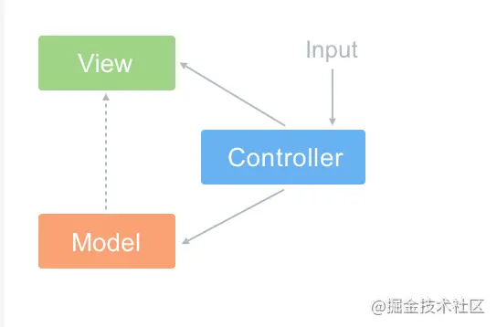
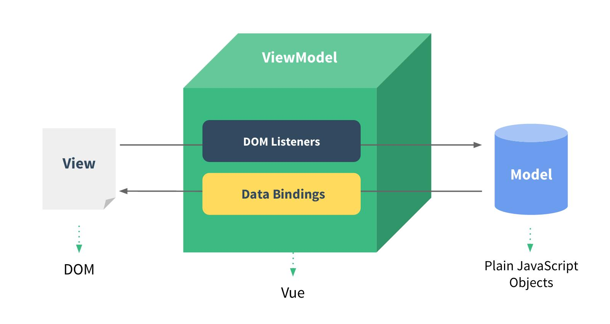
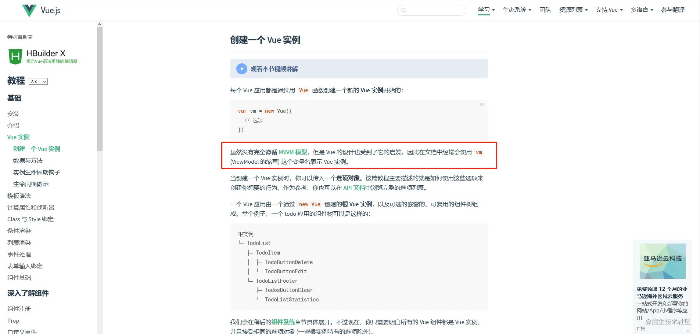
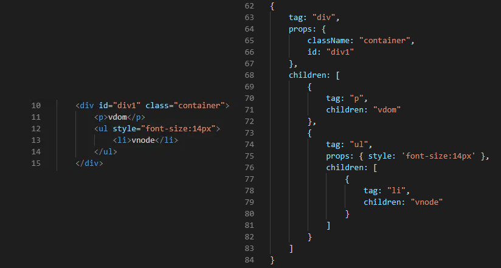
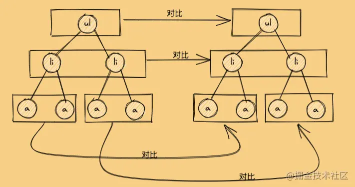
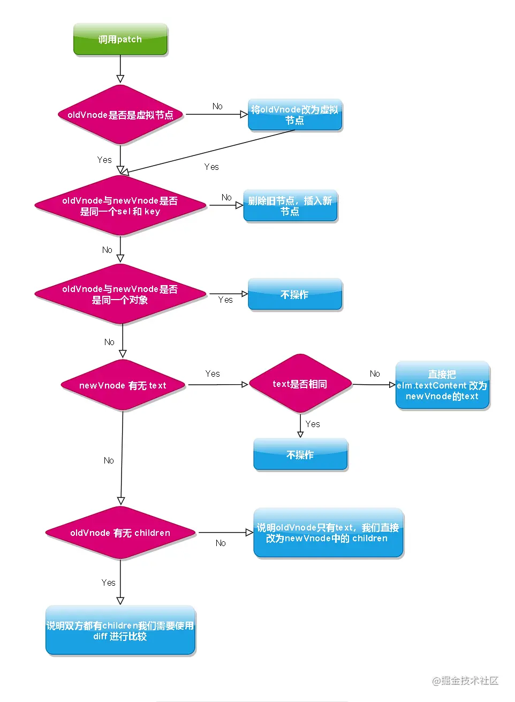
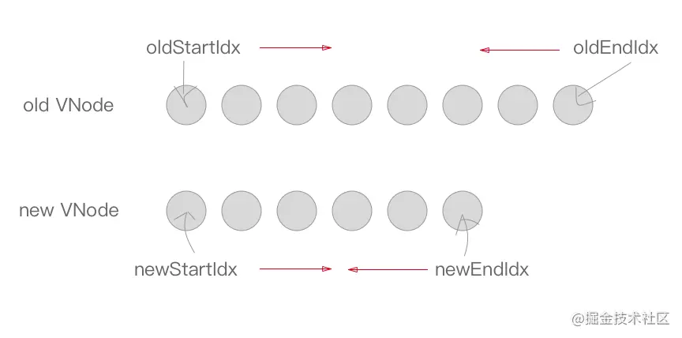
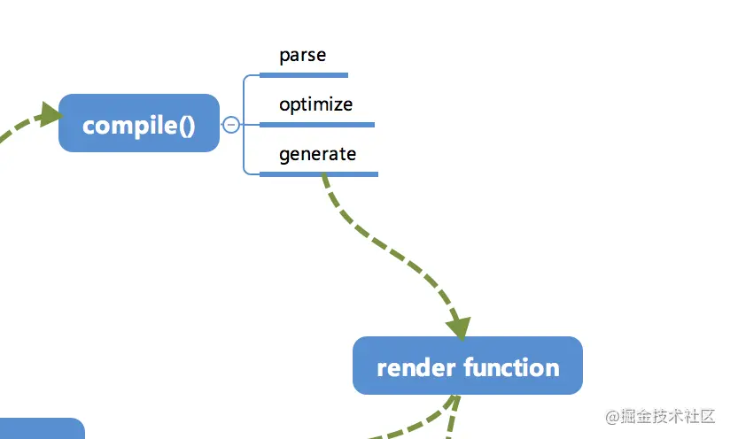

# 前端面试指北

## VUE相关面试题

强烈建议阅读[Vue源码分析](/vueAnalysis/introduction/)

###  MVC 和 MVVM 区别
#### 背景及概念
:::tip
* 第一阶段，直接用JavaScript操作DOM节点，使用浏览器提供的原生API
* 第二阶段，由于原生API不好用，还要考虑浏览器兼容性，jQuery的出现风靡一时
* 第三阶段，MVC模式，需要服务器端配合，JavaScript可以在前端修改服务器渲染后的数据。
* 第四阶段，随着前端页面越来越复杂，用户对于交互性要求也越来越高，仅仅用jQuery是远远不够的，MVVM模型应运而生
:::

#### MVC
:::tip
MVC 全名是 Model View Controller，是模型(model)－视图(view)－控制器(controller)的缩写，一种软件设计典范(例如:JSP、asp、php)
* Model（模型）：是应用程序中用于处理应用程序数据逻辑的部分。通常模型对象负责在数据库中存取数据
* View（视图）：是应用程序中处理数据显示的部分。通常视图是依据模型数据创建的
* Controller（控制器）：是应用程序中处理用户交互的部分。通常控制器负责从视图读取数据，控制用户输入，并向模型发送数据

**MVC 的思想**：一句话描述就是 Controller 负责将 Model 的数据用 View 显示出来，换句话说就是在 Controller 里面把 Model 的数据赋值给 View。缺点:如果需要更新视图还需要依赖手动操作DOM，如实用JQ。
:::
#### MVVM

:::tip
* 是指数据层（Model）-视图层（View）-数据视图（ViewModel）的响应式框架。它包括
1. 修改View层，Model对应数据发生变化
2. Model数据变化，不需要查找DOM，直接更新View
* MVVM 与 MVC 最大的区别就是：它实现了 View 和 Model 的自动同步，也就是当 Model 的属性改变时，我们不用再自己手动操作 Dom 元素，来改变 View 的显示，而是改变属性后该属性对应 View 层显示会自动改变（对应Vue数据驱动的思想）
整体看来，MVVM 比 MVC 精简很多，不仅简化了业务与界面的依赖，还解决了数据频繁更新的问题，不用再用选择器操作 DOM 元素。因为在 MVVM 中，View 不知道 Model 的存在，Model 和 ViewModel 也观察不到 View，这种低耦合模式提高代码的可重用性
:::

:::tip
注意：Vue 并没有完全遵循 MVVM 的思想 这一点官网自己也有说明
那么问题来了 为什么官方要说 Vue 没有完全遵循 MVVM 思想呢？
* 严格的 MVVM 要求 View 不能和 Model 直接通信，而 Vue 提供了$refs 这个属性，让 Model 可以直接操作 View，违反了这一规定，所以说 Vue 没有完全遵循 MVVM。
:::
### Vue2.0 响应式数据的原理
:::tip 简版
整体思路是数据劫持+观察者模式
* 用`observe`方法对象进行递归遍历至基本数据类型,包括子属性对象的属性，都加上 setter和getter
这样的话,对象内部通过 `defineReactive` 方法，使用 `Object.defineProperty` 将属性进行劫持（只会劫持已经存在的属性），数组则是通过重写数组方法来实现。当页面使用对应属性时，每个属性都拥有自己的 `dep` 属性，存放他所依赖的 `watcher`（依赖收集），当属性变化后会通知自己对应的 `watcher` 去更新(派发更新)。
:::
:::tip 完整版
vue.js 是采用数据劫持结合发布者-订阅者模式的方式，通过Object.defineProperty()来劫持各个属性的setter，getter，在数据变动时发布消息给订阅者，触发相应的监听回调。
* 第一步：需要observe方法将数据对象进行递归遍历，包括子属性对象的属性，使用 `Object.defineProperty` 都加上 setter和getter这样的话，给这个对象的某个值赋值，就会触发setter，那么就能监听到了数据变化
* 第二步：compile解析模板指令，将模板中的变量替换成数据，然后初始化渲染页面视图，并将每个指令对应的节点绑定更新函数，添加监听数据的订阅者,一旦数据有变动，收到通知，更新视图
* 第三步：Watcher订阅者是Observer和Compile之间通信的桥梁，主要做的事情是:
1. 在自身实例化时往属性订阅器(dep)里面添加自己
2. 自身必须有一个update()方法
3. 待属性变动dep.notice()通知时，能调用自身的update()方法，并触发Compile中绑定的回调，则功成身退。
* 第四步：MVVM作为数据绑定的入口，整合Observer、Compile和Watcher三者，通过Observer来监听自己的model数据变化，通过Compile来解析编译模板指令，最终利用Watcher搭起Observer和Compile之间的通信桥梁，达到数据变化 -> 视图更新；视图交互变化(input) -> 数据model变更的双向绑定效果。
:::

```js
// 简易版和源码略有差异
  // 监听对象的属性
  const oldArrayProto = Array.prototype;
  // 然后将arrayMethods继承自数组原型
  // 这里是面向切片编程思想（AOP）--不破坏封装的前提下，动态的扩展功能
  const arrayMethods = Object.create(oldArrayProto);
  let methodNames = [
    "push",     // 末尾添加
    "pop",      // 删除添加
    "shift",    // 开口删除
    "unshift",  // 开头添加
    "splice",   // 添加或删除
    "reverse",  // 反转
    "sort",     // 排序
  ];
  methodNames.forEach((method)=>{ // 重写数组方法
    arrayMethods[method]= function() {
      updateView(); // 触发视图更新
      oldArrayProto[method].call(this, ...arguments)
    }
  })
  //
  function observer(target) {
    if(typeof target !== 'object' || target === null) {
      // 不是对象或者数组
      return target
    }
    if(Array.isArray(target)) { // 如果是数组特殊 处理
      target.__proto__ = arrayMethods; // 修改原型指向
    }
    Object.keys(target).forEach((key) => {
      defineReactive(target, key, target[key]);
    });
  }
  function defineReactive (obj, key, val) {
    observer(val) // 实现深度监听
    // Object.defineProperty(arr, index, { // 可监听到下标改变，监听不到push、length等原方法属性
    Object.defineProperty(obj, key, {
      enumerable: true,  /* 属性可枚举 */
      configurable: true,/* 属性可被修改或删除 */
      get: function reactiveGetter () {
        console.log('__get:', val)
        return val; 
      },
      set: function reactiveSetter (newVal) {
        console.log('__set:', `${val}=>${newVal}`)
        if (newVal === val) return; //值不变才调用更新
        //深度监听,如果set修改值不再次调用observer监听，当把 data.age = 1 => data.age = { num: 1}改变数据类型,就永远无法监听到num。
        observer(newVal)
        // val是在闭包中的，此处设置完之后，再get也是会获取最新的值
        val = newVal
        updateView(newVal);
      }
    });
  }
  function updateView(params) { // 更新视图
    console.log('视图更新:', params);
  }
  const data = {
    name: 'goudanlee',
    info: {
      address: '曹县'
    },
    age: 17,
    list: [1]
  }
  observer(data);
  data.name = 'goudanlee2'
  data.x = 100 // 新增属性监听不到所以有Vue.set
  delete data.name // 删除属性监听不到所以有Vue.delete
  data.info.address = '北京'
  data.age = {
    num: 21
  }
  data.age.num = 22
  data.list[0] = 3 // 可监听到
  data.list.push(1); // 通过重写数组方法才可监听到
```
### 使用`Object.defineProperty` 缺点
:::tip
* 深度监听，需要递归到底，如果源数据大且嵌套层级深、一次性计算量大。
* 无法监听新增/删除属性(Vue.set/Vue.delete)
* 可监听到数组下标改变，无法原生监听数组(push、pop、length)，需要特俗处理
:::
### Vue 如何检测数组变化
:::tip
`Object.defineProperty` 可监听到数组下标改变，无法原生监听数组(push、pop、length),考虑性能原因没有用 defineProperty 对数组的每一项进行拦截，而是选择对 7 种数组（push,shift,pop,splice,unshift,sort,reverse）方法进行重写(AOP 切片思想)
所以在 Vue 中修改数组的索引和长度是无法监控到的。需要通过以上 7 种变异方法修改数组才会触发数组对应的 watcher 进行更新
:::
```js
// src/obserber/array.js
// 先保留数组原型
const arrayProto = Array.prototype;
// 然后将arrayMethods继承自数组原型
// 这里是面向切片编程思想（AOP）--不破坏封装的前提下，动态的扩展功能
export const arrayMethods = Object.create(arrayProto);
let methodsToPatch = [
  "push",
  "pop",
  "shift",
  "unshift",
  "splice",
  "reverse",
  "sort",
];
methodsToPatch.forEach((method) => {
  arrayMethods[method] = function (...args) {
    //   这里保留原型方法的执行结果
    const result = arrayProto[method].apply(this, args);
    // 这句话是关键
    // this代表的就是数据本身 比如数据是{a:[1,2,3]} 那么我们使用a.push(4)  this就是a  ob就是a.__ob__ 这个属性就是上段代码增加的 代表的是该数据已经被响应式观察过了指向Observer实例
    const ob = this.__ob__;

    // 这里的标志就是代表数组有新增操作
    let inserted;
    switch (method) {
      case "push":
      case "unshift":
        inserted = args;
        break;
      case "splice":
        inserted = args.slice(2);
      default:
        break;
    }
    // 如果有新增的元素 inserted是一个数组 调用Observer实例的observeArray对数组每一项进行观测
    if (inserted) ob.observeArray(inserted);
    // 之后咱们还可以在这里检测到数组改变了之后从而触发视图更新的操作--后续源码会揭晓
    return result;
  };
});
```
### 虚拟 DOM 优缺点
:::tip
由于在浏览器中操作 DOM 是很昂贵的。频繁的操作 DOM，会产生一定的性能问题。这就是虚拟 Dom 的产生原因。Vue2 的 Virtual DOM 借鉴了开源库 snabbdom 的实现。Virtual DOM 本质就是用一个原生的 JS 对象去描述一个 DOM 节点，是对真实 DOM 的一层抽象。
:::

```js
class VNode {
    constructor (tag, data, children, text, elm) {
        /*当前节点的标签名*/
        this.tag = tag;
        /*当前节点的一些数据信息，比如props、attrs等数据*/
        this.data = data;
        /*当前节点的子节点，是一个数组*/
        this.children = children;
        /*当前节点的文本*/
        this.text = text;
        /*当前虚拟节点对应的真实dom节点*/
        this.elm = elm;
    }
}
vm.$createElement('div',{attrs: {id:'app'}}, '内容' || children)
React.createElement("h1", {className: "main"}, "内容" || children);
```
* **优点：**
1. 保证性能下限：避免频繁操作DOM，频繁操作DOM会可能让浏览器回流和重绘，性能也会非常低，还有就是手动操作 DOM 还是比较麻烦的，要考虑浏览器兼容性问题，当前jQuery等库简化了 DOM操作，但是项目复杂了，DOM操作还是会变得复杂，虚拟DOM改变了当前的状态不需要立即的去更新DOM，过前后两次差异进行比较寻求最小或者局部更新，或者把多次合并成一次。
2. 无需手动操作 DOM： 我们不再需要手动去操作 DOM，只需要写好 View-Model 的代码逻辑，框架会根据虚拟 DOM 和 数据双向绑定，帮我们以可预期的方式更新视图，极大提高我们的开发效率；
3. 跨平台： 虚拟 DOM 本质上是 JavaScript 对象,而 DOM 与平台强相关，相比之下虚拟 DOM 可以进行更方便地跨平台操作，例如服务器渲染、weex 开发等等。
* **缺点:**
1. 无法进行极致优化： 虽然虚拟 DOM + 合理的优化，足以应对绝大部分应用的性能需求，但在一些性能要求极高的应用中虚拟 DOM 无法进行针对性的极致优化。
2. 首次渲染大量 DOM 时，由于多了一层虚拟 DOM 的计算，会比 innerHTML 插入慢。
### Vue diff 算法
:::tip
diff即对比，是一广泛的概念，如linux diff命令、git diff 等,两棵树做diff就如同vdom diff
原本diff 复杂度 O (n^3) ，1000 个节点的树，要比对 10 亿次，性能消耗太大，算法不可用，vdom diff用了以下的方式优化后时间复杂度到 O (n) 级别。
1. 只比较同一层级，不跨域级比较
2. tag不相同，则直接删除重建，不再深度比较
3. tag 和 key,两者都相同，则认为是相同节点，不再深度比较
* 上面的方式可以说是偷懒或者比较暴力，但是对于dom非常合适，能解决80%的场景，且性能好。
代码总结：按照上面规则 走`patch`方法做同级比较、 再用`sameVnode`方法判断是否继续走`patchVnode`方法，在`patchVnode`方法中`oldVnode.children`和`Vnode.children`都存在并且不同就调用`updateChildren`方法
:::

```js
/**
 * 把传入的 参数 作为 对象返回
 * @param {string} sel 选择器
 * @param {object} data 数据
 * @param {array} children 子节点 children和text不会共存
 * @param {string} text 文本
 * @param {dom} elm DOM
 * @returns object
 */
export default function (sel, data, children, text, elm) {
  return { sel, data, children, text, elm }
}
// 第一次只有vnode,没有oldvnode会直接走 createElm()
return {
  sel, // 标签选择器
  data, // 数据
  children, // 是否有子元素 children和text不能共存
  text, // 文本
}

```

* **一、写个基础的patch**
```js
import vnode from './vnode'
// 导出 patch
/**
 * @param {vnode/DOM} oldVnode
 * @param {vnode} newVnode
 */
export default function patch(oldVnode, newVnode) {
  // 1.判断oldVnode 是否为虚拟 DOM 这里判断是否有 sel
  if (!oldVnode.sel) {
    // 转为虚拟DOM
    // 给一个参数不是vnode,创建一个空的vnode,关联到这个DOM元素
    oldVnode = emptyNodeAt(oldVnode)
  }
  // 判断 oldVnode 和 newVnode 是否为同一虚拟节点
  // 通过 key 和 sel 进行判断
  if (sameVnode(oldVnode, newVnode)) {
    // 是同一个虚拟节点 调用我们写的 patchVnode.js 中的方法
    // 走深度比对
    patchVnode(oldVnode, vnode)
    ...
  } else {
    // 不是同一虚拟个节点 直接暴力拆掉老节点，重建新的节点
    const oEl = oldVnode.el // 当前oldVnode对应的真实元素节点
    let parentEle = api.parentNode(oEl)  // 父元素
    createEle(vnode)  // 根据Vnode生成新元素
    if (parentEle !== null) {
        api.insertBefore(parentEle, vnode.el, api.nextSibling(oEl)) // 将新元素添加进父元素
        api.removeChild(parentEle, oldVnode.el)  // 移除以前的旧元素节点
        oldVnode = null
    }
    ...
  }
  // 新的Vnode变成老的Vnode
  // newVnode.elm = oldVnode.elm
  // 返回newVnode作为 旧的虚拟节点
  return newVnode
}
// 判断两节点是否值得深度比较，值得比较则执行patchVnode
function sameVnode (a, b) {
  // 都不传key,key === undefiend // true,就会走后面的判断
  return (
    a.key === b.key &&  // key值
    a.tag === b.tag &&  // 标签名
    a.isComment === b.isComment &&  // 是否为注释节点
    // 是否都定义了data，data包含一些具体信息，例如onclick , style
    isDef(a.data) === isDef(b.data) &&  
    sameInputType(a, b) // 当标签是<input>的时候，type必须相同
  )
}
/**
 * 转为 虚拟 DOM
 * @param {DOM} elm DOM节点
 * @returns {object}
 */
function emptyNodeAt(elm) {
  // 把 sel 和 elm 传入 vnode 并返回
  // 这里主要选择器给转小写返回vnode
  // 这里功能做的简陋，没有去解析 # .
  // data 也可以传 ID 和 class
  // 会把vnode和真实的dom做一绑定，否则不知道最后插入到哪去
  return vnode(elm.tagName.toLowerCase(), undefined, undefined, undefined, elm)
}
```
* **二、patchVnode**
```js
function patchVnode (oldVnode, vnode) {
  // 一、判断是否相同对象
  if (oldVnode === vnode) {
    return;
  }
  // 下面的这种情况也比较简单，在当新老 VNode 节点都是 isStatic（静态的），并且 key 相同时，只要将 componentInstance 与 elm 从老 VNode 节点“拿过来”即可。这里的 isStatic 也就是前面提到过的「编译」的时候会将静态节点标记出来，这样就可以跳过比对的过程。
  if (vnode.isStatic && oldVnode.isStatic && vnode.key === oldVnode.key) {
    vnode.elm = oldVnode.elm;
    vnode.componentInstance = oldVnode.componentInstance;
    return;
  }
  // 连等赋值,把新 oldVnode.elm 设置给新的vnode.elm，这样就能知道关联到哪个真实dom
  const elm = vnode.elm = oldVnode.elm;
  const oldCh = oldVnode.children;
  const ch = vnode.children;
  // 二、判断newVnode上有没有text
  // 这里为啥不考虑 oldVnode呢，因为 newVnode有text说明就没children, children和text不会共存
  if (vnode.text) {
    // 当新 VNode 节点是文本节点的时候，直接用 setTextContent 来设置 text，这里的 nodeOps 是一个适配层，根据不同平台提供不同的操作平台 DOM 的方法，实现跨平台。
    nodeOps.setTextContent(elm, vnode.text);
  } else { 
    // 1.新、旧节都有children 2. 新节点且有children，旧节点无children有text 2.只有旧节点且是text、3.只有旧节点且有children
    // 1.oldCh 与 ch 都存在且不相同时，使用 updateChildren 函数来更新子节点，这个后面重点讲。
    if (oldCh && ch && (oldCh !== ch)) {
      updateChildren(elm, oldCh, ch);
    // 2.新children有，旧children无（旧text有直接清空），然后将 ch 批量插入插入到节点elm下。
    } else if (ch) {
      // 如果旧text有值直接清空
      if (oldVnode.text) nodeOps.setTextContent(elm, '');
      // 添加新children
      addVnodes(elm, null, ch, 0, ch.length - 1);
    // 3.同理当只有 旧children有，新children无，老节点通过 removeVnodes 全部清除
    } else if (oldCh) {
      removeVnodes(elm, oldCh, 0, oldCh.length - 1)
    // 4.旧text有值，全部清空
    } else if (oldVnode.text) {
      nodeOps.setTextContent(elm, '')
    }
  }
}
```
* **三、updateChildren**

```js
function updateChildren (parentElm, oldCh, newCh) {
    let oldStartIdx = 0;
    let newStartIdx = 0;
    let oldEndIdx = oldCh.length - 1;
    let oldStartVnode = oldCh[0];
    let oldEndVnode = oldCh[oldEndIdx];
    let newEndIdx = newCh.length - 1;
    let newStartVnode = newCh[0];
    let newEndVnode = newCh[newEndIdx];
    let oldKeyToIdx, idxInOld, elmToMove, refElm;

    while (oldStartIdx <= oldEndIdx && newStartIdx <= newEndIdx) {
        if (!oldStartVnode) {
            oldStartVnode = oldCh[++oldStartIdx];
        } else if (!oldEndVnode) {
            oldEndVnode = oldCh[--oldEndIdx];
        // 1.新头旧头
        } else if (sameVnode(oldStartVnode, newStartVnode)) {
            patchVnode(oldStartVnode, newStartVnode);
            oldStartVnode = oldCh[++oldStartIdx];
            newStartVnode = newCh[++newStartIdx];
        // 2.新尾旧尾
        } else if (sameVnode(oldEndVnode, newEndVnode)) {
            patchVnode(oldEndVnode, newEndVnode);
            oldEndVnode = oldCh[--oldEndIdx];
            newEndVnode = newCh[--newEndIdx];
        // 3.旧头新尾:真实dom中的第一个节点会移到最后
        } else if (sameVnode(oldStartVnode, newEndVnode)) {
            patchVnode(oldStartVnode, newEndVnode);
            nodeOps.insertBefore(parentElm, oldStartVnode.elm, nodeOps.nextSibling(oldEndVnode.elm));
            oldStartVnode = oldCh[++oldStartIdx];
            newEndVnode = newCh[--newEndIdx];
        // 4.旧尾新头: 真实dom中的最后一个节点会移到最前，匹配上的两个指针向中间移动
        } else if (sameVnode(oldEndVnode, newStartVnode)) {
            patchVnode(oldEndVnode, newStartVnode);
            nodeOps.insertBefore(parentElm, oldEndVnode.elm, oldStartVnode.elm);
            oldEndVnode = oldCh[--oldEndIdx];
            newStartVnode = newCh[++newStartIdx];
        } else {
            // 以上四种方式都没命中
            // 如果四种匹配没有一对是成功的，那么遍历oldChild，newStartVnode挨个和他们匹配，匹配成功就在真实dom中将成功的节点移到最前面，如果依旧没有成功的，那么将newStartVnode对应的节点插入到dom中对应的oldStartIdx位置，oldStartIdx和newStartIdx指针向中间移动。
            let elmToMove = oldCh[idxInOld];
            if (!oldKeyToIdx) oldKeyToIdx = createKeyToOldIdx(oldCh, oldStartIdx, oldEndIdx);
            // 拿新节点的key，能否对应上oldCh 中的某个节点的key
            idxInOld = newStartVnode.key ? oldKeyToIdx[newStartVnode.key] : null;
            // key没有对应上就这个位置，直接插入
            if (!idxInOld) { // newStartVnode
                createElm(newStartVnode, parentElm);
                newStartVnode = newCh[++newStartIdx];
            } else {
            // key 对应上了，用sameVnode 去判断是否相等
                elmToMove = oldCh[idxInOld];
                // sameVnode 判断 sel、key都相等直接patchVnode
                if (sameVnode(elmToMove, newStartVnode)) {
                    patchVnode(elmToMove, newStartVnode);
                    oldCh[idxInOld] = undefined;
                    nodeOps.insertBefore(parentElm, newStartVnode.elm, oldStartVnode.elm);
                    newStartVnode = newCh[++newStartIdx]; // 每次走完，指针累加
                } else {
                    // 不相等 直接创建
                    createElm(newStartVnode, parentElm);
                    newStartVnode = newCh[++newStartIdx];
                }
            }
        }
    }

    if (oldStartIdx > oldEndIdx) {
        refElm = (newCh[newEndIdx + 1]) ? newCh[newEndIdx + 1].elm : null;
        addVnodes(parentElm, refElm, newCh, newStartIdx, newEndIdx);
    } else if (newStartIdx > newEndIdx) {
        removeVnodes(parentElm, oldCh, oldStartIdx, oldEndIdx);
    }
}
```
### Vue的template编译

:::tip
模板转换成js代码的过程，叫做模板编译
如果是用vue-cli开发并引入`vue-loader`就直接会在开发环境就把template编译为`render`，自己简单尝试可以用`vue-template-complier`
`template` => `ast` => `render`
* 第一步： 是将 模板字符串 转换成 element ASTs（解析器）
* 第二步： 是对 AST 进行静态节点标记，主要用来做虚拟DOM的渲染优化（优化器）
* 第三步： 是 使用 element ASTs 生成 render 函数代码字符串（代码生成器）

**compile 编译可以分成 parse、optimize 与 generate 三个阶段，最终需要得到 render**
* parse: 正则等方式将 template 模板中进行字符串解析，得到指令、class、style等数据，形成 AST
* optimize: 主要作用就跟它的名字一样「优化」,一些静态节点是不会根据数据变化而产生变化的，这些节点我们没有比对的需求，在静态的节点做上一些「标记」，在 patch 的时候我们就可以直接跳过这些被标记的节点的比对，从而达到「优化」的目的。
* generate: 会将 AST 转化成 render funtion 字符串，最终得到 render 的字符串以及 staticRenderFns 字符串。
:::
```js
const complier = require('vue-template-complier');
// 插值表达式
const template = `<p>{{message}}</p>`;
const render = new Function("with(this) {return _c('p', {attrs: {'id': 'app'}}, [_v('\n' + _s(message) + '\n)])}");
// 插值表达式
const template = `
  <div id="div1" class="container>
    
  </div>
`
// with(this){
//   return _c('div',
//     {staticClass: "containner",attrs: {"id": "div1"}},
//     [_c('img', {attrs: {"src": imgUrl}})  ]
//   )
// }

// 三目运算符
const template = `<p>{{show ? '打开' : '关闭'}}</p>`;
const render = new Function("with(this) {return _c('p', {attrs: {'id': 'app'}}, [_v('\n' + _s(show ？'打开' : '关闭') + '\n)])}");
// 循环v-for
const template = `
  <ul>
    <li v-for="item in list" :key="item.id">{{item.title}}</li>
  </ul>
`;
// with(this){
//   return _c('ul',
//     _l((list), function(item){return _c('li', {key: item.id}, [_v(s_(item.title))])})
//   )
// }
// 事件
const template = `<button @click="handleclick">submit</button>`;
with(this){
  return _c('button',{on: {"click": handleclick}}, [_v("submint")])
}
// v-model
const template = `<input type="text" v-mode="title" />`;

width(this) {
_c(
  'input',
  {
    directives: [
      {
        name: "model",
        rawName: "v-model",
        value: (title),
        expression: "title"
      }],
      attrs: { "type": "text" },
      domProps: { "value": (title) },
      on: {
        "input": function ($event) {
          if ($event.target.composing) return;
          title = $event.target.value
        }
      }
    }
  )
}
// this = new Vue、 _c = createElement、 _v = createTextVNode、 _s = toStrig, _l = renderList用来做循环
`createElement ==> Vode`
// 用template代替render(render(高)的性能要比tempate(低)要高。)
Vue.component("h-title",{
    render:function(h){
        return h(
            "h" + this.level,
            {
                attrs:{
                    “data-id”:10        
                }
            },
           [
             createElement('a', {
               arrtrs: {
                 name: 'headerId',
                 href: "#" + "headerId"
               }
             }, 'this is a tag')
           ]
        )
    },
    props:{
        level:{
            type:String
        }
    }
  })
```
### 为什么 data 是一个函数
:::tip
组件中的 data 写成一个函数，数据以函数返回值形式定义，这样每复用一次组件，就会返回一份新的对象的独立拷贝data，类似于给每个组件实例创建一个私有的数据空间，让各个组件实例维护各自的数据。而单纯的写成对象形式，就使得所有组件实例共用了一份 data，就会造成一个变了全都会变的结果，跟JS的引用类型相关，而非Vue.
:::

### 组件中写name选项有什么作用
:::tip
1、组件keep-alive缓存用name搭配exclude过滤
2、组件递归调用
3、组件安装
4、vue-devtools调试工具name 对应组件名称
:::
### v-if 和 v-show 的区别
:::tip
v-if 在编译过程中会被转化成三元表达式,条件不满足时不渲染此节点。

v-show 会被编译成指令，条件不满足时控制样式将对应节点隐藏 （display:none）
:::
### computed和watch的区别
:::tip
1. `computed` 是计算属性，依赖其他属性计算值，并且 `computed` 的值有缓存(data里不变还是不会重新计算的)，只有当计算值变化才会返回内容，它可以设置 `getter` 和 `setter`。
2. 从使用场景上说，`computed`适用一个数据被多个数据影响，而`watch`适用一个数据影响多个数据；
3. `computed` 是在`Dep.update()`，执行之后，数据更新之前,watch 是在set刚开始的时候添加回调用，可以监听数据变化情况
4. `watch`监听引用类型需要设置`deep:true`
:::
**运用场景：**
* 当我们需要进行数值计算，并且依赖于其它数据时，应该使用 computed，因为可以利用 computed 的缓存特性，避免每次获取值时，都要重新计算；
* 当我们需要在数据变化时执行异步或开销较大的操作时，应该使用 watch，使用 watch 选项允许我们执行异步操作 ( 访问一个 API )，限制我们执行该操作的频率，并在我们得到最终结果前，设置中间状态。这些都是计算属性无法做到的。
```js
// 先来看看computed最最核心的代码， 脏检查, 执行计算
 if (watcher.dirty) {
    watcher.evaluate()
  }
 // Dep更新依赖
 if (Dep.target) {
    watcher.depend()
 }

const vm = {
    data: {
      name: '狗蛋'
    }
    computed: {
      info:{
        get: function () {
          console.log("调用了getter属性");
          return this.name + '牛逼'
        },
        set: function (newValue) {
          console.log("调用了settter属性");
          console.log(newValue);
          this.name = '狗蛋Plus';
        },
      }  
    }
};
// 第一次访问 `this.name` 的时候, 会调用相应的 get(),记录了依赖项 `name`
1、在 computed 初始化的过程中会创建一个 watcher 并设置lazy=true,所以在初始化时会求值，在页面中调用 computed 时，开始求值，调用 watcher.evaluate()方法,并将 dirty=false。
2、当 computed依赖的属性发生改变时，会调用 watcher.update() 方法，将dirty=true。
3、当在页面中再次获取该属性时，会再次调用 如果dirty为 truewatcher.evaluate() 方法，否则返回原来计算的值。这就是computed 为什么具有缓存效果的原因。
```
### v-if 与 v-for 为什么不建议一起使用
:::tip
v-for 和 v-if 不要在同一个标签中使用,因为在vue2.0解析时先解析 v-for 优先级高于 v-if(vue3.0恰恰相反),这意味着 v-if 将分别重复运行于每个 v-for 循环中。如果遇到需要同时使用时可以考虑写成计算属性的方式。
:::
### v-for 为什么要加 唯一的key
建议阅读有关[v-for](https://juejin.cn/post/6993478891243307022)
:::tip
key 是为 Vue 中 vnode 的唯一标记，当diff oldCh 和 newCh 四种比较方式没有匹配到，如果设置了key就会用key比较，如果不使用 key，Vue 会使用一种最大限度减少动态元素并且尽可能的尝试就地修改/复用相同类型元素的算法。通过这个 key，我们的 diff 操作可以更准确、更快速
更准确：因为带 key 就不是原地复用了，在 sameNode 函数 a.key === b.key 对比中可以避免就地复用的情况。所以会更加准确。
更快速：利用 key 的唯一性生成 map 对象来获取对应节点，比遍历方式更快
:::
```js
function createKeyToOldIdx (children, beginIdx, endIdx) {
  let i, key
  const map = {}
  for (i = beginIdx; i <= endIdx; ++i) {
    key = children[i].key
    if (isDef(key)) map[key] = i
  }
  return map
}
```
### Vue组件通信
* 父子组件通信
* 兄弟组件通信
* 跨多层级组件通信
* 任意组件
#### 父子通信
:::tip
1. 父组件通过 `props` 传递数据给子组件，子组件通过 `emit` 发送事件传递数据给父组件
2. 父组件`v-model`(语法糖),子组件派发`this.$emit('input', 1)`
3. 通过访问 `$parent` 或者 `$children` 对象来访问组件实例中的方法和数据
4. Vue 2.3 及以上版本的话还可以使用 `$listeners`、`$attrs` 和 `.sync` 属性
:::
* $attrs：当前组件的属性，通俗的讲也就是在组件标签定义的一系列属性，如input的value，placeholder等，但是不包括在当前组件里面定义的props属性
* $listeners：当前组件监听的事件，通俗的讲也就是在使用组件的时候在标签中定义的事件，如@input，以及一些自定义事件
* 当前组件中使用`v-bind="$attrs"`、`v-bind="$props"`,`v-on="$listeners"`也就是把之前父组件那里给它的属性再全部传到它的子组件
* 多级组件传多个值时，调用目标组件绑定$attrs，可直接获取根组件所传递参数，而不用每一级组件逐层传递。例如：组件二次封装，想保留之前属性方法，并且扩展新属性方法。
```
<!--父组件中-->
<input :value.sync="value" />
<!--以上写法等同于-->
<input :value="value" @update:value="v => value = v"></comp>
<!--子组件中-->
<script>
  this.$emit('update:value', 1)
</script>
```

#### 兄弟组件通信
:::tip
对于这种情况可以通过查找父组件中的子组件实现，也就是 `this.$parent.$children`，在 `$children` 中可以通过组件 name 查询到需要的组件实例，然后进行通信。
:::
#### 跨多层次组件通信
:::tip
provide / inject，虽然文档中不推荐直接使用在业务中，但是如果用得好的话还是很有用的。
假设有父组件 A，然后有一个跨多层级的子组件 B,element表单中有使用(disabled)
:::
```
// 父组件 A
export default {
  provide: {
    data: 1
  }
}
// 子组件 B
export default {
  inject: ['data'],
  mounted() {
    // 无论跨几层都能获得父组件的 data 属性
    console.log(this.data) // => 1
  }
}
```
#### 任意组件
:::tip
这种方式可以通过 Vuex 或者 Event Bus（Vue本身就有EventBus能力，不需要再引入EventBus） 解决，另外如果你不怕麻烦的话，可以使用这种方式解决上述所有的通信情况
* Vuex: UserInfo、getUserInfo、logout
* Event Bus: $on不会自己销毁，需要我们手动给销毁，否则会重复触发,甚至造成内存泄漏，在keep-alive中尤为明显。
:::
### 组件生命周期

:::tip
* beforeCreate 在实例初始化之后，数据观测(data observer) 和 event/watcher 事件配置之前被调用。在当前阶段 data、methods、computed 以及 watch 上的数据和方法都不能被访问
* created 实例已经创建完成之后被调用。在这一步，实例已完成以下的配置：数据观测(data observer)，属性和方法的运算， watch/event 事件回调。这里没有$el,如果非要想与 Dom 进行交互，可以通过 vm.$nextTick 来访问 Dom
* beforeMount 在挂载开始之前被调用：相关的 render 函数首次被调用。
* mounted 在挂载完成后发生，在当前阶段，真实的 Dom 挂载完毕，数据完成双向绑定，可以访问到 Dom 节点
* beforeUpdate 数据更新时调用，发生在虚拟 DOM 重新渲染和打补丁（patch）之前。可以在这个钩子中进一步地更改状态，这不会触发附加的重渲染过程
* updated 发生在更新完成之后，当前阶段组件 Dom 已完成更新。要注意的是避免在此期间更改数据，因为这可能会导致无限循环的更新，该钩子在服务器端渲染期间不被调用。
* beforeDestroy 实例销毁之前调用。在这一步，实例仍然完全可用。我们可以在这时进行善后收尾工作，比如清除计时器。
* destroyed Vue 实例销毁后调用。调用后，Vue 实例指示的所有东西都会解绑定，所有的事件监听器会被移除，所有的子实例也会被销毁。 该钩子在服务器端渲染期间不被调用。
* activated keep-alive 专属，组件被激活时调用
* deactivated keep-alive 专属，组件被销毁时调用
* errorCaptured(错误调用)：当捕获一个来自后代组件的错误时被调用
:::
### 父子组件的渲染顺序
:::tip
* 加载渲染过程
父beforeCreate->父created->父beforeMount->子beforeCreate->子created->子beforeMount->子mounted->父mounted
* 子组件更新过程
父beforeUpdate->子beforeUpdate->子updated->父updated
父组件更新过程
父beforeUpdate->父updated
* 销毁过程
父beforeDestroy->子beforeDestroy->子destroyed->父destroyed
:::
### keep-alive 使用场景和原理
建议阅读有关[keep-alive源码](https://www.jianshu.com/p/9523bb439950)
:::tip
keep-alive 是 Vue 内置的一个组件，可以实现组件缓存，当组件切换时不会对当前组件进行卸载。
* 常用的两个属性 include/exclude/max，允许组件有条件的进行缓存。
* 两个生命周期 activated/deactivated，用来得知当前组件是否处于活跃状态。
* keep-alive 的中还运用了 LRU(最近最少使用) 算法，选择最近最久未使用的组件予以淘汰。
1. 在首次加载被包裹组建时，由keep-alive.js中的render函数可知，vnode.componentInstance的值是undfined，keepAlive的值是true，因为keep-alive组件作为父组件，它的render函数会先于被包裹组件执行；那么只执行到i(vnode,false)，后面的逻辑不执行；
2. 再次访问被包裹组件时，vnode.componentInstance的值就是已经缓存的组件实例，那么会执行insert(parentElm, vnode.elm, refElm)逻辑，这样就直接把上一次的DOM插入到父元素中。
:::
```js
// 大白话就是将render 返回的Vnode存储下来了，当命中的时候再取出来通过render返回
export default {
  name: "keep-alive",
  abstract: true, //抽象组件

  props: {
    include: patternTypes, //要缓存的组件
    exclude: patternTypes, //要排除的组件
    max: [String, Number], //最大缓存数
  },

  created() {
    this.cache = Object.create(null); //缓存对象  {a:vNode,b:vNode}
    this.keys = []; //缓存组件的key集合 [a,b]
  },

  destroyed() {
    for (const key in this.cache) {
      pruneCacheEntry(this.cache, key, this.keys);
    }
  },

  mounted() {
    //动态监听include  exclude
    this.$watch("include", (val) => {
      pruneCache(this, (name) => matches(val, name));
    });
    this.$watch("exclude", (val) => {
      pruneCache(this, (name) => !matches(val, name));
    });
  },

  render() {
    const slot = this.$slots.default; //获取包裹的插槽默认值
    const vnode: VNode = getFirstComponentChild(slot); //获取第一个子组件
    const componentOptions: ?VNodeComponentOptions =
      vnode && vnode.componentOptions;
    if (componentOptions) {
      // check pattern
      const name: ?string = getComponentName(componentOptions);
      const { include, exclude } = this;
      // 不走缓存
      if (
        // not included  不包含
        (include && (!name || !matches(include, name))) ||
        // excluded  排除里面
        (exclude && name && matches(exclude, name))
      ) {
        //返回虚拟节点
        return vnode;
      }

      const { cache, keys } = this;
      const key: ?string =
        vnode.key == null
          ? // same constructor may get registered as different local components
            // so cid alone is not enough (#3269)
            componentOptions.Ctor.cid +
            (componentOptions.tag ? `::${componentOptions.tag}` : "")
          : vnode.key;
      if (cache[key]) {
        //通过key 找到缓存 获取实例
        vnode.componentInstance = cache[key].componentInstance;
        // make current key freshest
        remove(keys, key); //通过LRU算法把数组里面的key删掉
        keys.push(key); //把它放在数组末尾
      } else {
        cache[key] = vnode; //没找到就换存下来
        keys.push(key); //把它放在数组末尾
        // prune oldest entry  //如果超过最大值就把数组第0项删掉
        if (this.max && keys.length > parseInt(this.max)) {
          pruneCacheEntry(cache, keys[0], keys, this._vnode);
        }
      }

      vnode.data.keepAlive = true; //标记虚拟节点已经被缓存
    }
    // 返回虚拟节点
    return vnode || (slot && slot[0]);
  },
}
```
### $nextTick 原理和使用场景
建议阅读有关[nextTick源码](https://juejin.cn/post/6939704519668432910#heading-4)
:::tip
1. Vue 是异步渲染,$nextTick 会在DOM渲染之后被触发回调，以获取最新的DOM节点。
2. 页面渲染时会将data的修改做整合，多次data的修改会合并成一次DOM渲染，否则渲染过于频繁太耗性能了。
* $nextTick内部实现了microtask队列
2.5 之前会使用`Mutation.Observe`, 2.5之后是用优雅降级`setImmediate`-`MessageChannel`-`Promise`-`setTimeout`
:::
```js
let callbacks = [];
let pending = false;
function flushCallbacks() {
  pending = false; //把标志还原为false
  // 依次执行回调
  for (let i = 0; i < callbacks.length; i++) {
    callbacks[i]();
  }
}
let timerFunc; //定义异步方法  采用优雅降级
if (typeof Promise !== "undefined") {
  // 如果支持promise
  const p = Promise.resolve();
  timerFunc = () => {
    p.then(flushCallbacks);
  };
} else if (typeof MutationObserver !== "undefined") {
  // MutationObserver 主要是监听dom变化 也是一个异步方法
  let counter = 1;
  const observer = new MutationObserver(flushCallbacks);
  const textNode = document.createTextNode(String(counter));
  observer.observe(textNode, {
    characterData: true,
  });
  timerFunc = () => {
    counter = (counter + 1) % 2;
    textNode.data = String(counter);
  };
} else if (typeof setImmediate !== "undefined") {
  // 如果前面都不支持 判断setImmediate
  timerFunc = () => {
    setImmediate(flushCallbacks);
  };
} else {
  // 最后降级采用setTimeout
  timerFunc = () => {
    setTimeout(flushCallbacks, 0);
  };
}

export function nextTick(cb) {
  // 除了渲染watcher  还有用户自己手动调用的nextTick 一起被收集到数组
  callbacks.push(cb);
  if (!pending) {
    // 如果多次调用nextTick  只会执行一次异步 等异步队列清空之后再把标志变为false
    pending = true;
    timerFunc();
  }
}
```
### Vue.mixin 的使用场景和原理
:::tip
在日常的开发中，我们经常会遇到在不同的组件中经常会需要用到一些相同或者相似的代码，这些代码的功能相对独立，可以通过 Vue 的 mixin 功能抽离公共的业务逻辑，原理类似“对象的继承”，当组件初始化时会调用 mergeOptions 方法进行合并，采用策略模式针对不同的属性进行合并。当组件和混入对象含有同名选项时，这些选项将以恰当的方式进行“合并”。
* 缺点：(Vue3推出 Compostion Api 去解决这些问题)
1. 变量来源不明确，不利于阅读（只能靠全局搜索）
2. 多mixin可能会造成命名冲突
3. mixin和组件可能出现多对多的关系，复杂度较高
:::
```js
export default function initMixin(Vue){
  Vue.mixin = function (mixin) {
    //   合并对象
      this.options=mergeOptions(this.options,mixin)
  };
}
};

// src/util/index.js
// 定义生命周期
created
beforecreated
mounted
upated
destroy
export const LIFECYCLE_HOOKS = [
  "beforeCreate",
  "created",
  "beforeMount",
  "mounted",
  "beforeUpdate",
  "updated",
  "beforeDestroy",
  "destroyed",
];

// 合并策略
const strats = {};
// mixin核心方法
export function mergeOptions(parent, child) {
  const options = {};
  // 遍历父亲
  for (let k in parent) {
    mergeFiled(k);
  }
  // 父亲没有 儿子有
  for (let k in child) {
    if (!parent.hasOwnProperty(k)) {
      mergeFiled(k);
    }
  }

  //真正合并字段方法
  function mergeFiled(k) {
    if (strats[k]) {
      options[k] = strats[k](parent[k], child[k]);
    } else {
      // 默认策略
      options[k] = child[k] ? child[k] : parent[k];
    }
  }
  return options;
}
```
### Vue.extend 作用和原理
建议阅读有关[组件原理](https://juejin.cn/post/6954173708344770591)
:::tip
官方解释：Vue.extend 使用基础 Vue 构造器，创建一个“子类”,参数是一个包含组件选项的对象。
其实就是一个子类构造器 是 Vue 组件的核心 api 实现思路就是使用原型继承的方法返回了 Vue 的子类 并且利用mergeOptions 把传入组件的 options 和父类的 options 进行了合并,最终还是要通过Vue.components注册才可以使用。(例如实现一个全局提示组件)
:::
```js
export default function initExtend(Vue) {
  let cid = 0; //组件的唯一标识
  // 创建子类继承Vue父类 便于属性扩展
  Vue.extend = function (extendOptions) {
    // 创建子类的构造函数 并且调用初始化方法
    const Sub = function VueComponent(options) {
      this._init(options); //调用Vue初始化方法
    };
    Sub.cid = cid++;
    Sub.prototype = Object.create(this.prototype); // 子类原型指向父类
    Sub.prototype.constructor = Sub; //constructor指向自己
    Sub.options = mergeOptions(this.options, extendOptions); //合并自己的options和父类的options
    return Sub;
  };
}
```
### Vue自定义指令作用和原理
:::tip
指令本质上是装饰器，是 vue 对 HTML 元素的扩展，给 HTML 元素增加自定义功能。vue 编译 DOM 时，会找到指令对象，执行指令的相关方法。(例如:v-html、v-transfer-dom实现dom挂载指定节点、v-copy实现复制、实现按钮权限控制或者点击特效)
自定义指令有五个生命周期
1. `bind`：只调用一次，指令第一次绑定到元素时调用。在这里可以进行一次性的初始化设置。
2. `inserted`：被绑定元素插入父节点时调用 (仅保证父节点存在，但不一定已被插入文档中)。
3. `update`：被绑定于元素所在的模板更新时调用，而无论绑定值是否变化。通过比较更新前后的绑定值，可以忽略不必要的模板更新。
4. `componentUpdated`：被绑定元素所在模板完成一次更新周期时调用。
5. `unbind`：只调用一次，指令与元素解绑时调用。
:::
* 原理
1. 在生成 ast 语法树时，遇到指令会给当前元素添加 directives 属性
2. 通过 genDirectives 生成指令代码
3. 在 patch 前将指令的钩子提取到 cbs 中,在 patch 过程中调用对应的钩子
4. 当执行指令对应钩子函数时，调用对应指令定义的方法

### VUEX

:::tip
vuex 是专门为 vue 提供的全局状态管理系统，用于多个组件中数据共享、数据缓存等。（无法持久化、内部核心原理是通过创造一个全局实例 new Vue）
State：定义了应用状态的数据结构，可以在这里设置默认的初始状态。
Getter：允许组件从 Store 中获取数据，mapGetters 辅助函数仅仅是将 store 中的 getter 映射到局部计算属性。
Mutation：是唯一更改 store 中状态的方法，他是一个原子操作，原子最小，且必须是同步函数。
Action：用于提交 mutation，而不是直接变更状态，可以包含任意异步或者整合多个Mutation操作。
Module：允许将单一的 Store 拆分为多个 store 且同时保存在单一的状态树中。
:::
```js
export default new Vuex.Store({
  state: {
    userInfo: [],
  },
  mutations: {
    SET_USER_INFO(state, userInfo) {
      state.userInfo = userInfo
    },
  },
  actions: {
    getInfo({ commit, state }) {
      return new Promise((resolve, reject) => {
        getInfo().then(async response => {
          commit('SET_USER_INFO', response)
          resolve(response)
        }).catch(error => {
          reject(error)
        })
      })
    },
  },
  modules: {},
})

this.$store.commit('SET_USER_INFO', {}) // 同步
store.dispatch('getInfo').then(() => {}) // 异步
```
### vue-router 路由模式有几种？
vue-router 有 3 种路由模式：`hash`、`history`、`abstract`，对应的源码如下所示：
```js
switch (mode) {
  case 'history':
    this.history = new HTML5History(this, options.base)
    break
  case 'hash':
    this.history = new HashHistory(this, options.base, this.fallback)
    break
  // 适用于所有JavaScript环境，例如服务器端和Node.js. 如果没有浏览器API，路由器将自动强制进入此模式。
  case 'abstract': 
    this.history = new AbstractHistory(this, options.base)
    break
  default:
    if (process.env.NODE_ENV !== 'production') {
      assert(false, `invalid mode: ${mode}`)
    }
}
```
#### hash 模式
:::tip
1.就是指 url 尾巴后的 # 号以及后面的字符, 请求的时候不会被包含在 http 请求中 只会携带#之前的，所以每次改变hash不会重新请求加载页面
2.hash 改变会触发 hashchange 事件,能兼容到ie8。
3.hash变化会被浏览器记录，浏览器的前进和后退都能用。
:::
```
window.addEventListener("hashchange", funcRef, false);
```
#### history 模式
:::tip
利用了 HTML5 History Interface 中新增的 pushState() 和 replaceState() 方法。这两个 API 可以在不进行刷新的情况下，操作浏览器的历史纪录。唯一不同的是，前者是新增一个历史记录，后者是直接替换当前的历史记录,`history`只能兼容到 `IE10`,需要额外的Nginx配置，否则刷新后会404
:::
```js
window.history.pushState(state, title, url);
window.history.replaceState(state, title, url));
window.addEventListener("popstate", ()=>{});
window.history.back(); // 后退
window.history.forward(); // 前进
window.history.go(-3);  // 后退三个页面
// Nginx配置 无论写任何path都会返回index.html，
location / {
  try_files $uri $uri/ /index.html;
  root /data/files/dist/;
  index index.html;
  add_header Access-Control-Allow-Origin *;
}
```