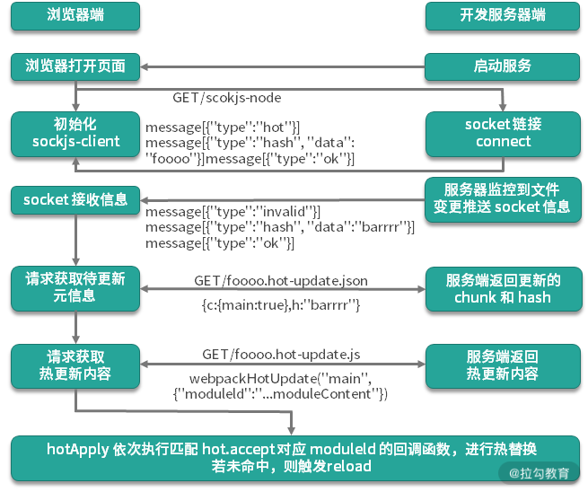

# 前端面试指北

## webpack相关面试题

### webpack-merge
```
用webpack-merge将配置文件拆分为3个文件，一个是webpack.common.js，即不管是生产环境还是开发环境都会用到的部分，以及webpack.prod.js和webpack.dev.js, 并且使用webpack-merge来合并对象。
```
* webpack.common.js
```js
const path = require('path')
const HtmlWebpackPlugin = require('html-webpack-plugin')
const vConsolePlugin = require('vconsole-webpack-plugin') // 移动端调试vConsole
const { srcPath, distPath } = require('./paths')
module.exports = {
    entry: path.join(srcPath, 'index'),
    module: {
        rules: [
            {
                test: /\.js$/, // 文件验证规则
                loader: ['babel-loader'], // babel-loader 可以额外配置.babelrc文件
                include: srcPath, // 包含处理哪些文件夹下的文件
                exclude: /node_modules/ // 不包含，过滤的文件 
            },
            // {
            //     test: /\.vue$/,
            //     loader: ['vue-loader'],
            //     include: srcPath
            // },
            // {
            //     test: /\.css$/,
            //     // loader 的执行顺序是：从后往前（知识点）
            //     loader: ['style-loader', 'css-loader']
            // },
            {
                test: /\.css$/,
                // loader 的执行顺序是：从后往前
                loader: ['style-loader', 'css-loader', 'postcss-loader'] 
                // 加了 postcss
                // 注意:common.js 不应该用style-loader，只有在dev中存在，prod中用MiniCssExtractPlugin，后面【CSS抽离】会提到
            },
            {
                test: /\.less$/,
                // 增加 'less-loader' ，注意顺序
                loader: ['style-loader', 'css-loader', 'less-loader']
            }
        ]
    },
    plugins: [
        new vConsolePlugin({
            filter: [],
            enable: process.env.NODE_ENV !== 'production'
        }),
        new HtmlWebpackPlugin({
            template: path.join(srcPath, 'index.html'),
            filename: 'index.html'
        })
    ]
}
```
* webpack.dev.js
```js
const path = require('path')
const webpack = require('webpack')
const webpackCommonConf = require('./webpack.common.js')
const { smart } = require('webpack-merge')
const { srcPath, distPath } = require('./paths')

module.exports = smart(webpackCommonConf, {
    mode: 'development',
    module: {
        rules: [
            // 直接引入图片 url
            {
                test: /\.(png|jpg|jpeg|gif)$/,
                use: 'file-loader'
            }
        ]
    },
    plugins: [
        new webpack.DefinePlugin({
            // window.ENV = 'development'
            ENV: JSON.stringify('development')
        })
    ],
    devServer: {
        port: 8080,
        progress: true,  // 显示打包的进度条
        contentBase: distPath,  // 根目录
        open: true,  // 自动打开浏览器
        compress: true,  // 启动 gzip 压缩

        // 设置代理
        proxy: {
            // 将本地 /api/xxx 代理到 localhost:3000/api/xxx
            '/api': 'http://localhost:3000',

            // 将本地 /api2/xxx 代理到 localhost:3000/xxx
            '/api2': {
                target: 'http://localhost:3000',
                pathRewrite: {
                    '/api2': ''
                }
            }
        }
    }
})

```
* webpack.prod.js
```js
const path = require('path')
const webpack = require('webpack')
const { CleanWebpackPlugin } = require('clean-webpack-plugin')
const webpackCommonConf = require('./webpack.common.js')
const { smart } = require('webpack-merge')
const { srcPath, distPath } = require('./paths')
module.exports = smart(webpackCommonConf, {
    mode: 'production',
    output: {
        filename: 'bundle.[contentHash:8].js',  // 打包代码时，加上 hash 戳,内容改变hash才会变
        path: distPath,
        // publicPath: 'http://cdn.abc.com'  // 修改所有静态文件 url 的前缀（如 cdn 域名），这里暂时用不到
    },
    module: {
        rules: [
            // 图片 - 考虑 base64 编码的情况
            {
                test: /\.(png|jpg|jpeg|gif)$/,
                use: {
                    loader: 'url-loader',
                    options: {
                        // 小于 5kb 的图片用 base64 格式产出
                        // 否则，依然延用 file-loader 的形式，产出 url 格式
                        limit: 5 * 1024,

                        // 打包到 img 目录下
                        outputPath: '/img1/',

                        // 设置图片的 cdn 地址（也可以统一在外面的 output 中设置，那将作用于所有静态资源）
                        // publicPath: 'http://cdn.abc.com'
                    }
                }
            },
        ]
    },
    plugins: [
        new CleanWebpackPlugin(), // 会默认清空 output.path 文件夹
        new webpack.DefinePlugin({
            // window.ENV = 'production'
            ENV: JSON.stringify('production')
        })
    ]
})

```
#### postcss-loader
```js
// 依赖autoprefixer
// 需要添加 postcss.config.js文件
const autoprefixer = require('autoprefixer')
const pxtorem = require('postcss-pxtorem')
module.exports = ({ file }) => {
  let remUnit
  if (file && file.dirname && file.dirname.indexOf('vant') > -1) {
    remUnit = 37.5 
  } else {
    remUnit = 75  // rem 换算
  }
  return {
    plugins: [
      autoprefixer(), // 自动加前缀
      pxtorem({
        rootValue: remUnit,
        propList: ['*'],
        selectorBlackList: ['van-circle__layer']
      })
    ]
  }
}

```
### 多入口配置entry
:::tip
1. 一个项目中保存了多个 HTML 模版，不同的模版有不同的入口，并且有各自的 router、store 等；
2. 不仅可以打包出不同 HTML，而且开发的时候也可以顺利进行调试；
3. 不同入口的文件可以引用同一份组件、图片等资源，也可以引用不同的资源；
:::
```js
// webpack.common.js
const HtmlWebpackPlugin = require('html-webpack-plugin')
module.exports = {
    entry: { // 多页面，在entry入口出需要建多个
        index: path.join(srcPath, 'index.js'),
        other: path.join(srcPath, 'other.js')
    },
    module: {
        rules: [
          ...
        ]
    },
    plugins: [
        // new HtmlWebpackPlugin({
        //     template: path.join(srcPath, 'index.html'),
        //     filename: 'index.html'
        // })

        // 多入口 - 生成 index.html
        new HtmlWebpackPlugin({
            template: path.join(srcPath, 'index.html'),
            filename: 'index.html',
            // chunks 表示该页面要引用哪些 chunk （即上面的 index 和 other），默认全部引用
            chunks: ['index']  // 只引用 index.js
        }),
        // 多入口 - 生成 other.html
        new HtmlWebpackPlugin({
            template: path.join(srcPath, 'other.html'),
            filename: 'other.html',
            chunks: ['other']  // 只引用 other.js
        })
    ]
}
// webpack.prod.js
module.exports = smart(webpackCommonConf, {
    mode: 'production',
    output: {
        // filename: 'bundle.[contentHash:8].js',  // 打包代码时，加上 hash 戳
        filename: '[name].[contentHash:8].js', // name 即多入口时 entry 的 key
        path: distPath,
        // publicPath: 'http://cdn.abc.com'  // 修改所有静态文件 url 的前缀（如 cdn 域名），这里暂时用不到
    },
    module: {
      ...
    },
    plugins: [
      new CleanWebpackPlugin(), // 会默认清空 output.path 文件夹
      new webpack.DefinePlugin({
          // window.ENV = 'production'
          ENV: JSON.stringify('production')
      })
    ]
})

```
### CSS抽离
:::tip
原本打包过后是css-in-js,在开发环境中使用HMR,style-loader会在页面中创建很多`<style>`标签,增加js体积,配置完`MiniCssExtractPlugin后`,可以将css单独打包出来`MiniCssExtractPlugin`这个插件应该只在生产环境构建中使用，并且在loader链中不应该有style-loader,抽离之后可以相互引用。
:::
```js
const MiniCssExtractPlugin = require('mini-css-extract-plugin')
module.exports = smart(webpackCommonConf, {
  mode: 'production',
  output: {
    ...
  },
  module: {
        rules: [
            // 图片 - 考虑 base64 编码的情况
            {
                test: /\.(png|jpg|jpeg|gif)$/,
                use: {
                    loader: 'url-loader',
                    options: {
                        // 小于 5kb 的图片用 base64 格式产出
                        // 否则，依然延用 file-loader 的形式，产出 url 格式
                        limit: 5 * 1024,

                        // 打包到 img 目录下
                        outputPath: '/img1/',

                        // 设置图片的 cdn 地址（也可以统一在外面的 output 中设置，那将作用于所有静态资源）
                        // publicPath: 'http://cdn.abc.com'
                    }
                }
            },
            // 抽离 css
            {
                test: /\.css$/,
                loader: [
                    MiniCssExtractPlugin.loader,  // 注意，这里不再用 style-loader
                    'css-loader',
                    'postcss-loader'
                ]
            },
            // 抽离 less --> css
            {
                test: /\.less$/,
                loader: [
                    MiniCssExtractPlugin.loader,  // 注意，这里不再用 style-loader
                    'css-loader',
                    'less-loader',
                    'postcss-loader'
                ]
            }
        ]
    },
    plugins: [
      new CleanWebpackPlugin(), // 会默认清空 output.path 文件夹
      new webpack.DefinePlugin({
          // window.ENV = 'production'
          ENV: JSON.stringify('production')
      }),

      // 抽离 css 文件
      new MiniCssExtractPlugin({
          filename: 'css/main.[contentHash:8].css'
      })
    ],

    optimization: {
      // 压缩 css、js
      minimizer: [new TerserJSPlugin({}), new OptimizeCSSAssetsPlugin({})],
    }
})
```
### 抽离公共代码(splitChunks)
:::tip
1. 某块业务代码被多个入口引用，抽离出来，放到一个公共模块中。这样不管这个模块被多少个入口引用，都只会在最终打包结果中出现一次解决代码冗余。
2. 第三方库一般很大，而且代码基本不会再改动,我会把一些特别大的库分别独立打包，(抽离后不会因为业务代码改变，而导致库hash值也变)，剩下的加起来如果还很大，就把它按照一定大小切割成若干模块。
:::
```js
// prod.common.js
module.exports = smart(webpackCommonConf, {
    mode: 'production',
    output: {
    },
    module: {
      ...
    },
    optimization: {
        // 压缩 css
        minimizer: [new TerserJSPlugin({}), new OptimizeCSSAssetsPlugin({})],

        // 分割代码块
        splitChunks: {
            chunks: 'all',
            /**
             * initial 入口 chunk，对于异步导入的文件不处理
                async 异步 chunk，只对异步导入的文件处理
                all 全部 chunk
             */

            // 缓存分组
            cacheGroups: {
                // 第三方模块
                vendor: {
                    name: 'vendor', // chunk 名称
                    priority: 1, // 权限更高，优先抽离，重要！！！
                    test: /node_modules/, // 命中第三方模块
                    minSize: 0,  // 大小限制
                    minChunks: 1  // 最少复用过几次
                },

                // 公共的模块
                common: {
                    name: 'common', // chunk 名称
                    priority: 0, // 优先级
                    minSize: 0,  // 公共模块的大小限制(如果太小就没必要单独打包了)
                    minChunks: 2  // 公共模块最少复用过几次
                }
            }
        }
    }
})
// webpack.common.js
module.exports = {
    entry: {
    },
    module: {
    },
    plugins: [
        // new HtmlWebpackPlugin({
        //     template: path.join(srcPath, 'index.html'),
        //     filename: 'index.html'
        // })

        // 多入口 - 生成 index.html
        new HtmlWebpackPlugin({
            template: path.join(srcPath, 'index.html'),
            filename: 'index.html',
            // chunks 表示该页面要引用哪些 chunk （即上面的 index 和 other），默认全部引用
            chunks: ['index', 'vendor', 'common']  // 要考虑代码分割
        }),
        // 多入口 - 生成 other.html
        new HtmlWebpackPlugin({
            template: path.join(srcPath, 'other.html'),
            filename: 'other.html',
            chunks: ['other', 'common']  // 考虑代码分割
        })
    ]
}
// chunks在哪些地方用到
// 1.entry(中可以表示chunks的引用)
// 2.splitChunks(也可以定义chunks)
// 3.HtmlWebpackPlugin(使用chunks)
```
### 懒加载
```js
// export default {
//   message: 'this is data'
// }
// 引入动态数据 - 懒加载
setTimeout(()=>{
  // 回顾vue、react异步组件都是用的这个语法，是js的语法
  // 异步加载也是定义一个chunk
  import('./data.js').then(res => {
    console.log(res.default.message) // 主力这里的defalut
  })
})

const List = () => import(/* webpackChunkName: "home" */ './List.vue')
```

### 处理JSX和VUE
```js
// React
// npm install --save-dev @babel/preset-react
// .babelrc文件中配置
{
    "presets": ["@babel/preset-react"],
    "plugins": []
}
// Vue直接只用vue-loader
```

### module chunk bundle 的区别

:::tip
* module: 各个源码文件，webpack中的一切皆模块(js、img、css、sass...)
* chunk: 多个模块合并成的,如 entry 、import()、 splitChunk
* bundle: webpack 处理好 chunk 文件后，最后会输出 bundle 文件，这个 bundle 文件包含了经过加载和编译的最终源文件，所以它可以直接在浏览器中运行。

module、chunk 和 bundle 其实就是同一份逻辑代码在不同转换场景下的取了三个名字：
我们直接写出来的是 module，webpack 处理时是 chunk，最后生成浏览器可以直接运行的 bundle。
:::
### webpack 性能优化
:::tip
1. 优化打包构建速度 - 开发体验和效率
2. 优化产出代码 - 产品性能
:::
####  优化打包构建速度
:::tip
1. `Loader`优化配置 【dev】
2. `IgnorePlugin` (忽略第三方包指定目录，让这些指定目录(如moment的语言包)不要被打包进去)【prod】
3. `noParse` 不去解析属性值代表的库的依赖(jquery) 【prod】
4. `happyPack` 开启多个进程去打包(按需开启)，提高构建速度（特别是多核CPU） `ParallelUglifyPlugin` webpack内置Uglify工具压缩JS,但是是单线程，`ParallelUglifyPlugin` 是多进程压更快，和`happyPack`同理 【prod】
* 项目较大，打包较慢，开启多进程能提高速度
* 项目较小，打包很快，开启多进程会降低速度（进程多了，进程开启、销毁、通信），欲速则不达
5. 热更新 模块热替换，解决页面刷新导致的状态丢失问题。【dev】 
6. `DllPlugin` 我们的代码都可以至少简单区分成业务代码和第三方库。大部分第三方库框架如Vue React体积大，比较稳定、不常升级,构建慢。使用DllPlugin 动态库就不需要重新打包，每次构建只重新打包业务代码。【dev】
:::
**1. 优化`Loader`配置**
```js
// Loader处理文件的转换操作是很耗时的，所以需要让尽可能少的文件被Loader处理
{
    test: /\.js$/,
    use: [
        'babel-loader?cacheDirectory',//开启转换结果缓存(加上cacheDirectory参数后，启用缓存之后，如ES6没有改的就不会重新编译)
    ],
    include: path.resolve(__dirname, 'src'),//只对src目录中文件采用babel-loader
    exclude: path.resolve(__dirname,' ./node_modules'),//排除node_modules目录下的文件
    // include或者exclude确定范围，提升速度
}
```
**2. IgnorePlugin**
```js
// 忽略第三方包指定目录，让这些指定目录不要被打包进去
// 当我们使用moment,是一个时间工具包，内部里面把所有的语言包都引入；
// 我们可以控制解析改包时，可以忽略调引入的文件。
plugins: [
    //weback自带的插件 忽略
    new webpack.IgnorePlugin(/\.\/locale/,/moment/),//优化3   如果引入这个moment包时 会忽略调 locale文件
    new HtmlWebpackPlugin({
        template:"./public/index.html",

    })
],
//我们要手动引入需要的语言包
//手动引入中文包
// import "moment/locale/zh-cn";
```
**3. noParse**
```js
// 不去解析属性值代表的库的依赖,webpack精准过滤不需要解析的文件.
// 当解析jq的时候,会去解析jq这个库是否有依赖其他的包,我们对类似jq这类依赖库，
// 一般会认为不会引用其他的包(特殊除外,自行判断)。所以，对于这类不引用其他的
// 包的库，我们在打包的时候就没有必要去解析，这样能够增加打包速率。
// 可以在webpack的module配置中增加noParse属性（以下代码只需要看module的noParse属性）
{
    module:{
        noParse: /jquery|lodash/,  //接收参数  正则表达式 或函数
        noParse:function(contentPath){
            return /jquery|lodash/.test(contentPath);
        }
    }
}
```
**4. happyPack 和 ParallelUglifyPlugin**
```js
// JS 单线程 =>nodeJS单线程=> webpack也是单线程，但是可以开启多个进程去打包，提高构建速度(特别是多核CPU)
// webpack内置Uglify工具压缩JS,但是是单线程，使用ParallelUglifyPlugin` 是多进程压更快，和`happyPack`同理
// npm i -D happypack
module: {
    rules: [
        // js
        {
            test: /\.js$/,
            // 把对 .js 文件的处理转交给 id 为 babel 的 HappyPack 实例
            use: ['happypack/loader?id=babel'],
            include: srcPath,
            // exclude: /node_modules/
        },
    ]
}
plugins: [
    ...
    // happyPack 开启多进程打包
    new HappyPack({
        // 用唯一的标识符 id 来代表当前的 HappyPack 是用来处理一类特定的文件
        id: 'babel',
        // 如何处理 .js 文件，用法和 Loader 配置中一样
        loaders: ['babel-loader?cacheDirectory']
    }),

    // 使用 ParallelUglifyPlugin 并行压缩输出的 JS 代码
    new ParallelUglifyPlugin({
        // 传递给 UglifyJS 的参数
        // （还是使用 UglifyJS 压缩，只不过帮助开启了多进程）
        uglifyJS: {
            output: {
                beautify: false, // 最紧凑的输出
                comments: false, // 删除所有的注释
            },
            compress: {
                // 删除所有的 `console` 语句，可以兼容ie浏览器
                drop_console: true,
                // 内嵌定义了但是只用到一次的变量
                collapse_vars: true,
                // 提取出出现多次但是没有定义成变量去引用的静态值
                reduce_vars: true,
            }
        }
    })
],
```
**5. 热更新**

:::tip
发展历史 保存后自动编译（Auto Compile） => 自动刷新浏览器（Live Reload） => HMR（Hot Module Replacement，模块热替换）
1. **手动：** 最早一切依赖手动，修改代码后需要手动执行`npm run build:xxx`, 然后刷新页面。
2. **Watch：** 早期使用`gulp`或者`webpack`配置`Watch`模式，通过监控源码文件的变化来解决上面不能自动编译。
3. **Live Reload：** 每次代码变更后浏览器中的预览页面能自动显示最新效果而无须手动点击刷新，我们需要一种通信机制来连接浏览器中的预览页面与本地监控代码变更的进程
**缺点：** 整个网页刷新，速度较慢,状态会丢失(如：表单输入、弹框打开消失、颜色样式)
4. **Hot Module Replacement** 模块热替换，解决页面刷新导致的状态丢失问题。

* **CSS:** 使用 style-loader 和 css-loader 来解析导入的 CSS 文件。其中 css-loader 处理的是将导入的 CSS 文件转化为模块供后续 Loader 处理；而 style-loader 则是负责将 CSS 模块的内容在运行时添加到页面的 style 标签中。
* **JS:** 使用hot.accept方法,当文本发生变更时，可以观察到浏览器端显示最新内容的同时并未触发页面刷新。vue-loader、 react-hot-loader 等加载器也都实现了该功能。
:::
```js
// webpack中的配置
devServer: {
    port: 8080,
    progress: true,  // 显示打包的进度条
    contentBase: distPath,  // 根目录
    open: true,  // 自动打开浏览器
    compress: true,  // 启动 gzip 压缩
    hot: true,
    // 设置代理
    proxy: {
    }
}
// JS 代码中的热替换
// ./text.js 
export const text = 'Hello World' 
// ./index2.js 
import {text} from './text.js' 
const div = document.createElement('div') 
document.body.appendChild(div) 
function render() { 
  div.innerHTML = text; 
} 
render() 
if (module.hot) { // 如果开启热更新
  // 监听 xxx.js范围之内才热更新
  module.hot.accept('./text.js', function() { 
    render() 
  }) 
}

```

6. DllPlugin动态链接库插件
::: tip
我们的代码都可以至少简单区分成业务代码和第三方库。大部分第三方库框架如Vue React体积大，比较稳定、不常升级,构建慢。使用DllPlugin 动态库就不需要重新打包，每次构建只重新打包业务代码。
用webpack已内置DllPlugin, 打包出dll文件，DllReferencePlugin 使用dll文件
:::
```js
// package.json
// {
//   "scripts": {
//     "dll": "webpack --config webpack.dll.config"
//  }
// }
// npm run dll
// webpack.dll.config.js
module.exports = {
  entry: {
    // 把React 相关的模块放到一个单独的攻台链接库
    react: ['react', 'react-dom', 'react-redux']
  },
  output: {
    // 输出的动态链接库的文件名称，[name] 代表当前动态链接库的名称
    // 也就是entry中配置的 react 和 polyfill
    filename: '[name].dll.js',
    //  输出的文件都放在dist 目录下
    path: resolve('dist/dll'),
    // library必须和后面dllplugin中的name一致 后面会说明
    // 只所有加_dll_是为了防止全局变量冲突
    library: '[name]_dll_[hash]'
  },
  plugins: [
  // 接入 DllPlugin
    new DllPlugin({
      // 动态链接库的全局变量名称，需要和 output.library 中保持一致
      // 该字段的值也就是输出的 manifest.json 文件 中 name 字段的值
      name: '[name]_dll_[hash]',
      // 描述动态链接库的 manifest.json 文件输出时的文件名称
      path: path.join(__dirname, 'dist/dll', '[name].manifest.json')
    }),
  ]
}
// 在入口文件引入dll文件
<script src="../../dist/dll/react.dll.js" ></script>
```

#### 优化产出代码
:::tip
1. 小图片`base64`编码，减少网络请求
2. `bundle`加`hash`,文件没有修改 hash不变，能被浏览器缓存命中
3. 懒加载，通过`import`
4. splitChunks 提取公共代码，重复引用，解决代码冗余。
5. `IgnorePlugin` (忽略第三方包指定目录，让这些指定目录(如moment的语言包)不要被打包进去)【prod】
6. 使用CDN加速 `publicPath` 配置CDN路径
7. 使用`production` 配置环境变量(接口域名、sourceMap、代码压缩)
8. 启动`Tree-Shaking`(主要功能就是去除没有用到代码,必须用 ES6 Module 才能Tree-Shaking 生效, commonjs就不行, webpack中已经默认开启Tree-Shaking)
9. `Scope Hosting` `webpack3.0+` 的默认行为，当打包前会自动简化代码，减少变量( )
* 体积更小
* 合理分包，不重复加载
* 速度更快，内存使用更少
:::

```js
// hello.js
export default '李狗蛋'
// main.js
import str from './hello.js'
console.log(str)
// 默认打包结果
[
  (function(module,__webpack_exports__, __webpack_require__){
  var WEBPACK_IMPORTED_MODULEC_0__till_js__ = __webpackrequire__(1);
  console.log(__WEBPACK_IMPORT_MODULE_0__util_js__.["a"]);
  }),
  (function (module,__webpack_exports__, __webpack_require__)
    __webpack_exports__["a"] = ("李狗蛋");
}]
// Scope Hosting
[
  (function(module,__webpack_exports__, __webpack_require__){
    var hello = ('李狗蛋')
    console.log(hello);
  })
]
// 1. 在A文件导出一个字符串，在B文件中引入之后，通过console.log打印出来。
// 2. 通过webpack打包构建之后，会发现将这两个文件构建成了两个函数，一个函数内是我们输出的字符串，一个函数内是console.log语句。
// 问题：两个函数也就是两个作用域；不仅代码增加了，可读性还不太友好。
// 3. 使用scope hosting进行配置处理之后，会讲本身的两个函数作用域合成一个，减少了代码量，也便于阅读
```
### ES Module 和 Commonjs 区别
强烈建议阅读[es6Module与CommonJS](https://segmentfault.com/a/1190000021458835)
:::tip
* `CommonJs` 动态引入，执行时引入 可以动态加载语句，代码发生在运行时
* `CommonJs` 导出值是拷贝，可以修改导出的值，这在代码出错时，不好排查引起变量污染
* `ES Module` 静态引入,编译时引入,不可以动态加载语句，只能声明在该文件的最顶部，代码发生在编译时
* `Es Module` 导出是引用值之前都存在映射关系，并且值都是可读的，不会被修改。
* 只有`ES6 Module` 才能静态分析，实现 `Tree-Shaking`
:::

```js
/*** Commonjs ***/
// Commonjs Node.js是commonJS规范的主要实践者(module、exports、require、global)
// index.js
let num = 0;
module.exports = {
    num,
    add() {
       ++ num 
    }
}
// 引用自定义的模块时，参数包含路径
let { num, add } = require("./index.js")
console.log(num) // 0
add()
console.log(num) // 0 值没有改变

/*** es6 Modules ***/
export let counter = 1;
export function incCounter() {
  counter ++;
}
import { counter, incCounter } from './exportDemo.mjs'
incCounter();
console.log(counter) // 打印结果为2，而不是初始值的1

/**commonJS**/
let apiList = require('../api/index.js')
if(isDev) {
  // commonJS 可以动态引入,执行时引入
  let apiList = require('.../api/index.js')
}

/** es6 Modules**/
import apiList form '../api/index.js'
if(isDev) {
  // 编译时报错，语法不支持，只能静态引入
  import apiList form2 '../api2/index.js'
}

```
### 配置Babel、babel-polyfill
:::tip
* `Babel` 默认只转换新的 JavaScript 句法（syntax），而不转换新的 API
* `babel-polyfill` 是 `core-js`(实现了promise、Symbol、Class等) 和 `regenerator-runtime` （ es6 generator 函数(处理异步)）两者的集合。
* `Babel 7.4`之后弃用了`babel-polyfill`,推荐直接引入`core-js` 和 `regenerator-runtime`
* `babel-runtime` 使用 `babel-polyfill` 会导致污染了全局环境，并且不同的代码文件中包含重复的代码，使用`babel-runtime`就可以避免。

**建议：** `babel-runtime` 适合在组件，类库项目中使用，而`babel-polyfill`适合在独立业务项目中使用。
:::
```js
// ES6转ES5 分 语法 和API 两部分
npm i -D webpack webpack-cli
npm i -D babel-loader @babel/core
npm i -D babel-preset-env
npm install --save babel-runtime
npm install --save-dev babel-plugin-transform-runtime

// npm babel src/xxx.js
/** .babelrc **/
{
  "presets": [
    [
      "@babel/preset-env", // preset-env 是es6、es7的plugins集合,常用语法解析,免去挨个配置
      {
        "useBuiltIns": "usage", // 自动添加 babel-polyfill的引用，按需引入
        "corejs": 3, // corejs版本
      }
      // "babel/preset-typescript"
    ]
  ],
  "plugins": [
    [
      "@babel/plugin-transform-runtime",
      {
        "absoluteRuntime": false,
        "corejs": 3,
        "helpers": true,
        "regenerator": true,
        "useESModules": false
      }
    ]
  ]
}

// 特别注意: 使用 import '@babel/polyfill', 会导致把整个polyfill都引入,体积大, 只配置"useBuiltIns": "usage",不用写import,就可以做到按需引入

/** Babel 7.4 之前 **/
// import '@babel/polyfill'
/** Babel 7.4 之后 **/
// import 'core-js';
// import 'regenerator-runtime/runtime';

// babel-polyfill
// 1. 会导致污染了全局环境
// 2. 不同的代码文件中包含重复的代码，导致编译后的代码体积变大
window.Promise = function() {}
Array.prototype.includes = function() {}
// babel-runtime
_promise["default"] = function() {}
_includes["default"]()


// core-js 实现了promise、Symbol、Class等,Babel 默认只转换新的 JavaScript 句法（syntax），而不转换新的 API,所以需要用到core-js,但core-js不支持generator
// ES6 generator 函数(处理异步)， 后被async/await 替代
function* tell(x){
  console.log('执行a处理')
  yield 'a'
  console.log('执行b处理')
  yield 'b'
  console.log('执行c处理')
  yield 'c'
}
let k = tell();
console.log(k.next()); // 执行a处理  {value: 'a', done: false}
console.log(k.next()); // 执行b处理  {value: 'b', done: false}
console.log(k.next()); // 执行c处理  {value: 'c', done: false}
console.log(k.next()); //  {value: undefined, done: true}
```


