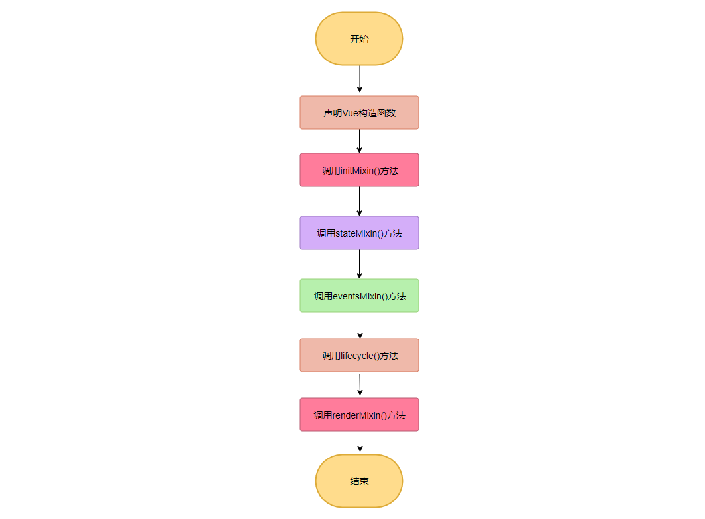

# initMixin流程
在上一节我们讲到了`initGlobalAPI`的整体流程，这一节，我们来介绍`initMixin`的整体流程。首先，我们把目光回到`src/core/index.js`文件中：
```js
import Vue from './instance/index'
import { initGlobalAPI } from './global-api/index'
initGlobalAPI(Vue)

export default Vue
```
我们发现，它从别的模块中引入了大`Vue`，那么接下来我们的首要任务就是揭开`Vue`构造函数的神秘面纱。

在看`src/core/instance/index.js`代码之前，我们发现`instance`目录结构如下：
```sh
|-- instance
|   |-- render-helpers      # render渲染相关的工具函数目录
|   |-- events.js           # 事件处理相关
|   |-- init.js             # _init等方法相关
|   |-- inject.js           # inject和provide相关
|   |-- lifecycle.js        # 生命周期相关
|   |-- proxy.js            # 代理相关
|   |-- render.js           # 渲染相关
|   |-- state.js            # 数据状态相关
|   |-- index.js            # 入口文件
```

可以看到，目录结构文件有很多，而且包含的面也非常杂，但我们现在只需要对我们最关心的几个部分做介绍：
* `events.js`：处理事件相关，例如：`$on`，`$off`，`$emit`以及`$once`等方法的实现。
* `init.js`：此部分代码逻辑包含了`Vue`从创建实例到实例挂载阶段的所有主要逻辑。
* `lifecycle.js`：生命周期相关，例如：`$destroy`、`$activated`和`$deactivated`。
* `state.js`：数据状态相关，例如：`data`、`props`以及`computed`等。
* `render.js`：渲染相关，其中最值得关注的是`Vue.prototype._render`渲染函数的定义。

在介绍了`instance`目录结构的及其各自的作用以后，我们再来看入口文件，其实入口文件这里才是`Vue`构造函数庐山真面目：
```js
import { initMixin } from './init'
import { stateMixin } from './state'
import { renderMixin } from './render'
import { eventsMixin } from './events'
import { lifecycleMixin } from './lifecycle'
import { warn } from '../util/index'

function Vue (options) {
  if (process.env.NODE_ENV !== 'production' &&
    !(this instanceof Vue)
  ) {
    warn('Vue is a constructor and should be called with the `new` keyword')
  }
  this._init(options)
}

initMixin(Vue)
stateMixin(Vue)
eventsMixin(Vue)
lifecycleMixin(Vue)
renderMixin(Vue)

export default Vue
```

代码分析：
* `Vue`构造函数其实就是一个普通的函数，我们只能通过`new`操作符进行访问，既`new Vue()`的形式，`Vue`函数内部也使用了`instanceof`操作符来判断实例的父类是否为`Vue`构造函数，不是的话则在开发环境下输出警告信息。
* 除了声明`Vue`构造函数，这部分的代码也调用了几种`mixin`方法，其中每种`mixin`方法各司其职，处理不同的内容。

从以上代码中，我们能得到`src/core/instance/index.js`文件非常直观的代码逻辑流程图：



接下来我们的首要任务是弄清楚`_init()`函数的代码逻辑以及`initMixin`的整体流程。我们从上面的代码发现，在构造函数内部会调用`this._init()`方法，如下：
```js
// 实例化时，会调用this._init()方法。
new Vue({
  data: {
    msg: 'Hello, Vue.js'
  }
})
```

然后，我们在`init.js`中来看`initMixin()`方法是如何被定义的：
```js
export function initMixin (Vue) {
  Vue.prototype._init = function (options) {
    // 省略代码
  }
}
```
我们可以发现，`initMixin()`方法的主要作用就是在`Vue.prototype`上定义一个`_init()`实例方法，接下来我们来看一下`_init()`函数的具体实现逻辑：
```js
Vue.prototype._init = function (options) {
    const vm = this
    // 1. 合并配置
    if (options && options._isComponent) {
      initInternalComponent(vm, options)
    } else {
      vm.$options = mergeOptions(
        resolveConstructorOptions(vm.constructor),
        options || {},
        vm
      )
    }

    // 2.render代理
    if (process.env.NODE_ENV !== 'production') {
      initProxy(vm)
    } else {
      vm._renderProxy = vm
    }

    // 3.初始化生命周期、初始化事件中心、初始化inject，
    //   初始化state、初始化provide、调用生命周期
    vm._self = vm
    initLifecycle(vm)
    initEvents(vm)
    initRender(vm)
    callHook(vm, 'beforeCreate')
    initInjections(vm)
    initState(vm)
    initProvide(vm)
    callHook(vm, 'created')

    // 4.挂载
    if (vm.$options.el) {
      vm.$mount(vm.$options.el)
    }
  }
```
因为我们是要分析`initMixin`整体流程，对于其中某些方法的具体实现逻辑会在后续进行详细的说明，因此我们可以从以上代码得到`initMixin`的整体流程图。
<div style="text-align: center">
  
</div>